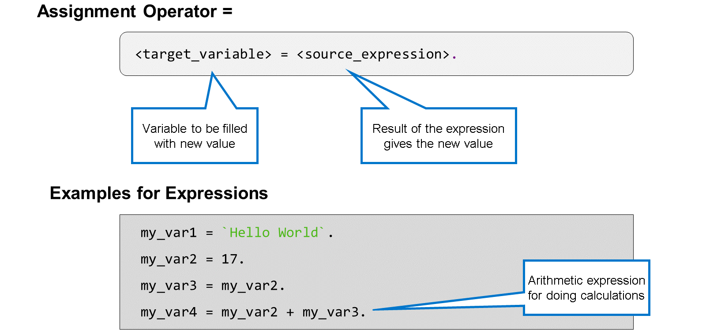
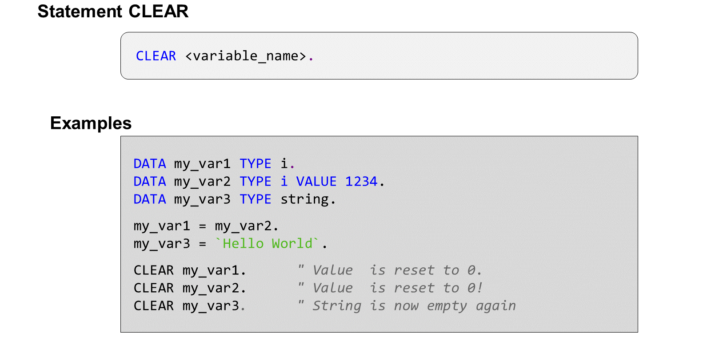
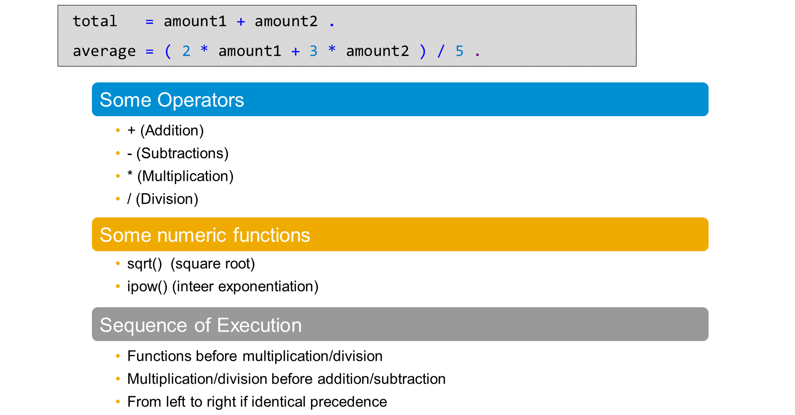
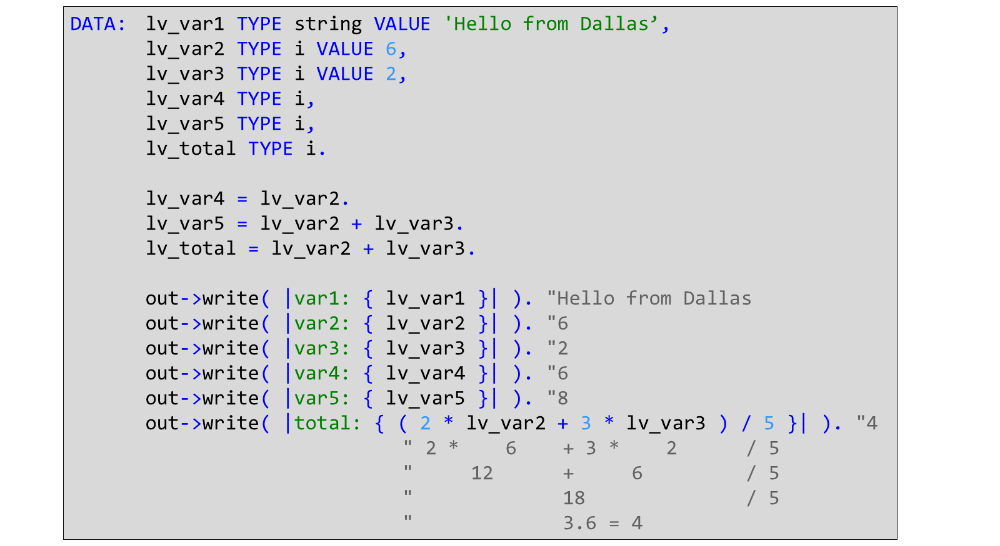

# 🌸 2 [PROCESSING DATA](https://learning.sap.com/learning-journeys/learn-the-basics-of-abap-programming-on-sap-btp/processing-data_deaa9868-3de8-44d0-b28f-e42758302db9)

> 🌺 Objectifs
>
> - [ ] Vous pourrez attribuer des valeurs aux objets de données.

## 🌸 ASSIGN VALUES TO DATA OBJECTS

Utilisez les affectations de valeurs pour modifier la valeur des variables.

En ABAP, l'opérateur d'affectation de valeurs est un simple signe égal `=`. La variable de gauche est renseignée avec la valeur de l'expression de droite.

L'expression la plus simple est un objet de données unique, par exemple un littéral ou une autre variable. Cependant, ABAP prend en charge des expressions plus sophistiquées, comme l'expression arithmétique de l'exemple ci-dessus.

### RESETTING VARIABLES

L'instruction `CLEAR` réinitialise le contenu d'un objet de données à sa valeur initiale liée au type. Pour plus d'informations sur les valeurs initiales d'un type particulier, consultez la documentation des mots-clés de l'instruction `CLEAR`. En général, si le type de données est numérique, sa valeur initiale est zéro, tandis que si le type de données est caractère, sa valeur initiale est un espace.

### ARITHMETIC CALCULATIONS

Les expressions arithmétiques sont des expressions ABAP combinant valeur, opérateurs et fonctions que le système d'exécution traite pour calculer un résultat. Pour les expressions arithmétiques, le type de résultat dépend du type des opérandes utilisés en entrée de l'expression.

Vous pouvez utiliser une expression arithmétique à n'importe quelle position d'opérande de lecture, par exemple à droite de l'affectation de valeur.

Le premier exemple est une addition simple. Les valeurs de `amount1` et `amount2` sont additionnées, et les résultats sont placés dans la variable total.

Le deuxième exemple est un peu plus sophistiqué. Avant leur addition, les valeurs de `amount1` et `amount2` sont pondérées par les facteurs 2 et 3. Le résultat de cette addition est ensuite divisé par 5 pour calculer une moyenne pondérée.

L'arithmétique ABAP de base fournit les opérateurs `+` pour l'addition, `-` pour la soustraction, `*` pour la multiplication et `/` pour la division. De plus, vous pouvez utiliser l'opérateur `DIV` pour la division d'un nombre entier et `MOD` pour le reste d'une division. Ainsi, 6 `DIV` 4 vaut 1 et 6 `MOD` 4 vaut 2.

ABAP dispose de nombreuses fonctions intégrées pour diverses tâches. Nombre d'entre elles sont utilisées pour le traitement de chaînes de caractères, mais voici quelques exemples de fonctions numériques. Utilisez la fonction `sqrt()` pour extraire la racine carrée et la fonction `ipow()` pour élever un nombre à une puissance entière.

Dans les expressions complexes impliquant plusieurs opérateurs, la multiplication et la division ont priorité sur l'addition et la soustraction. Les expressions ayant la même priorité sont traitées de gauche à droite.

La syntaxe ABAP requiert au moins un espace entre les opérateurs et les opérandes. `1 + 1` est correct. `1+1` entraîne une erreur de syntaxe.

Les espaces sont également nécessaires après les parenthèses ouvrantes et avant les parenthèses fermantes.

## 🌸 USE SYSTEM INFORMATION IN A PROGRAM

La classe `CL_ABAP_CONTEXT_INFO` propose différentes méthodes pour déterminer les données environnementales de l'application en cours. Certaines de ces méthodes sont listées ci-dessous.

### SYSTEM INFORMATION

| Method                                                  | Description             |
| ------------------------------------------------------- | ----------------------- |
| CL_ABAP_CONTEXT_INFO->GET_SYSTEM_DATE( ).               | Current date            |
| CL_ABAP_CONTEXT_INFO->GET_SYSTEM_TIME( ).               | Current time            |
| CL_ABAP_CONTEXT_INFO->GET_USER_TECHNICAL_NAME( ).       | User ID of current user |
| CL_ABAP_CONTEXT_INFO->GET_USER_LANGUAGE_ABAP_FORMAT( ). | User login language     |

Jusqu'à présent, vous avez déclaré toutes les variables sur lesquelles vous travaillez dans vos applications ABAP. Cependant, le système contient des informations spécifiques que vous pouvez utiliser dans votre code source. Le système d'exécution ABAP gère ces informations et les met à la disposition de toute application ABAP souhaitant les utiliser.

Les informations système fournissent des informations sur l'état actuel du système. Le système d'exécution ABAP renseigne et modifie les valeurs si nécessaire.
