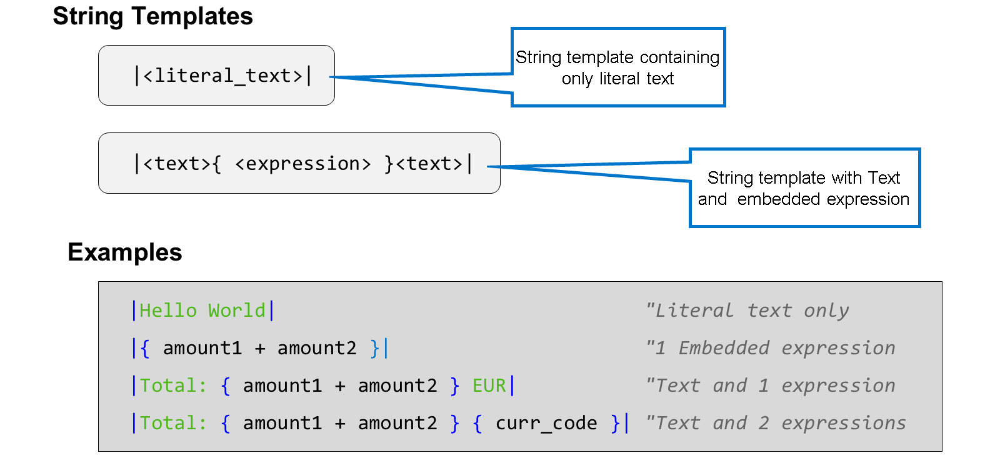
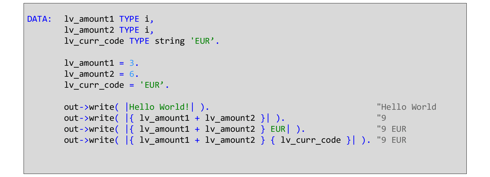
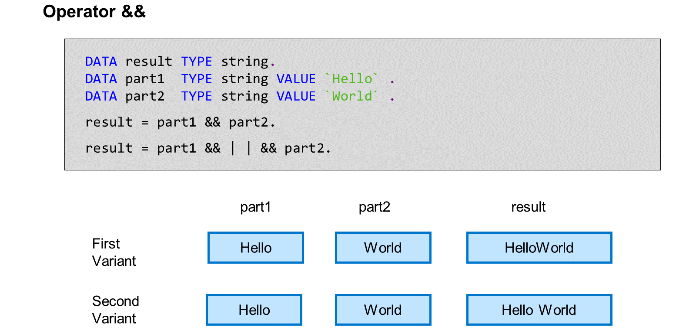
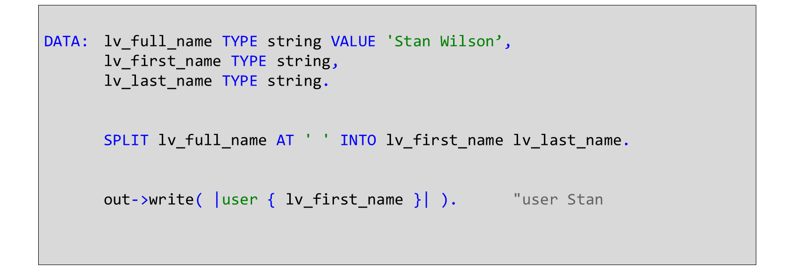

# 🌸 3 [PROCESSING CHARACTER STRING](https://learning.sap.com/learning-journeys/learn-the-basics-of-abap-programming-on-sap-btp/processing-character-strings_dd12da92-fbed-452a-86ae-3f9b14f6db24)

> 🌺 Objectifs
>
> - [ ] Vous serez capable de traiter des chaînes de caractères dans un programme d'application.

## 🌸 CHARACTER STRING FUNCTIONS

### PROCESSING STRINGS

Les modèles de chaîne sont des expressions ABAP de type chaîne de résultat. Vous pouvez les utiliser à n'importe quelle position d'opérande de lecture, par exemple à droite d'une affectation de valeur.

Un modèle de chaîne commence et se termine par une barre verticale ( | | ). Le modèle de chaîne le plus simple ne contient que du texte littéral. Sous cette forme, un modèle de chaîne ne diffère pas vraiment d'une chaîne littérale.

Ce qui distingue un modèle de chaîne d'une chaîne littérale est la possibilité d'incorporer des expressions. Une expression incorporée est une expression ABAP entourée d'accolades ( { } ). À l'exécution, ABAP évalue l'expression incorporée et traduit le résultat en chaîne. Dans le résultat, cette chaîne remplace l'expression incorporée (avec les accolades qui l'entourent).

> #### 🍧 Note
>
> La syntaxe ABAP nécessite au moins un espace après le crochet ouvrant et au moins un espace avant le crochet fermant.

Un modèle de chaîne peut contenir plusieurs expressions intégrées.

À l'intérieur des accolades, vous pouvez placer n'importe quel type d'expression ABAP : variables, littéraux ou expressions arithmétiques.

### JOIGNING STRING

Vous pouvez joindre des champs à l'aide de l'opérateur de concaténation &&. Vous pouvez joindre n'importe quelle combinaison d'objets de données et d'expressions de chaîne.

Les variables ci-dessus (Partie1 et Partie2) de l'expression sont jointes sans espace ni autre séparateur. Si vous avez besoin d'espaces ou d'un autre séparateur ou caractère, n'oubliez pas de les insérer vous-même dans l'expression, comme illustré dans la figure ci-dessus.

En utilisant l'exemple de chaîne, les utilisateurs peuvent souhaiter séparer leur nom complet afin que vous puissiez afficher uniquement le prénom.

## 🌸 PROCESS CHARACTER STRINGS

### BUSINESS EXAMPLE

Vous connaissez le nom complet d'un client, mais vous devez afficher son prénom. Créez le code ABAP pour séparer le nom complet en prénom et nom, puis affichez le prénom dans la console.

> #### 🍧 Note
>
> Dans cet exercice, XX fait référence à votre numéro.

[Exercices](./assets/hands_on.pdf)
