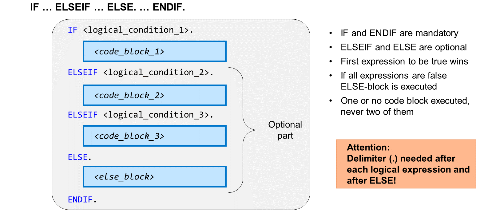
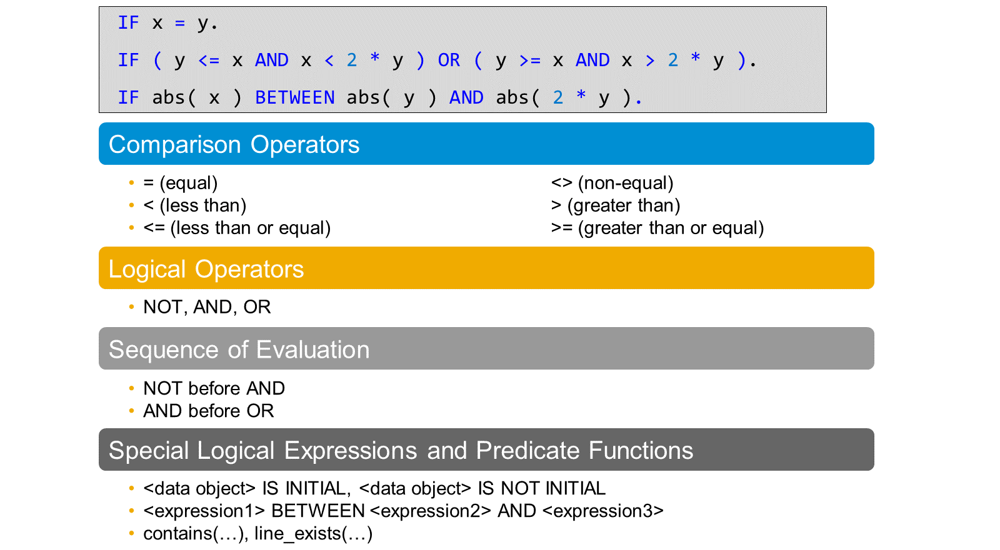
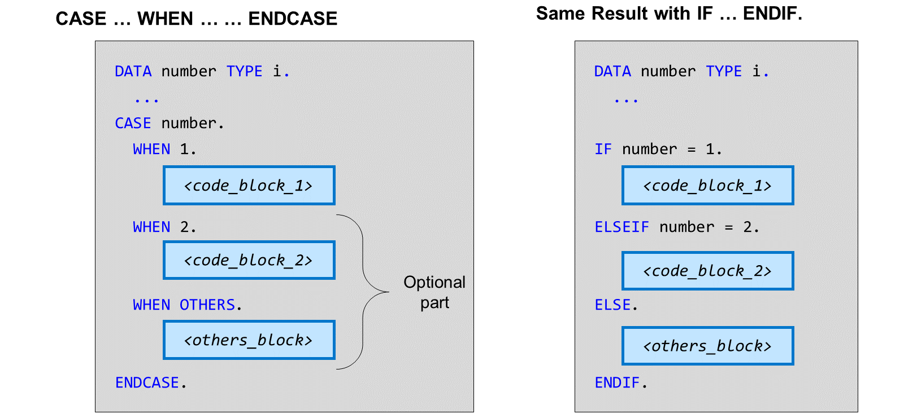

# 🌸 1 [COMPLEMENTING CONDITIONAL LOGIC](https://learning.sap.com/learning-journeys/learn-the-basics-of-abap-programming-on-sap-btp/implementing-conditional-logic_fbe05958-b3af-437a-9ce4-bc1197ffd035)

> 🌺 Objectifs
>
> - [ ] vous serez capable d'implémenter une logique conditionnelle dans un programme ABAP.

## 🌸 IMPLEMENTING CONDITIONAL BRANCHING

### CONDITIONAL BRANCHING: IMPLEMENTATION

#### 💮 **IF ELSEIF ELSE ENDIF** :

Le branchement conditionnel est une structure de contrôle qui permet de rendre l'exécution du code dépendante de conditions logiques.

Le branchement conditionnel le plus courant est constitué d'une paire de mots-clés : `IF` et `ENDIF`. Le bloc de code ABAP entre `IF` et `ENDIF` n'est exécuté que si la condition après `IF` est remplie.

Vous pouvez ajouter des blocs de code étendant la structure `IF` . `ENDIF` d'un bloc en utilisant le mot-clé `ELSE` et un nombre arbitraire de blocs en utilisant le mot-clé `ELSEIF`. En ajoutant le mot-clé `ELSE`, vous vous assurez qu'un seul bloc de code ABAP est toujours exécuté. Si `ELSE` est absent, aucun bloc de code ABAP ne peut être exécuté.

Tous les mots-clés `IF` . `ENDIF` sont obligatoires, et chaque mot-clé `IF` doit contenir un `ENDIF`.

Le bloc de code ABAP exécuté est le suivant :

Tout d'abord, la condition `IF` est évaluée. Si elle est remplie, le bloc de code ABAP correspondant est exécuté, et le programme continue après `ENDIF`.
Seule la condition `IF` non remplie est évaluée après le premier `ELSEIF`. Si elle est remplie, le bloc de code correspondant est exécuté et le programme continue après `ENDIF`.

Ceci est répété pour toutes les conditions `ELSEIF`. Si aucune condition n'est remplie et que la structure contient `ELSE`, le bloc de code ABAP suivant `ELSE` est exécuté. Sinon, aucun bloc de code ABAP n'est exécuté.

> #### 🍧 Hint
>
> Contrairement à de nombreux autres langages de programmation, ABAP nécessite un délimiteur (.) après chaque condition logique et même après le mot-clé ELSE.

### LOGICAL CONDITIONS

Les conditions logiques sont une combinaison de comparaisons, d'opérations logiques, d'expressions et de fonctions que le système d'exécution évalue pour déterminer si la condition est `true` ou `false`.

L'utilisation la plus courante des conditions logiques se situe après les mots-clés `IF` ou `ELSEIF` dans une structure `IF . . . ENDIF`.

Le premier exemple (dans la figure ci-dessus) est une comparaison simple : la condition est `true` si les deux objets de données, x et y, ont la même valeur.

Le deuxième exemple (dans la figure ci-dessus) est un peu plus sophistiqué : soit la valeur de x est supérieure ou égale à y et inférieure à deux fois la valeur de y, soit elle est inférieure ou égale à y et supérieure à deux fois la valeur de y.

Le troisième exemple (dans la figure ci-dessus) utilise la fonction arithmétique `abs( )` et l'expression logique `BETWEEN <expression 1> AND <expression 2>`. La condition est `true` si la valeur absolue de x est comprise entre la valeur absolue de y et la valeur absolue de deux fois y.

Pour des comparaisons de valeurs simples, vous pouvez utiliser les opérateurs `=`, `<>`, `>`, `<`, `>`= et `<=`. Vous pouvez comparer les valeurs non seulement d'objets de données, mais aussi de nombreuses autres expressions, comme l'expression arithmétique 2 \* y dans l'exemple ci-dessus.

> #### 🍧 Note
>
> ABAP utilise le même symbole (=) pour les attributions et les comparaisons de valeurs. La distinction se fait selon la position.

### OPERATORS AND MEANINGS

| Operator | Meaning                                                                                                                                               |
| -------- | ----------------------------------------------------------------------------------------------------------------------------------------------------- |
| AND      | Used to join multiple logical expressions to create a new logical expression that is true only when all of the multiple logical expressions are true. |
| OR       | Used to join multiple logical expressions to create a new logical expression that is true if at least one of the logical expressions is true.         |
| NOT      | The negation of a logical expression using NOT creates a new logical expression that is false if the logical expression is true and vice versa.       |

Vous pouvez utiliser les opérateurs `AND` et `OR` pour combiner des expressions logiques, et `NOT` pour nier une expression. Sans crochets, `NOT` a une liaison plus forte que `AND` et `AND` plus forte que `OR`.

ABAP connaît des expressions logiques spéciales :

- `<objet de données> IS INITIAL` est `true` si `<objet de données>` contient sa type-specific value

- `<objet de données> IS NOT INITIAL` est `true` si `<objet de données>` contient une valeur différente de la valeur initiale spécifique au type

- `<objet de données> BETWEEN <expression 1> AND <expression 2>`

Certaines fonctions ABAP spéciales sont des fonctions de prédicat. Cela signifie qu'elles sont elles-mêmes des conditions logiques. Par exemple, `Contains( )` est une fonction qui compare des valeurs de type caractère.

## 🌸 IMPLEMENT AN IF STATEMENT

### BUSINESS EXAMPLE

À l'aide des mots-clés `IF ... ENDIF`, les utilisateurs peuvent créer et évaluer les conditions logiques d'un programme ABAP, puis afficher les résultats. Créez un nouveau programme d'application et utilisez les mots-clés `IF`, `ELSE` et `ENDIF`, puis affichez le résultat.

[Exercices](./assets/hands_on.pdf)

## 🌸 CASE STATEMENT

#### 💮 **CASE WHEN ENDCASE** :

Une deuxième technique de branchement conditionnel est la structure de contrôle `CASE . . . WHEN . . . ENDCASE`.

Le branchement conditionnel avec `CASE . . . ENDCASE` est un cas particulier du branchement plus général avec `IF . . . ENDIF`. Vous pouvez utiliser `CASE` lorsque le branchement dépend de la valeur d'un seul objet de données, que vous comparez consécutivement à un ensemble de valeurs possibles, en utilisant une comparaison d'égalité à chaque fois.

Dans l'exemple ci-dessus, la valeur de l'objet de données « number » est comparée aux valeurs 1 et 2. Si la valeur est égale à 1, `<code_block_1>` est exécuté ; si la valeur est égale à 2, `<code_block_2>` est exécuté à la place. Pour toute autre valeur, le bloc de code suivant `WHEN OTHERS` est exécuté.

Tout branchement conditionnel avec `CASE ... ENDCASE` peut également être implémenté dans une structure `IF ... ENDIF`. Ceci est illustré dans l'exemple ci-dessus à droite.

## 🌸 PROCESS CHARACTER STRINGS

### BUSINESS EXAMPLE

Vous connaissez le nom complet d'un client, mais vous devez afficher son prénom. Créez le code ABAP pour séparer le nom complet en prénom et nom, puis affichez le prénom dans la console.

[Exercices](<./assets/hands_on%20(1).pdf>)
