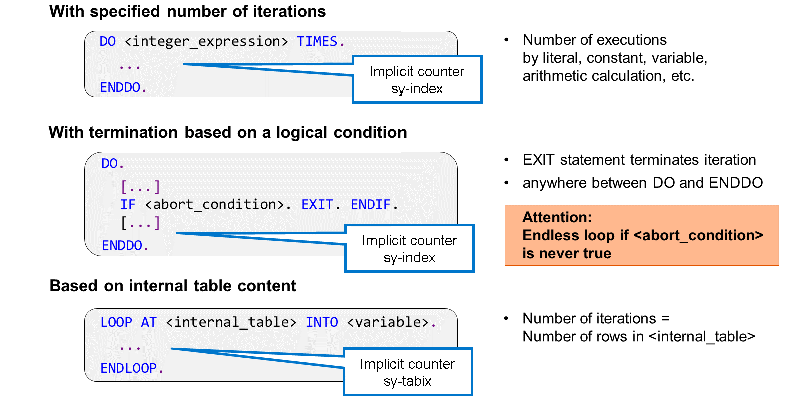

# 🌸 2 [IMPLEMENTING LOOP](https://learning.sap.com/learning-journeys/learn-the-basics-of-abap-programming-on-sap-btp/implementing-loops_d5638237-9d67-4883-b176-4fc60d3bfb0c)

> 🌺 Objectifs
>
> - [ ] Vous pourrez implémenter des loops.

## 🌸 IMPLEMENTING LOOPS

En ABAP, les loops sont définies dans un bloc de code exécuté plusieurs fois.

La forme la plus simple de boucle consiste en un bloc de code entouré d'instructions `DO` à `ENDDO`. Sans autre mesure, ces instructions pourraient créer une boucle sans fin, ce qui doit être évité par l'une des possibilités suivantes :

#### 💮 **Nombre de loops spécifié** :

En étendant l'instruction `DO` avec une expression entière suivie du mot-clé `TIMES`, vous pouvez spécifier explicitement la fréquence de traitement du bloc de code. L'expression entière peut être aussi simple qu'un littéral numérique, mais des calculs arithmétiques peuvent également être utilisés. Si la valeur de l'expression est égale à 0, le bloc de code entre `DO` et `ENDDO` n'est pas exécuté et le programme continue immédiatement avec le code suivant `ENDDO`.

#### 💮 **Abandon basé sur une condition logique** :

Vous pouvez interrompre une boucle à tout moment à l'aide de l'instruction `EXIT`. Le programme continue alors avec le code suivant `ENDDO`. Notez qu'en dehors de la boucle, `EXIT` a un effet différent : il met fin au traitement du bloc de traitement en cours, par exemple la méthode courante.

Habituellement, `EXIT` est entouré de `IF` et `ENDIF` pour terminer la boucle en fonction d'une condition d'abandon. Sachez que de telles boucles peuvent se transformer en boucles sans fin si la condition d'abandon n'est jamais vraie.

Bien sûr, il est possible de combiner les deux techniques, c'est-à-dire spécifier explicitement le nombre de boucles, puis quitter la boucle avec `EXIT`. Ainsi, le nombre de boucles devient un nombre maximal qui pourrait ne pas être atteint à l'exécution.

Dans le bloc de code entre `DO` et `ENDDO`, vous pouvez implémenter des accès en lecture à l'objet de données intégré ABAP `SY-INDEX`. Cette variable entière sert de compteur de boucles ; l'exécution ABAP l'incrémente d'une unité au début de chaque nouvelle boucle.

La variable intégrée ABAP `SY-TABIX` peut remplir une fonction similaire pour les boucles. Cependant, sachez que `SY-TABIX` n'est pas réellement un compteur, mais qu'elle identifie la position de la ligne de table traitée dans la boucle en cours.

## 🌸 IMPLEMENTING DO ENDDO LOOP

### BUSINESS EXAMPLE

En utilisant les mots-clés `DO . . ENDDO`, les utilisateurs peuvent souhaiter créer une boucle avec un nombre spécifié de boucles.

[Exercices](<./assets/hands_on%20(2).pdf>)

## 🌸 IMPLEMENTING DO ENDDO LOOP WITH AN ABORT CONDITION

### BUSINESS EXAMPLE

En utilisant les mots-clés `DO . . ENDDO`, les utilisateurs peuvent souhaiter créer une boucle avec une condition d'abandon à l'aide du mot-clé `EXIT`.

[Exercices](<./assets/hands_on%20(3).pdf>)
