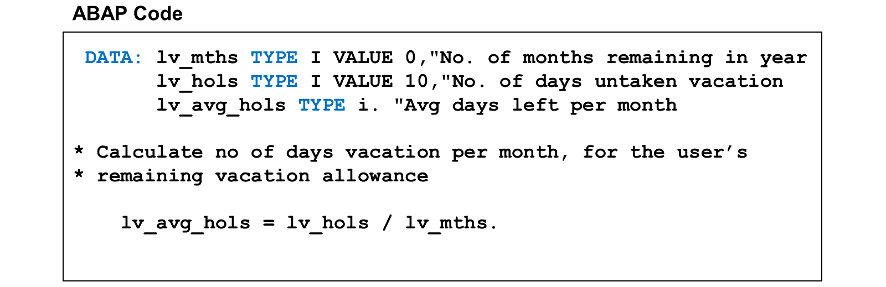
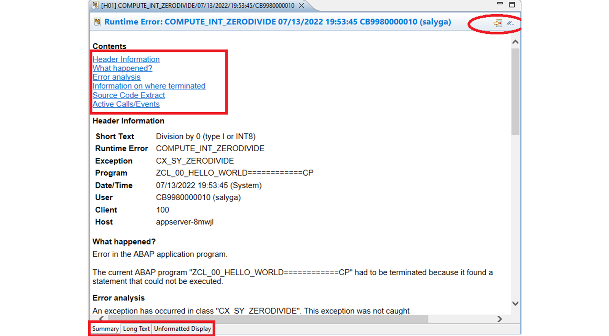
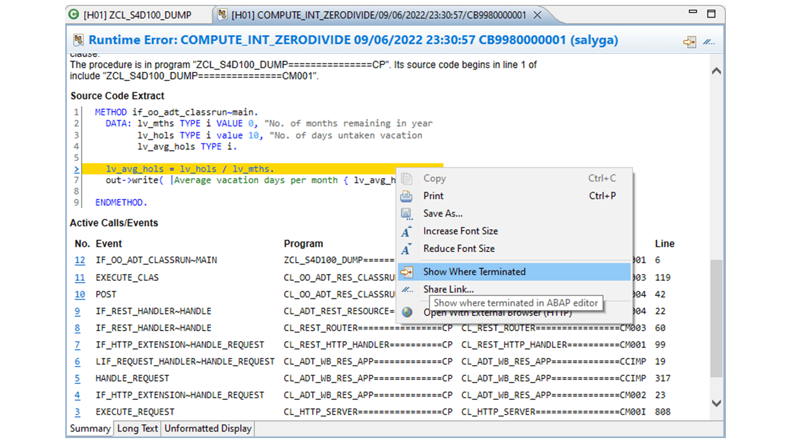

# 🌸 1 [ANALYZING RUNTIME ERRORS](https://learning.sap.com/learning-journeys/learn-the-basics-of-abap-programming-on-sap-btp/analyzing-runtime-errors)

> 🌺 Objectifs
>
> - [ ] Vous pourrez analyser les erreurs d'exécution.

## 🌸 ABAP SHORT DUMP

### THE NEED OF DEBUGGING

Il est indéniable que des erreurs surviennent dans les programmes. Cependant, elles se manifestent de différentes manières. Lorsqu'un utilisateur lance une application défectueuse, celle-ci peut planter, un imprévu peut se produire, voire rien du tout. Du point de vue de l'utilisateur, au niveau de l'interface utilisateur, il est impossible de déterminer précisément comment et pourquoi cette erreur s'est produite.

En tant que développeur, vous devez maintenant examiner le programme plus en détail, ligne par ligne, afin d'identifier précisément les instructions et les combinaisons de valeurs des différentes variables du programme qui ont provoqué l'erreur. C'est là qu'intervient le débogueur.

### RUNTIME ERRORS

Il est important d'effectuer régulièrement une vérification de la syntaxe lors de l'écriture de code ABAP. Cependant, une syntaxe correcte ne garantit pas toujours le bon fonctionnement de votre programme à l'exécution.

Par exemple, les calculs de votre programme peuvent poser problème selon les valeurs utilisées. La figure « Un programme syntaxiquement correct peut présenter des problèmes » illustre un programme qui, bien que syntaxiquement correct, peut provoquer une erreur d'exécution.

### ABAP SHORT DUMP

Si l'environnement d'exécution rencontre une instruction impossible à exécuter, il arrête le programme et déclenche une erreur d'exécution. Chaque erreur d'exécution est identifiée par un nom et associée à une situation d'erreur spécifique. L'environnement d'exécution arrête le programme si aucune erreur d'exécution n'est détectée. L'erreur d'exécution ABAP est affichée dans l'afficheur d'erreurs d'exécution ABAP à partir d'ABAP 7.53.

L'afficheur d'erreurs d'exécution ABAP peut être ouvert via différents points d'entrée :

- Si l'erreur survient pendant l'exécution de l'application ABAP, une boîte de dialogue apparaît en bas à droite. Choisissez **Show** pour afficher l'erreur.

- Dans la **Feed Reader view**, double-cliquez sur l'entrée d'erreur d'exécution.

Dans la barre d'outils, vous pouvez accéder à l'emplacement du code source où le vidage s'est produit et partager le lien vers celui-ci.

Trois onglets sont disponibles en bas de l'éditeur :

1. Le premier fournit les informations suivantes :

- Informations d'en-tête

- Analyse des erreurs

- Informations sur l'endroit où le programme s'est terminé

- Extrait du code source

- La ligne où l'erreur s'est produite est mise en surbrillance ; sélectionnez-la pour accéder à l'erreur dans le code source

- Appels/événements actifs

2. L'onglet Texte long fournit les informations complètes du dump. Il prend en charge les fonctionnalités Plan et Plan rapide (Ctrl+O sur votre clavier).

3. L'onglet Affichage non formaté fournit les informations du dump dans un format technique, uniquement nécessaire pour des analyses spécifiques.

Un dump court vous permet également d'accéder directement au débogueur ABAP pour afficher les valeurs des variables juste avant l'erreur d'exécution.

Les erreurs d'exécution sont normales. Vous les rencontrerez probablement fréquemment lors du développement de vos programmes. Cependant, il est important de les éviter. Un utilisateur de votre système de production pourrait être désorienté s'il constatait une erreur d'exécution, comme celle illustrée dans la figure. L'utilisateur peut ne pas comprendre une référence à l'application ABAP et aux informations techniques présentées.

### AVOIDING RUNTIME ERRORS

Dans l'exemple ci-dessus, une logique a été ajoutée pour éviter l'erreur d'exécution de division par zéro.

[Exercices](./assets/hands_on.pdf)
