# 🌸 1 [BUILDING AN **ABAP RESTFUL** APP](https://learning.sap.com/learning-journeys/learn-the-basics-of-abap-programming-on-sap-btp/building-an-abap-restful-application)

> 🌺 Objectifs
>
> - [ ] Comprendre les composants d'une application RESTful ABAP.
>
> - [ ] Créer une application d'épicerie durable.

## 🌸 UNDERSTANDING RESTFUL APPLICATION PROGRAMMING COMPONENTS

Le **ABAP RESTful Application Programming Model** définit l'architecture de développement de bout en bout des **services OData** (tels que les applications **SAP Fiori**) dans l'environnement ABAP. Il prend en charge le développement de tous types d'**applications Fiori** et la publication d'**API Web**. Il s'appuie sur des technologies et des frameworks tels que **Core Data Services (CDS)** pour la définition de modèles de données sémantiquement riches, ainsi que sur une infrastructure de modèles de services pour la création de **services OData** avec liaisons à un **protocole OData**, et de services applicatifs ABAP pour une logique personnalisée et des interfaces utilisateur \*\*SAPUI5\*\*.

Dans cette unité, vous créerez une application d'épicerie durable à l'aide d'une application **ABAP RESTful**. Les objets requis pour une application **ABAP RESTful** incluent :

- **Database Tables**

- **Core Data Service (CDS) Entities**

- **Core Data Service (CDS) Behavior Definitions**

- **Core Data Service (CDS) Metadata Extensions**

- **Service Definition**

- **Service Binding**

Le développement d'une application RAP comprend les étapes principales suivantes :

#### 💮 **Provide the Database Tables** :

Le développement d'une **application RESTful** commence par la fourniture des tables de base de données. Selon le scénario de développement, il peut s'agir de tables existantes, héritées ou créées spécifiquement pour l'application.

#### 💮 **Define the Data Model** :

Le **data model** de l'objet métier est défini à l'aide de **Core Data Service (CDS) Views**. Selon qu'il s'agit d'un objet métier simple ou composite, une ou plusieurs **CDS views** sont requises. Dans le cas d'un objet métier composite, c'est également à cet endroit que vous définissez la hiérarchie des entités.

#### 💮 **Define and Implement the Behavior (Transactional apps only)** :

Le comportement d'un objet métier d'**application RESTful** est défini dans un objet de référentiel appelé **Core Data Service (CDS) Behavior Definition**. Généralement, le comportement d'un objet métier de programmation d'**application RESTful** nécessite également une logique supplémentaire implémentée dans un type de classe ABAP globale appelé **Behavior Pool**. Pour une application non transactionnelle, par exemple un rapport de liste, la définition ou l'implémentation du comportement peut être omise.

#### 💮 **Project the RESTful Application Programming Business Object and provide service-specific Metadata** :

La projection d'objet métier de programmation d'**application RESTful** se compose d'une projection de **data model** et, si un comportement a été défini, d'une projection de comportement. Pour définir une projection, créez une ou plusieurs **Core Data Service (CDS) projection views**, qui sont un type de **CDS view**, et une **Behavior Projection**, qui est un type de **behavior definition**. Pour les services d'interface utilisateur (UI), les **projection view(s)** doivent être enrichies de **metadata** spécifiques à l'UI. Pour permettre l'extensibilité future de l'application, nous recommandons de placer les annotations spécifiques au service dans des **metadata extensions**.

#### 💮 **Define the Service** :

Dans les **applications RESTful**, un service est défini par la création d'une **Service Definition**. Cette définition référence les **projection view(s)** et spécifie ce qui doit être exposé, c'est-à-dire ce qui est visible pour le consommateur du service.

#### 💮 **Bind the Service and Test the Service** :

Une **service binding** est nécessaire pour spécifier comment le service doit être consommé (UI ou API Web) et via quel protocole (OData V2 ou OData V4). Pour les services d'interface utilisateur, une Preview est disponible.

## 🌸 CREATION OF THE SUSTAINABLE GROCERY APPLICATION

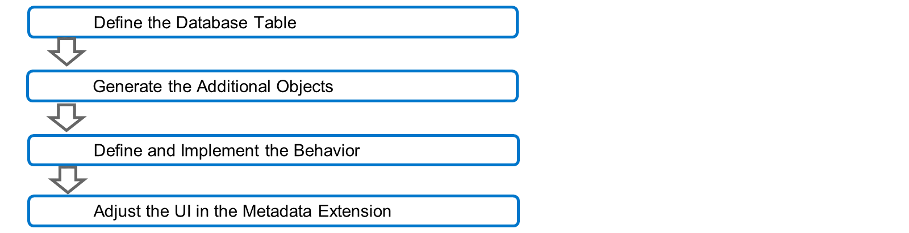

Pour créer le programme d'**application RESTful**, l'objet suivant doit être créé ou généré :

#### 💮 **Database Table** :

Une table de base de données stockera les données de manière permanente. Nous allons créer une table de base de données simple pour stocker les informations relatives à vos achats d'épicerie.

#### 💮 **Additional Objects** :

Un certain nombre d'objets requis par le programme d'**application RESTful** seront générés via la fonctionnalité **Generate ABAP Repository Objects...** des outils de développement ABAP (ADT).

#### 💮 **Behavior** :

Le comportement d'un objet métier de programme d'**application RESTful** est défini dans un objet de référentiel appelé **Core Data Service (CDS) Behavior Definition**. Généralement, ce comportement nécessite également une logique supplémentaire, implémentée dans un type de classe ABAP globale appelé **Behavior Pool**. Pour une application non transactionnelle, par exemple un rapport de liste, la définition ou l'implémentation du comportement peut être omise. Le comportement que nous ajouterons consiste en une action permettant de vérifier si les articles d'épicerie sélectionnés sont périmés. Cela activera l'indicateur d'expiration dans la table de base de données.

#### 💮 **Metadata Extension** :

Le fichier **metadata extension** permet de personnaliser l'interface utilisateur.

## 🌸 CREATE A DATABASE TABLE

### DATABASE TABLE FOR SUSTAINABLE GROCERY APP

Une table de base de données est nécessaire pour stocker nos données d'épicerie. Nous allons créer une table de base de données à utiliser dans notre application d'épicerie durable.

[Exercices](./assets/hands_on.pdf)

## 🌸 GENERATING ADDITIONAL OBJECTS

### GENERATING ADDITIONAL OBJECTS

Nous venons de définir une table de base de données pour stocker nos données, mais l'application que nous allons créer nécessite d'autres objets que cette table. Nous pouvons générer ces objets à l'aide d'un wizard dans ABAP Development Tools (ADT).

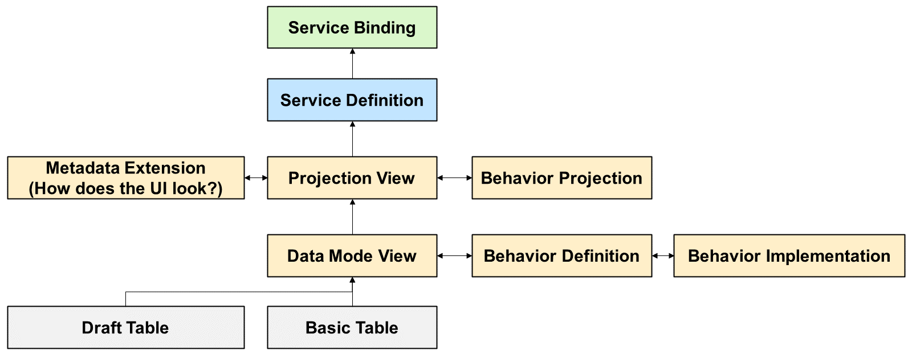

Les objets générés contiennent toutes les informations nécessaires pour fournir à une application fonctionnelle des fonctionnalités de création, de lecture, de mise à jour et de suppression. Nous ajusterons et étendrons ultérieurement certains de ces objets afin de modifier l'apparence de l'interface utilisateur et d'implémenter un contrôle des produits périmés.

Pour démarrer le générateur d'objets, faites un clic droit sur le nom de la table dans le **Project Explorer** et choisissez **Generate ABAP Repository Objects**. Le wizard démarre et vous devez saisir un package auquel tous les nouveaux objets seront affectés. Sélectionnez ensuite le générateur. Pour cet exemple, nous utilisons le service d'interface utilisateur du modèle de programmation d'applications RESTful ABAP.

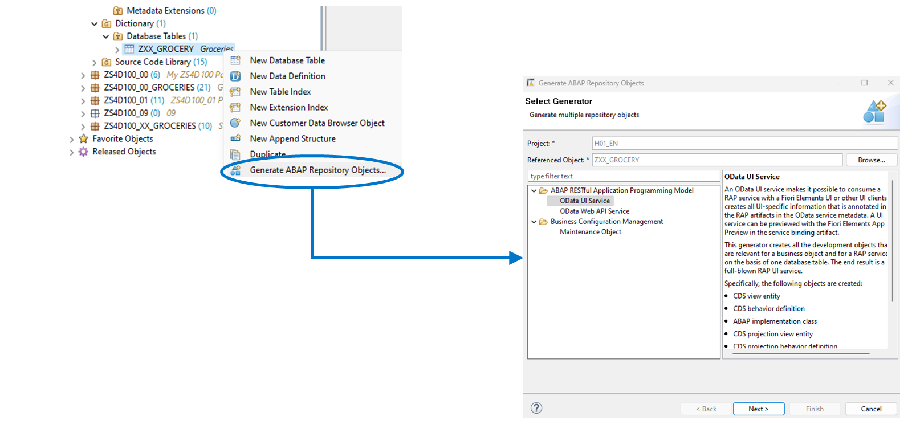

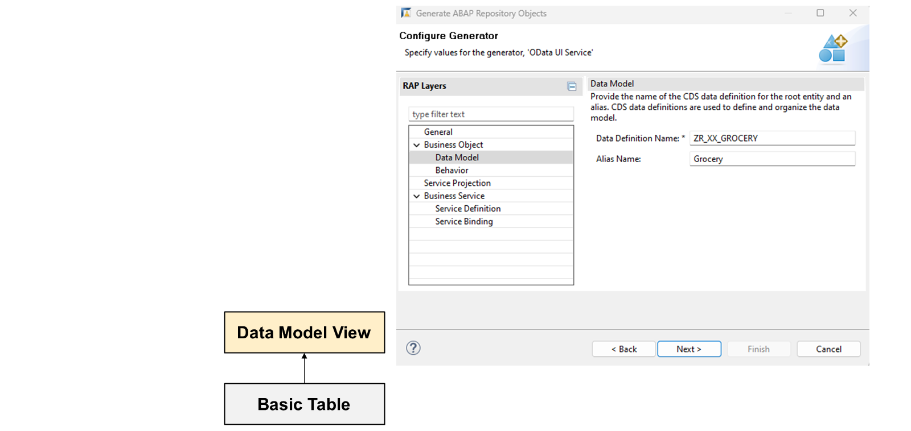

Dans le modèle de programmation d'application RESTful, vous n'accédez pas directement aux tables de base de données. Vous utilisez plutôt une **Core Data Service (CDS) view entity** pour définir le **data model**. À ce stade, dans le générateur, vous saisissez le nom d'une définition de données. Puisque vous travaillez dans l'espace de noms client, le nom doit commencer par Z ou Y.

Vous devez également saisir un alias utilisé dans l'application générée pour identifier l'entité représentée par la définition de données.

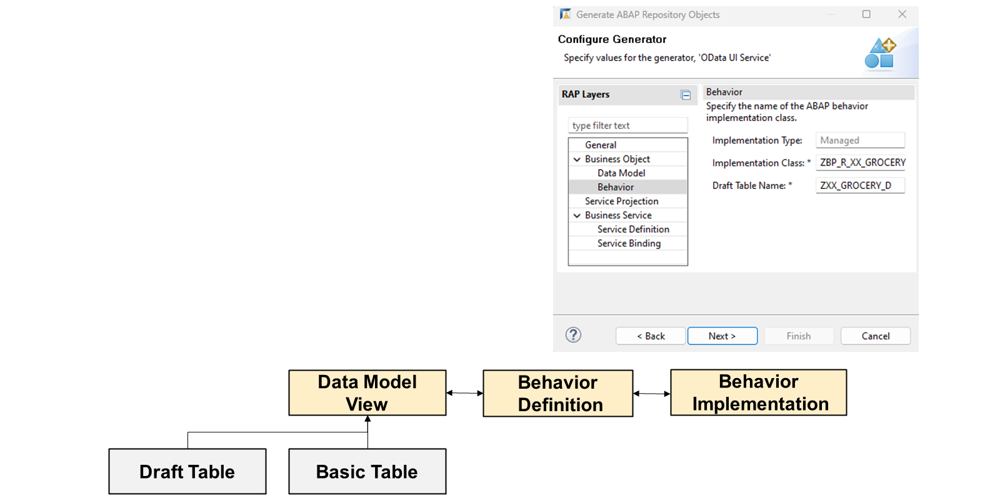

Grâce à la **data mode view** que vous créez, vous pouvez lire les données de la base de données. Cependant, notre application doit également pouvoir créer, modifier et supprimer des données. Pour ce faire, vous devez définir une **behavior definition**. Celle-ci est liée à la **data mode view** et spécifie les actions de création, de mise à jour et de suppression autorisées.

Outre la définition des actions de création, de mise à jour et de suppression disponibles, la **behavior definition** peut également contenir les types de définitions suivants :

- Draft enabling (**draft**s)

- Numérotation automatique

- Validations : Il s'agit de contrôles effectués lors de la saisie de données dans l'application

- Déterminations : Une détermination effectue un calcul pour remplir les champs de l'enregistrement de données.

Le générateur crée la **behavior definition** et active la numérotation automatique du champ UUID. Si vous devez utiliser des validations et des déterminations, vous devez les ajouter manuellement.

La **behavior definition** déclare les validations et déterminations existantes. Cependant, elles nécessitent également une implémentation ABAP. Les implémentations sont des méthodes ; une classe d'implémentation est donc nécessaire. La convention de nommage de cette classe consiste à utiliser le préfixe Z ou Y pour l'espace de noms client, suivi de `BP_R`. BP signifie « pool de comportement » et R signifie « restreint ».

La **behavior definition** définit également l'activation du **draft** pour l'entité. En fonction de la définition de la vue du **data model**, le générateur crée une table correspondante qui contiendra les données **draft**. Vous devez donc spécifier le nom de la table **draft** à ce stade. La convention de nommage stipule que pour une table de base `Z<table>`, la table **draft** doit être appelée `Z<table>_D`.

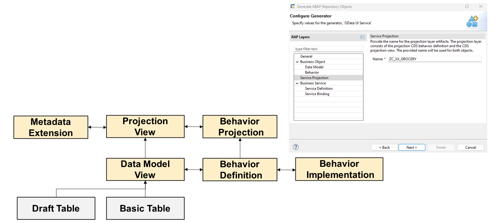

Le **data model** et sa **behavior definition** constituent une implémentation réutilisable d'une entité métier spécifique. L'étape suivante de la génération d'objets consiste à spécifier le nom de la **service projection**. Cette projection contient une vue avec les champs requis pour une application spécifique, une **behavior definition** spécifiant les comportements définis à inclure dans l'application, et une extension de métadonnées. Cette extension de métadonnées contient des **Core Data Service (CDS) annotations** qui définissent l'apparence de l'interface utilisateur de l'application.

La convention de nommage de la couche de projection est `ZC_<nom>`. La vue de projection, la projection de comportement et l'extension de métadonnées porteront toutes le même nom.

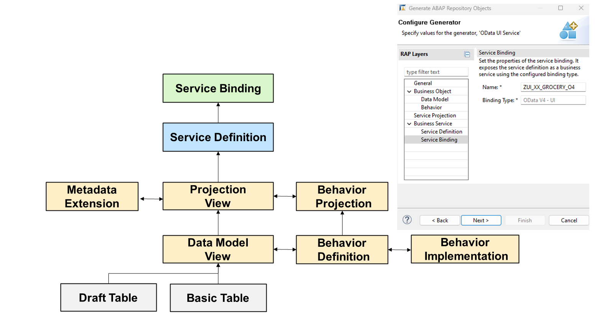

Pour exposer l'application, vous devez créer une **service definition** et une **service binding**. La **service definition** spécifie la vue de projection à exposer dans ce service, et la **service binding** spécifie le protocole à utiliser. Dans notre exemple, définissez un service d'interface utilisateur OData basé sur la version 4 du protocole OData.

La convention de nommage de la **service definition** est `Z<nom>`. La convention de nommage de la **service binding** est `ZUI_<nom>_O4`. Cela indique que la liaison est destinée à une application Fiori Elements et qu'elle utilise la version 4 du protocole OData.

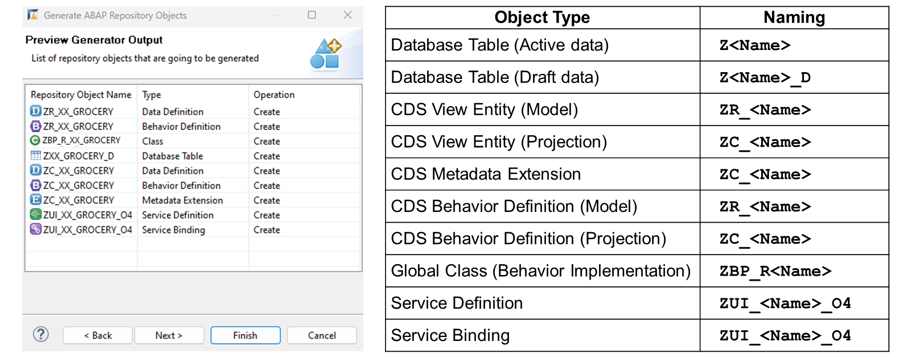

À la fin de l'assistant, le système affiche la liste de tous les objets qu'il va générer. Vous pouvez vérifier vos entrées par rapport aux conventions de nommage, repérer les erreurs de frappe et, si nécessaire, revenir en arrière et corriger celles qui sont incorrectes.

[Exercices](<./assets/hands_on%20(1).pdf>)

## 🌸 MODIFYING GENERATED OBJECTS

Plusieurs objets doivent être modifiés pour personnaliser notre application.

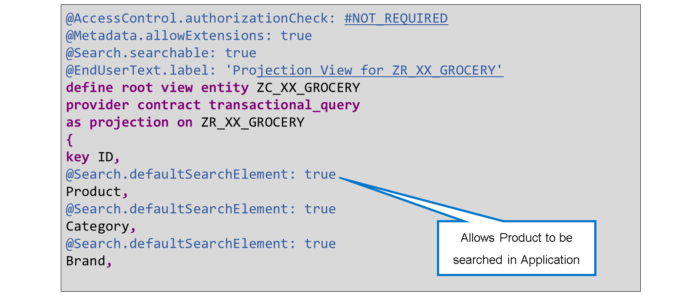

Dans le fichier de définition des données, les annotations `ZC_XX_GROCERY` peuvent être ajoutées pour activer les fonctions de recherche de l'application. Les annotations commencent par le symbole `@`. Ici, nous ajoutons des annotations pour activer les fonctions de recherche de champs spécifiques de l'application. L'annotation est placée avant le nom du champ.

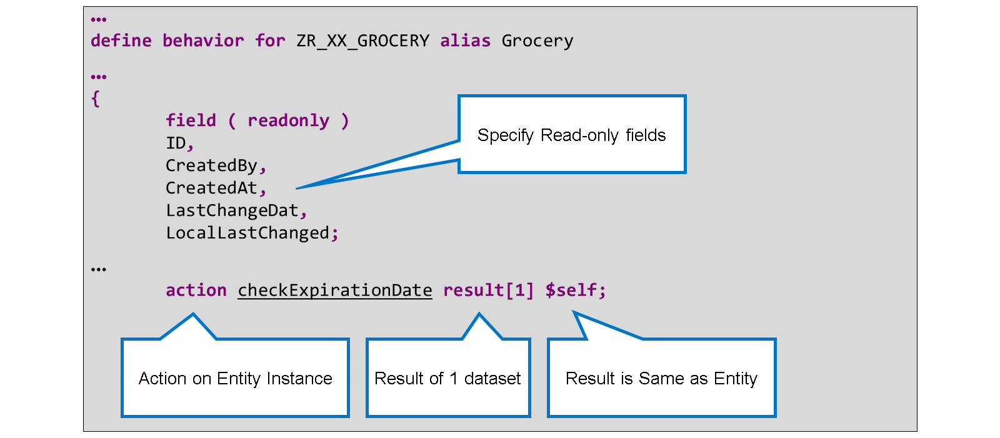

Dans la définition de comportement `ZR_XX_GROCERY`, les champs `CreatedBy` et `CreatedAt` seront en lecture seule. Nous créons également une action d'instance `CheckExpirationDate`.

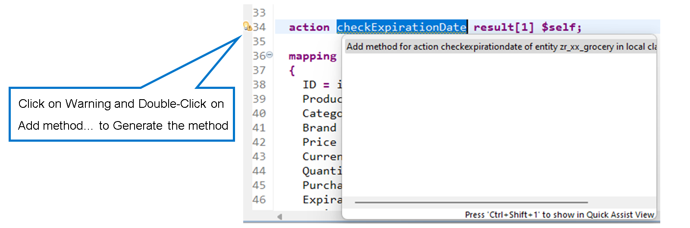

Dans la définition de comportement `ZR_XX_GROCERY`, vous pouvez demander à Eclipse de générer la méthode `checkExpirationDate` en cliquant sur l'avertissement en marge de l'instruction d'action. Double-cliquez ensuite sur l'instruction **Add method ...** pour que la méthode soit générée dans les classes locales de la classe d'implémentation `ZBP_R_XX_GROCERY`.

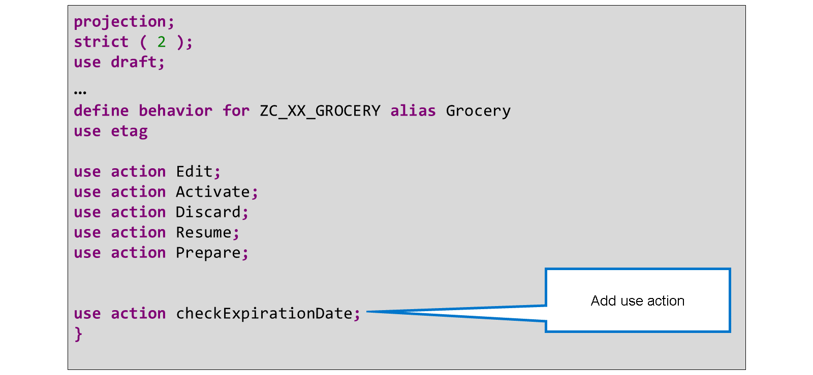

Dans la définition de comportement `ZR_XX_GROCERY`, l'action d'utilisation `checkExpirationDate` est ajoutée pour activer l'action.

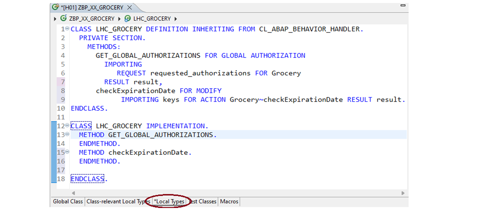

Dans la classe d'implémentation `ZBP_R_XX_GROCERY`, sous l'onglet **Local Types**, se trouve la méthode de l'action `checkExpirationDate`. Ce code permet de vérifier la date d'expiration d'un article d'épicerie sélectionné et de définir l'indicateur **expired** sur **true** ou **false**. Le code requis est présenté dans l'exercice.

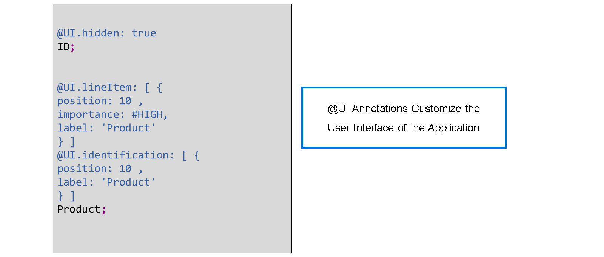

Le **metadata extension** permet d'ajuster l'interface utilisateur. `@UI.lineItem` fait référence à la liste initiale, tandis que `@UI.identification` fait référence à la liste détaillée sur un second écran.

Dans cet exemple, l'ID est masqué dans l'application. La position est de gauche à droite, de la valeur la plus faible à la plus élevée. Importance : `#HIGH` indique que le champ doit être affiché sur toutes les tailles d'appareil, tandis que importance : `#MEDIUM` indique que le champ est affiché sur les grands écrans (ordinateurs de bureau) et les écrans moyens (tablettes), mais pas sur les petits écrans (smartphones).

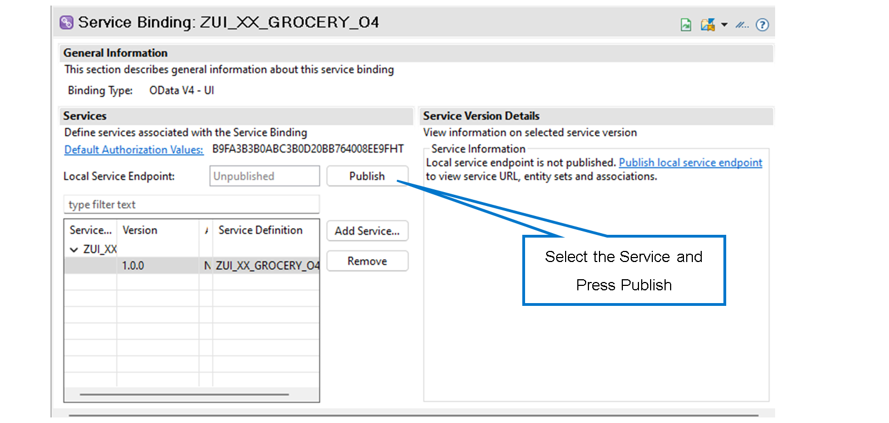

Pour publier le service, ouvrez la **service binding** `ZUI_XX_GROCERY_O4`, sélectionnez le service et appuyez sur le bouton **Publish**.

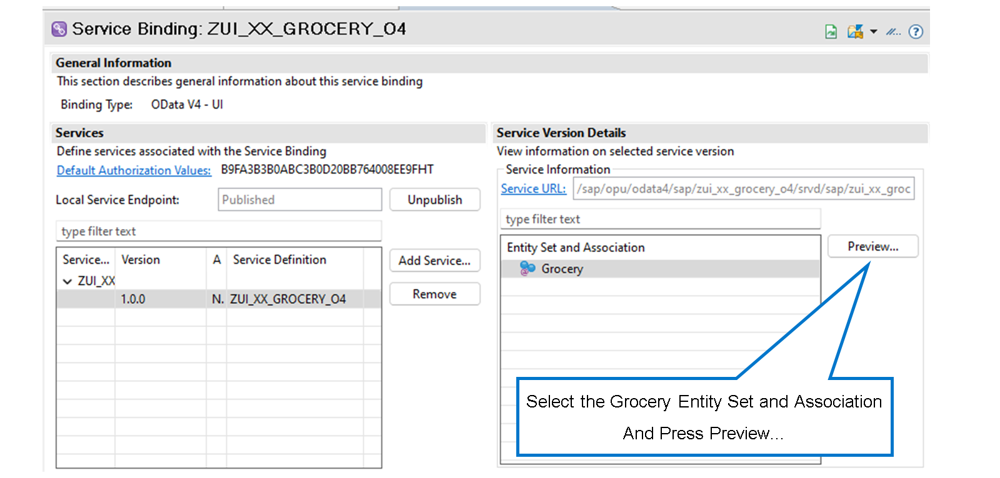

Pour tester l'application, sélectionnez **Grocery** dans la liste des **Entity Set** et l'**Association of the service binding** `ZUI_XX_GROCERY_04`. Cliquez sur **Preview...** pour lancer l'application.

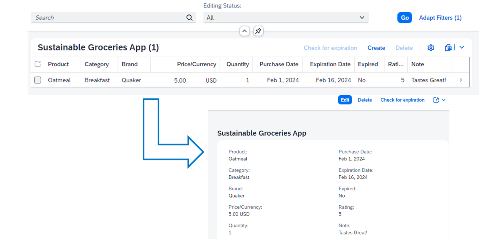

Une fois dans l'application **Sustainable Grocery**, appuyez sur **Go** pour remplir la liste de courses à partir des données existantes. Vous pouvez également utiliser le champ **Search** pour rechercher des articles d'épicerie. Appuyez sur **Create** pour ajouter un nouvel article d'épicerie. Appuyez sur **Delete** pour supprimer un article. Sélectionnez les articles cochés et appuyez sur **Check for expiration** pour vérifier la date d'expiration et activer l'indicateur **Expired**.

Si vous cliquez sur un article d'épicerie, vous serez redirigé vers sa page de détails. Depuis cette page, vous pouvez appuyer sur **Edit** pour modifier les valeurs de l'article, sur **Delete** pour supprimer l'article, puis sur **Check for expiration** pour activer l'indicateur **Expired**.

## 🌸 ENABLE SEARCH CAPABILITIES

### ENABLE SEARCH CAPABILITIES OF SUSTAINABLE GROCERY APP

Vous devez activer la recherche dans l'application Sustainable Grocery. Cette fonctionnalité est activée dans le fichier de définition de données ZC_XX_GROCERY.

[Exercices](<./assets/hands_on%20(2).pdf>)

## 🌸 MODIFY BEHAVIOR

### MODIFY BEHAVIOR OF SUSTAINABLE GROCERY APP

[Exercices](<./assets/hands_on%20(3).pdf>)

## 🌸 CHECK PRODUCT EXPIRATION

### IMPLEMENT ABAP CODE FOR CHECK PRODUCT EXPIRATION DATE

[Exercices](<./assets/hands_on%20(4).pdf>)

## 🌸 ENHANCE USER INTERFACE

### CUSTOMIZE THE USER INTERFACE OF THE SUSTAINABLE GROCERY APP

L'interface utilisateur de l'application Sustainable Grocery doit être personnalisée pour spécifier quelles données afficher et de quelle manière.

[Exercices](<./assets/hands_on%20(5).pdf>)

## 🌸 PUBLISH THE SUSTAINABLE GROCERY APP

### PUBLISH THE SUSTAINABLE GROCERY APP

[Exercices](<./assets/hands_on%20(6).pdf>)

## 🌸 TEST THE SUSTAINABLE GROCERY APP

### TEST THE SUSTAINABLE GROCERY APP

[Exercices](<./assets/hands_on%20(7).pdf>)
