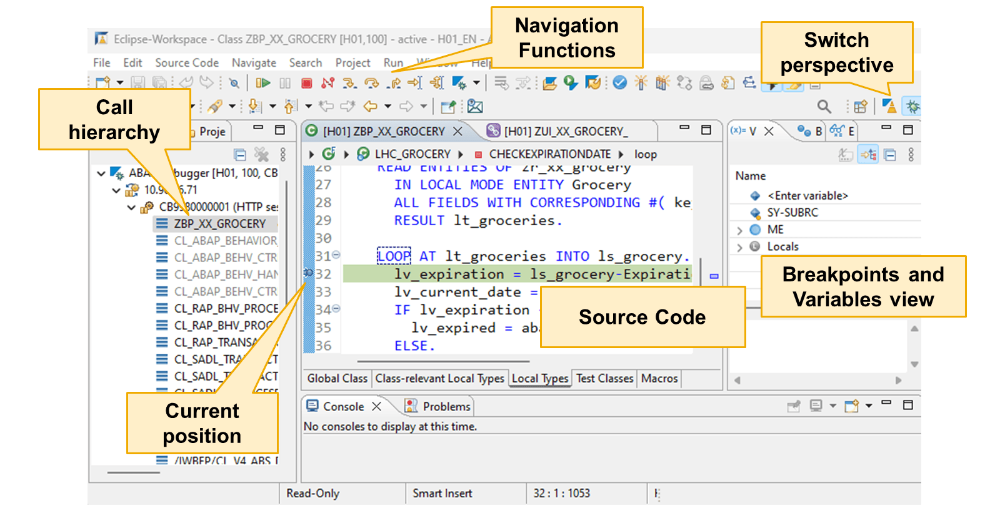
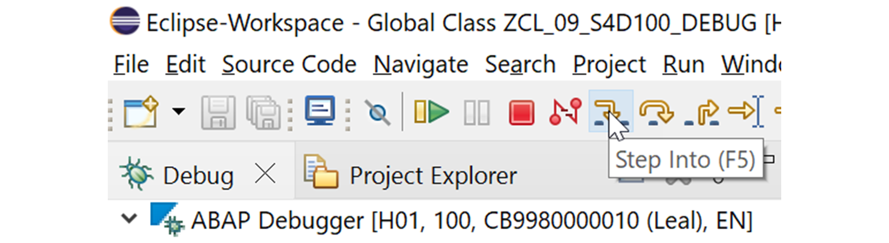
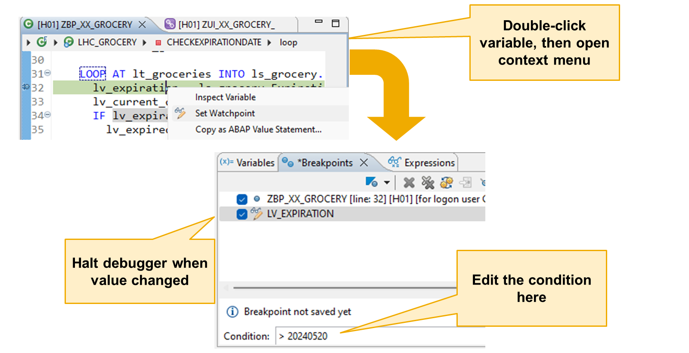

# 🌸 2 [USING ABAP DEBUGGER](https://learning.sap.com/learning-journeys/learn-the-basics-of-abap-programming-on-sap-btp/debugging-an-abap-program_fcc4a66d-35bb-48b6-bb9e-cf64a04c3266)

> 🌺 Objectifs
>
> - [ ] Vous serez capable de déboguer un programme ABAP.

## 🌸 START USING THE ABAP DEBUGGER IN ADT

Il est indéniable que des erreurs surviennent dans les programmes. Cependant, elles se manifestent de différentes manières. Lorsqu'un utilisateur lance une application défectueuse, celle-ci peut planter, un imprévu peut se produire, voire rien du tout. Du point de vue de l'utilisateur, au niveau de l'interface utilisateur, il est impossible de déterminer précisément comment et pourquoi cette erreur s'est produite.

En tant que développeur, vous devez examiner le programme plus attentivement, ligne par ligne, afin d'identifier les instructions et les combinaisons de valeurs des différentes variables du programme qui ont provoqué l'erreur. C'est là qu'intervient le débogueur.

Le débogueur de l'ADT est un outil de diagnostic important pour analyser une application ABAP.

Avec le débogueur, vous pouvez déterminer pourquoi un programme ne fonctionne pas correctement en y accédant pas à pas lors de l'exécution. Cela vous permet de visualiser les instructions exécutées et l'évolution des valeurs des variables au fur et à mesure de l'exécution du programme.

Pour utiliser le débogueur, vous devez d'abord décider où démarrer le processus de débogage. Une solution consiste à définir des points d'arrêt dans le code source, à exécuter le programme et à l'arrêter à ce point.

Voici quelques fonctionnalités disponibles dans le débogueur :

### FEATURES OF THE ABAP DEVELOPMENT TOOLS ADT DEBUGGER

| Feature                    | ADT Debugger               |
| -------------------------- | -------------------------- |
| Setting Breakpoints        | Yes                        |
| Watchpoints                | Yes (Depending on release) |
| Conditional breakpoints    | Yes                        |
| Stepping through code      | Yes                        |
| Displaying variable values | Yes                        |

### DEBUG AN ABAP PROGRAM USING ABAP DEVELOPMENT TOOLS (ADT)

Pour déboguer un programme ABAP avec ADT, vous utilisez la **Debug perspective**. Il s'agit d'une version personnalisée de la **Debug perspective** standard d'Eclipse, qui contient des vues et des fonctions particulièrement importantes pour le débogage.

Voici quelques éléments importants de la perspective du débogueur :

#### 💮 **Source Code View** :

La vue Code source est la partie centrale de la perspective du débogueur. Elle affiche le code source et met en évidence la position actuelle dans le programme.

#### 💮 **Variables View** :

La vue Variables est également très importante. Elle permet d'afficher les valeurs actuelles des variables.

#### 💮 **Breakpoints View** :

La vue Points d'arrêt est affichée à côté de la vue Variables (non sélectionnée dans la figure précédente, Perspective Débogage). Elle permet d'afficher, de supprimer ou de créer des points d'arrêt. Les points d'arrêt sont des points du programme où le traitement normal est interrompu. Le système affiche le débogueur afin que vous puissiez analyser l'état du programme à ce moment précis.

#### 💮 **Navigation Functions** :

Lors du débogage d'un programme, les fonctions de navigation permettent de contrôler l'exécution du code.

#### 💮 **Debug View** :

La vue Débogage, en haut à gauche, affiche la session de débogage et la hiérarchie des appels. Vous en aurez besoin ultérieurement pour déboguer les appels d'unités de modularisation, par exemple les méthodes.

#### 💮 **Perspective Selector** :

Vous pouvez revenir à la perspective ABAP grâce aux boutons de sélection de perspective situés dans le coin supérieur droit.

## 🌸 CONTROLLING THE EXECUTION OF THE CODE

### SOME NAVIGATIONS FUNCTIONS

Lorsque vous démarrez le débogage, utilisez les fonctions de navigation pour contrôler l'exécution du code.

Voici quelques fonctions de navigation importantes :

#### 💮 **Step Into (F5)** :

Choisissez « Pas à pas » ou appuyez sur la touche F5 de votre clavier pour exécuter une seule étape. Utilisez cette fonction pour une analyse étape par étape. Par exemple, vous souhaitez voir quel bloc de code d'une structure de contrôle est réellement exécuté.

#### 💮 **Resume (F8)** :

Choisissez « Reprendre » ou appuyez sur la touche F8 de votre clavier pour exécuter le programme jusqu'au point d'arrêt suivant. Si le débogueur ne rencontre plus de point d'arrêt, le programme est exécuté jusqu'à la fin et la session de débogage se termine.

#### 💮 **Run to Line (Shift+F8)** :

Choisissez « Exécuter jusqu'à la ligne » ou appuyez sur la touche Maj+F8 de votre clavier pour exécuter le programme jusqu'à la position actuelle du curseur. Choisir une ligne de code et cette fonction est une alternative pratique à la définition d'un point d'arrêt, à la sélection de « Reprendre » et à sa suppression.

#### 💮 **Jump to Line (Shift+F12)** :

Choisissez « Accéder à la ligne » ou appuyez sur Maj+F12 pour sauter des lignes de code ou revenir à du code déjà exécuté. Cette fonction peut être utile pour simuler ce qui se passerait si un morceau de code était supprimé ou pour recommencer le débogage d'un morceau de code que vous avez omis d'analyser la première fois. Gardez à l'esprit qu'il s'agit d'un saut, et non d'une exécution. Lorsque vous revenez en arrière, les modifications apportées aux objets de données ne sont pas annulées.

#### 💮 **Terminate** :

Choisissez « Terminer » (icône en forme de cadre rouge) si vous avez terminé le débogage et que vous ne souhaitez pas exécuter le reste du programme. La session de débogage se termine immédiatement.

### DISPLAY CONTENT OF DATA OBJECTS

Une façon d'analyser le contenu des objets de données dans le débogueur est d'utiliser la fonctionnalité de survol de l'éditeur ABAP. En mode débogage, placez le curseur sur le nom d'un objet de données et patientez quelques instants. Une boîte de dialogue s'ouvre avec son contenu.

Une autre façon d'analyser le contenu des objets de données dans le débogueur est la vue Variables. Cette vue affiche la liste des objets de données et leurs valeurs actuelles. La liste principale, appelée variables de niveau supérieur, contient par défaut des objets de données intégrés. Dans cet exemple, SY-SUBRC et ME. Développez le nœud Locals pour afficher la liste de tous les objets de données variables définis dans le bloc de traitement actuel.

Il existe trois façons d'ajouter des objets de données à la liste principale de la vue Variables :

- Dans l'éditeur, double-cliquez sur le nom d'un objet de données.

- Dans la liste des variables, faites un clic gauche sur l'espace réservé `<Entrer une variable>` et saisissez le nom de l'objet de données.

- Faites un clic droit sur une variable dans le nœud Locals et choisissez « Afficher comme variable de niveau supérieur ».

Une façon d'analyser le contenu des objets de données dans le débogueur est d'utiliser la fonctionnalité de survol de l'éditeur ABAP. En mode débogage, placez le curseur sur le nom d'un objet de données et patientez un instant. Une boîte de dialogue s'ouvre avec son contenu.

Une autre façon d'analyser le contenu des objets de données dans le débogueur est la vue Variables. Cette vue affiche la liste des objets de données et leurs valeurs actuelles. La liste principale, appelée variables de niveau supérieur, contient par défaut des objets de données intégrés. Dans l'exemple, il s'agit de SY-SUBRC et ME. Développez le nœud Locals pour afficher la liste de tous les objets de données variables définis dans le bloc de traitement actuel.

Il existe trois façons d'ajouter des objets de données à la liste principale de la vue Variables :

- Dans l'éditeur, double-cliquez sur le nom d'un objet de données.

- Dans la liste des variables, faites un clic gauche sur l'espace réservé `<Entrer une variable>` et saisissez le nom de l'objet de données.

- Faites un clic droit sur une variable dans le nœud Variables locales et choisissez « Afficher comme variable de niveau supérieur ».

Astuce : pour supprimer un objet de données de la liste, faites un clic droit dessus et choisissez « Supprimer ».

### WATCHPOINTS

Un simple point d'observation sur une variable provoque l'arrêt du programme dans le débogueur dès que la valeur de cette variable change. En ajoutant une condition, le programme ne s'arrête que lorsque la valeur de la variable change et que la condition est remplie.

Pour définir un point d'observation sur une variable, double-cliquez sur la variable dans le code source, puis faites un clic droit dessus et choisissez « Définir un point d'observation ». Un point d'observation est alors créé sur cette variable, visible dans la vue Points d'arrêt.

Pour ajouter une condition à un point d'observation, sélectionnez-le dans la liste des points d'arrêt et saisissez la condition dans le champ Condition. Appuyez sur Entrée pour enregistrer le point d'observation avec la condition.

Si la valeur inattendue d'une variable vous pose problème, vous pouvez suivre sa valeur pendant l'exécution du programme grâce à un point d'observation.

Un simple point d'observation sur une variable provoque l'arrêt du programme dans le débogueur dès que la valeur de cette variable change. En ajoutant une condition, le programme ne s'arrête pas à chaque changement de valeur de la variable, mais uniquement lorsque la condition est remplie.

Pour définir un point d'observation sur une variable, uniquement dans le débogueur, sélectionnez la variable dans le code source, puis faites un clic droit dessus et choisissez « Définir un point d'observation ». Un point d'observation est alors créé sur la variable, visible dans la vue Points d'arrêt.

Sélectionnez la variable Point d'observation pour y ajouter une condition, sélectionnez-la dans la liste des Points d'arrêt et saisissez la condition dans le champ Condition. Appuyez sur Entrée pour enregistrer le point d'observation avec la condition.

Pour supprimer le point d'observation, accédez à la vue Points d'arrêt, faites un clic droit sur la variable Point d'observation et choisissez « Supprimer ».

## 🌸 DEBUG AN ABAP APPLICATION AND SET A WATCHPOINT

### BUSINESS EXERCISE

[Exercices](<./assets/hands_on%20(8).pdf>)
