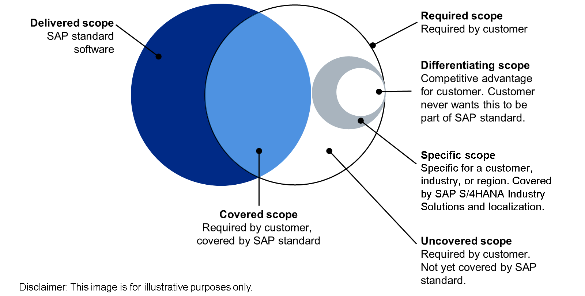

# 🌸 1 [EVALUATING THE NEED FOR EXTENSIONS](https://learning.sap.com/learning-journeys/practicing-clean-core-extensibility-for-sap-s-4hana-cloud/evaluating-the-need-for-extensions_aaae6788-b141-45d3-9d3b-3ead49dba796?userlogin=true)

> 🌺 Objectifs
>
> - [ ] Vous serez capable de décrire ce qu'est une extension logicielle et pourquoi elles sont nécessaires

## 🌸 WHAT IS A SOFTWARE EXTENSION?

Nous commençons notre discussion sur les **extensions** en examinant le terme **extension**. Qu'est-ce qu'une **extension **? Qu'est-ce que l'**extension** ? Et surtout, pourquoi ?

Tout logiciel est conçu avec un **périmètre** défini. Ce **périmètre** définit deux éléments :

- Le résultat fourni par le logiciel au client ;

- La manière dont le logiciel fournit ce résultat ;

Du point de vue du client, c'est la réalisation de ces résultats qui crée de la valeur. Pour un éditeur de logiciels comme SAP, le périmètre constitue le fondement de la proposition de valeur présentée au client et constitue un élément essentiel du processus de conception logicielle.

L'un des plus grands atouts de SAP ERP au cours de son histoire a sans aucun doute été son périmètre. Fournir un produit conçu pour couvrir la quasi-totalité des processus métier dans les domaines de la logistique, de la finance et des ressources humaines est une tâche ardue. Si l'on ajoute à cela le fait que la clientèle de SAP couvre plus de 30 secteurs différents, l'ampleur de la tâche devient encore plus évidente. Chaque secteur d'activité possède ses propres méthodes spécialisées pour exécuter certains processus métier (par exemple, les banques peuvent concevoir et exécuter leurs processus d'approvisionnement différemment d'une entité gouvernementale ou de l'armée) et, même au sein d'un même secteur, les entreprises peuvent concevoir et exécuter un processus différemment. Mais SAP n'a jamais éludé le défi de la portée. Bien au contraire, il a été relevé avec enthousiasme.

### THE NEED FOR FLEXIBILITY

Si l'étendue du périmètre couvert par les applications SAP est sans conteste un facteur important pour inciter les clients à adopter les solutions SAP, un autre facteur est valorisé : la flexibilité : la possibilité d'adapter le périmètre livré à leurs besoins spécifiques. SAP s'est donc retrouvé face à un autre défi : comment offrir non seulement un périmètre aux clients, mais aussi la flexibilité nécessaire pour l'adapter à leurs besoins spécifiques ? Comme pour le périmètre, SAP a relevé le défi de la flexibilité avec enthousiasme. Relever ce défi a toutefois nécessité une réflexion conceptuelle originale de la part de SAP.

Une solution potentielle aurait consisté à fournir au client un système dont le code source, une fois installé et opérationnel, serait « gelé ». Le client n'aurait aucune possibilité d'ajuster ou de modifier ce code, et ne se préoccuperait que de la maintenance, des mises à jour et des mises à niveau de routine, qui seraient, pour la plupart, simples et indolores. Le service informatique chargé de la maintenance du système appliquerait simplement le correctif approprié ou, le moment venu, mettrait à jour le logiciel. Il effectuerait ensuite un test rapide pour s'assurer que tout fonctionne toujours correctement et que le travail est terminé. Si le service informatique serait satisfait d'une telle approche pour des raisons de simplicité d'utilisation, les parties prenantes de l'entreprise, et surtout les utilisateurs finaux (où se révèle la véritable valeur d'un système logiciel), ne le seraient probablement pas, car ces deux groupes ont besoin d'un progiciel offrant plus de flexibilité en termes d'ajustements. Il va sans dire que cette approche n'a pas été adoptée par SAP.

Une autre solution potentielle se situe à l'opposé : un système livré avec un référentiel de code de base, mais ce code étant une « suggestion ». Le système serait alors accessible à tous. Les changements, modifications et suppressions massives de code seraient légion. Dans ce contexte, même la plus simple version de maintenance de SAP (application d'un simple correctif technique pour corriger un bug) serait pleine d'incertitudes. L'application d'un tel correctif pourrait prendre des mois, alors qu'elle ne devrait prendre que quelques minutes. Une mise à niveau complète pourrait être un cauchemar. Selon l'ampleur du projet client, les modifications apportées lors d'une simple mise à niveau pourraient prendre cinq ans. Les coûts associés à ce type d'approche sont considérables, tant pour SAP que pour le client. Outre les coûts financiers liés au temps consacré par l'équipe informatique à des tâches opérationnelles pourtant simples, l'incapacité d'un système à réagir rapidement aux évolutions d'un marché exigeant une capacité d'adaptation rapide entraîne également des coûts d'opportunité. Comme pour la première approche, SAP n'a pas adopté celle-ci.

Il était nécessaire d'adopter une approche « Boucles d'or », qui concilie les besoins des trois groupes distincts suivants :

- Les utilisateurs finaux qui souhaitent un logiciel offrant une expérience utilisateur cohérente (plus d'informations dans une leçon ultérieure), simple et facile à utiliser ;

- Les parties prenantes métier (notamment les responsables de processus) qui souhaitent une application stable, mais adaptable à la manière unique dont ils souhaitent exécuter un processus métier ;

- Le service informatique qui doit installer et maintenir un système répondant aux besoins des deux groupes mentionnés précédemment, tout en gérant les coûts de manière optimale pour l'entreprise.

Cette approche a porté ses fruits grâce aux ajustements de code initiés par le client. Le système a été installé avec des fonctionnalités standard (basées sur les meilleures pratiques), mais avec la possibilité pour le client (de manière claire et contrôlée) d'ajuster ces fonctionnalités afin d'obtenir les résultats souhaités, cohérents avec les besoins des parties prenantes et de manière rentable. Si cette approche peut paraître inévitable à première vue, on oublie facilement qu'il y a plusieurs décennies, lors de son lancement sur le marché, SAP R/3 était considéré comme révolutionnaire. Mais il est juste de dire qu’au fil du temps, cette approche équilibrée est devenue l’un des facteurs les plus importants du succès phénoménal de SAP ERP.
