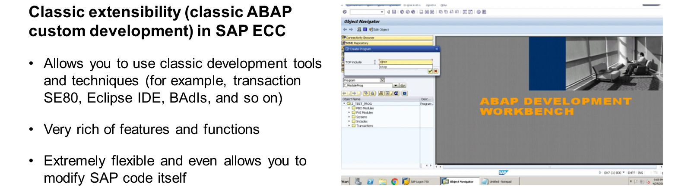
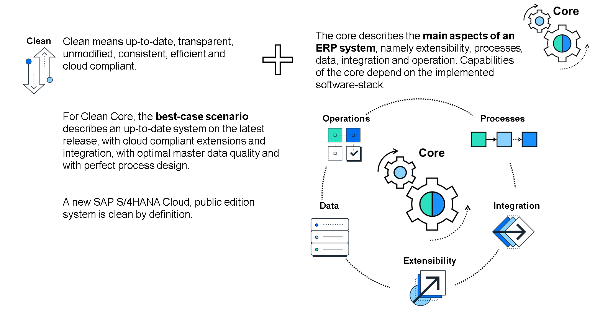

# 🌸 2 [CLEAN CORE APPROACH](https://learning.sap.com/learning-journeys/practicing-clean-core-extensibility-for-sap-s-4hana-cloud/introducing-the-clean-core-approach_fcb6c662-7041-4c99-88bd-345636fae7f3)

> 🌺 Objectifs
>
> - [ ] Explorer les évolutions et les modifications antérieures à SAP S/4HANA Cloud
>
> - [ ] Catégoriser les composants de l'approche « clean core » utilisée par SAP S/4HANA Cloud

## 🌸 CLASSIC EXTENSIBILITY APPROACHES

Avant l'avènement du cloud, cette approche était, à bien des égards, assez simple à mettre en œuvre, tant pour SAP que pour le client. Elle s'apparentait à un contrat. SAP fournissait certains éléments et les clients suivaient certaines étapes et procédures. Imaginez un scénario simple : un écran d'une application SAP contient deux champs : chiffre d'affaires et coût. Il ne serait pas présomptueux de supposer qu'un utilisateur final demanderait l'ajout d'un champ supplémentaire à l'affichage. Supposons qu'il le fasse en demandant un nouveau champ pour afficher le bénéfice. Et supposons que le bénéfice soit calculé non seulement à partir du chiffre d'affaires et du coût, mais aussi d'un facteur numérique spécifique utilisé par le client. Ce facteur étant spécifique au client, il n'existe aucun champ pour le contenir dans les tables de base de données sous-jacentes utilisées par l'application.

Pour mettre en œuvre ce type de scénario, SAP fournirait aux clients des sorties. Ces sorties seraient situées à plusieurs niveaux de la pile. Examinons ces couches une par une, en commençant par la couche la plus basse : la couche de données. Dans notre scénario simple, un développeur utiliserait un « table append » pour ajouter un nouveau champ à une table de base de données représentant le facteur numérique mentionné précédemment. Une fois activé, ce champ serait disponible en lecture et en stockage. L'ajout de table offrait aux clients un concept de sortie universel leur permettant d'adapter la définition de chaque table SAP fournie à leurs besoins métier spécifiques.

La couche suivante de la pile nécessitant une sortie fournie par SAP serait la couche supérieure : la couche visuelle. C'est ici que le nouveau champ (le bénéfice, dans notre scénario simple) serait visualisé. Les sorties de la couche visuelle étaient principalement de deux types : les sorties d'écran et les sorties de menu. Dans notre scénario simple, un développeur utiliserait une sortie d'écran pour ajouter le nouveau champ à l'écran, et éventuellement une sortie de menu pour ajouter une nouvelle commande qui, une fois sélectionnée par l'utilisateur final, effectuerait le calcul du bénéfice.

La dernière couche de la pile nécessitant une sortie serait, d'une certaine manière, la plus importante. En effet, un nouveau champ ajouté à la couche de données de la pile et visible à la couche visuelle contiendrait une valeur qui devrait potentiellement être lue, utilisée, mise à jour, voire supprimée périodiquement. Ces opérations devraient être implémentées en code ABAP. Ainsi, les sorties de code implémentées à la couche intermédiaire (c'est-à-dire le code) entre les données et l'interface utilisateur ont été créées par SAP. Encore une fois, dans notre scénario simple, un développeur confirmerait d’abord qu’une sortie de code existait pour effectuer toutes les opérations nécessaires sur le terrain, puis la sortie serait implémentée avec le code spécifique au client nécessaire.

Ainsi, le client disposait des fonctionnalités standard d'une application, enrichies des fonctionnalités supplémentaires souhaitées. Un aspect important de cette approche résidait dans la gestion complète du processus d'utilisation des exits par un processus système défini. Les exits devaient être activés. Leur implémentation spécifique devait réussir tous les tests de syntaxe et de cohérence pertinents. Le développement des exits s'effectuait dans un système de développement dédié et était testé dans un système de test avant d'être déployé aux utilisateurs finaux dans le système de production. Un autre aspect important de cette approche était que, de manière générale, le développement des exits pouvait utiliser n'importe quel objet SAP du système sans restriction. Par exemple :

- Toute table SAP pouvait être utilisée pour la lecture et l'écriture d'enregistrements.

- Tout module de fonction SAP pouvait être appelé.

- Toute classe SAP (et ses méthodes) pouvait être utilisée.

Dernier point (et important). Si un client constatait qu'aucune sortie n'était disponible (ou inutilisable), il pouvait opter pour les deux options suivantes :

- Modifier les objets SAP afin d'obtenir la fonctionnalité souhaitée ;

- Copier les objets SAP. Le nouvel objet appartiendrait au client et pourrait donc être modifié en conséquence.

Comme mentionné précédemment, un système intégrant les ajustements clients dans sa conception doit concilier avantages et coûts. Autrement dit, lors de l'application de correctifs ou de la mise à niveau du système, toute extension implémentée pourrait théoriquement poser problème, car le code nouveau ou mis à jour par l'éditeur pourrait rendre une extension instable, voire inutile. Des tests seraient nécessaires pour s'assurer que ce n'était pas le cas. Néanmoins, même en tenant compte de cela, les coûts de gestion de ce processus de test étaient raisonnables par rapport aux avantages et à la flexibilité des extensions. De manière générale, les ajustements clients effectués lors de l'implémentation des sorties étaient moins problématiques lors des mises à niveau, car leur existence était connue par SAP et pouvait être prise en compte. Les modifications des objets SAP et/ou des copies d'objets SAP pouvaient potentiellement être beaucoup plus problématiques et devaient être testées en profondeur après l'application d'un correctif ou la réalisation d'une mise à niveau.

Cette approche a soutenu SAP et ses clients pendant des décennies, de SAP R/3 dans toutes ses versions jusqu'à SAP Business Suite, en passant par les Service Packs et les packs d'amélioration. Cependant, l'une des raisons de son succès réside dans le fait que les systèmes étaient presque toujours situés dans les centres de données des clients et étaient donc entièrement gérés par les clients eux-mêmes. Les opérations effectuées par un client sur son système étaient totalement distinctes de celles des autres clients. Cependant, un changement majeur s'est produit : l'évolution de SAP ERP vers SAP S/4HANA.

## 🌸 CLEAN CORE CONCEPT

SAP S/4HANA Cloud fonctionne dans le cloud, et un produit cloud est différent. Tous les clients utilisent la même ligne de code de base et les modifications sont appliquées simultanément à tous. Par conséquent, il est impossible de permettre à chaque client d'implémenter des améliorations de la même manière que dans les anciens environnements sur site. Les améliorations client restent nécessaires, mais les règles et les processus qui les régissent doivent être entièrement repensés et repensés pour le cloud. Un nouveau défi se présente à SAP. Comme les précédents, celui-ci a également été relevé par SAP.

La solution consiste à concevoir une philosophie d'extension spécifiquement orientée cloud. Introduisons un nouveau terme : « clean core ». Décomposons-le.

#### 💮 **Core** :

Le noyau décrit les principaux aspects de SAP S/4HANA Cloud. Ces aspects peuvent être considérés comme des dimensions ou des composants et s'articulent autour des éléments suivants :

- Processus : Ensemble d'actions ou d'étapes réalisées dans SAP S/4HANA Cloud et couvrant l'expérience de bout en bout (E2E) pour la livraison ou l'obtention d'un résultat.

- Données : Données contenues et utilisées par les processus SAP S/4HANA Cloud. Elles sont généralement classées comme configuration, données principales et transactions.

- Intégration : Connexion de SAP S/4HANA Cloud à d'autres solutions pour l'envoi et la réception de données afin de soutenir l'exécution des processus.

- Opérations : Activités de maintenance nécessaires réalisées dans SAP S/4HANA Cloud, telles que la gestion des versions, la gestion des tâches en arrière-plan, la gestion des autorisations, la surveillance et les alertes.

- Extensibilité : Fonctionnalité ajoutée à SAP S/4HANA Cloud pour répondre aux besoins organisationnels non couverts par les processus standards.

#### 💮 **Clean** :

Clean signifie que, pour chacun des aspects mentionnés précédemment, l'approche nécessaire est adoptée pour assurer la mise à jour, la conformité cloud, l'optimisation et le perfectionnement, selon l'aspect concerné.

#### 💮 **Clean Core** :

Clean Core est à la fois un concept et une approche visant à créer une solution SAP S/4HANA Cloud moderne, flexible et compatible cloud. Clean Core est obtenu par l'intégration et l'extension de SAP S/4HANA Cloud afin d'assurer sa conformité cloud, avec une qualité optimale des données de référence et une gouvernance des processus métier optimisée. Avec un Clean Core, les clients bénéficient d'une meilleure maintenabilité et d'un coût total de possession (TCO) réduit pour SAP S/4HANA Cloud.

### BENEFITS OF CLEAN CORE

Un cœur propre profite à tous.

En résumé, les avantages pour les clients sont les suivants :

- Facilité de mise à niveau : simplifiez les mises à niveau grâce à un code personnalisé.

- Innovation rapide : toujours à la pointe des technologies.

- Sécurité, continuité et stabilité du système de bout en bout.

- TCO : utilisation efficace de l'infrastructure et des licences.

- Traçabilité permanente dans tous les domaines du cœur.

Les avantages pour les partenaires sont les suivants :

- Solutions évolutives et prêtes pour le cloud.

- Conformité aux normes grâce à l'innovation modulaire du cœur propre.

- Réduction de la complexité grâce à une utilisation simplifiée des solutions SAP prêtes à l'emploi.

### CLEAN CORE EXTENSIBILITY

Ce parcours d'apprentissage portant principalement sur l'aspect extension d'un noyau propre, il est au cœur de notre discussion.

L'extensibilité d'un noyau propre peut se résumer à une méthodologie d'extension où les extensions sont strictement séparées de l'application SAP. Les extensions accèdent aux objets métier SAP uniquement via des interfaces bien définies et stables en termes de mise à niveau.

Notez la première partie, « méthodologie d'extension », qui soulage les clients : les extensions ne disparaissent pas. Mais notez également les deuxième et troisième parties : l'extension client est strictement séparée de la base de référence SAP et doit utiliser des points officiellement définis et stables en termes de mise à niveau. C'est la partie « mise à niveau » qui est essentielle. La disponibilité des systèmes cloud n'est pas un simple souhait des clients. C'est une exigence non négociable. Il ne doit y avoir aucun risque qu'un système devienne indisponible simplement parce qu'une nouvelle version du logiciel est publiée. L'existence d'extensions client ne modifie en rien cette attente.

L'extensibilité du noyau propre permet d'atteindre l'équilibre entre la flexibilité logicielle, les ajustements client, et la stabilité et la disponibilité du système dans le cloud. Elle permet non seulement un déploiement logiciel plus rapide, mais aussi une adoption simplifiée des modifications logicielles, car le noyau est propre dès le départ et maintenu ainsi grâce à des mises à niveau régulières et sans interruption. Le concept d'extensibilité du noyau propre peut être résumé dans ce cadre de bonnes pratiques qu'un client adopte lors de la mise en œuvre de SAP S/4HANA Cloud :

- Adopter une politique zéro modification

- Suppression des améliorations redondantes par rapport au code et aux fonctionnalités standard, ainsi que des copies d'objets SAP

- Utilisation exclusive des API publiées (« interfaces stables à la mise à niveau »)

- Exploitation optimale de l'extensibilité utilisateur clé (in-app) de SAP S/4HANA Cloud

- Exploitation des fonctionnalités et services offerts par SAP Business Technology Platform pour créer des applications d'extension plus complètes

- Utilisation de SAP Integration Suite

Tout au long de ce cours, nous explorerons ces bonnes pratiques. Cependant, deux points importants sont à noter. Premièrement, comme les clients peuvent choisir entre deux options de déploiement cloud en fonction de leurs besoins spécifiques, ainsi qu'une troisième option de déploiement traditionnel sur site, l'option choisie détermine précisément les options utilisables (ou non). Ce parcours d'apprentissage est principalement axé sur SAP S/4HANA Cloud. Le terme SAP S/4HANA Cloud est un terme générique qui désigne les options de déploiement cloud, à savoir SAP S/4HANA Cloud Public Edition et SAP S/4HANA Cloud Private Edition. Le terme SAP S/4HANA désigne l'option de déploiement sur site. Si des distinctions doivent être établies entre SAP S/4HANA Cloud Public Edition et SAP S/4HANA Cloud Private Edition, le contenu le précisera explicitement. Sauf indication contraire, les fonctionnalités propres à SAP S/4HANA Cloud Private Edition (mais pas à SAP S/4HANA Cloud Public Edition) s'appliquent également aux déploiements sur site.

Deuxièmement, les clients SAP ERP existants doivent choisir l'approche de migration à utiliser lors de la transition vers l'une des options de déploiement possibles.

- Nouvelle implémentation : Un nouveau système SAP S/4HANA Cloud est provisionné ou un nouveau système SAP S/4HANA est installé.

- Conversion du système : Un système SAP ERP existant est migré vers SAP S/4HANA Cloud Private Edition ou un système sur site.

- Transformation de l'environnement : Une approche hybride des deux premières approches.

L'intersection de ces deux choix influence l'approche et les étapes spécifiques que le client doit suivre lors de sa migration vers SAP S/4HANA Cloud.
