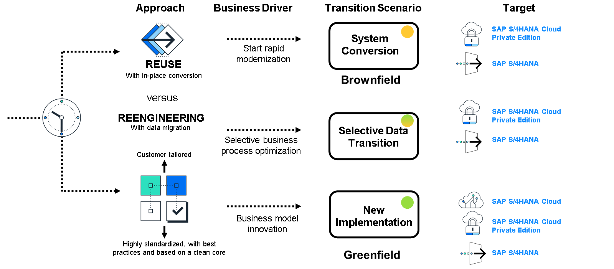

# 🌸 3 [TRANSITIONING TO S/4 HANA CLOUD](https://learning.sap.com/learning-journeys/practicing-clean-core-extensibility-for-sap-s-4hana-cloud/transitioning-to-sap-s-4hana-cloud_aa888600-4e9c-4e70-8665-5b7f7753c819)

> 🌺 Objectifs
>
> - [ ] Vous serez en mesure de différencier les différentes options de transition vers SAP S/4HANA Cloud

## 🌸 DIFFERENT APPROACHES TO TRANSITION TO SAP S/4 HANA

Comme mentionné dans la leçon précédente, un client doit prendre deux décisions importantes lors de son passage à SAP S/4HANA :

1. Quelle option de déploiement SAP S/4HANA utiliser :

   - SAP S/4HANA Cloud Public Edition

   - SAP S/4HANA Cloud Private Edition

   - SAP S/4HANA

2. Déployer via une conversion de système (également appelée Brownfield), une nouvelle implémentation (également appelée Greenfield) ou une approche de transformation du paysage (également appelée Selective Data Transition).

Si le client décide de convertir son système SAP ECC existant, il peut choisir entre SAP S/4HANA Cloud Private Edition ou (s'il souhaite conserver son environnement ERP sur site) SAP S/4HANA. Il en va de même pour une approche de transformation de l'environnement. Il n'existe aucune option de conversion de système ou de transformation de l'environnement pour SAP S/4HANA Cloud Public Edition ; une nouvelle implémentation est la seule option. Les clients peuvent également choisir une nouvelle approche d'implémentation pour SAP S/4HANA Cloud Private Edition ou SAP S/4HANA s'ils le souhaitent. Toutes les options sont compatibles avec une approche de noyau propre, mais peuvent affecter son exécution et ses facettes.

### SYSTEM CONVERSION (BROWNFIELD APPROACH)

Lors d'une conversion système, le système SAP S/4HANA Cloud Private Edition ou sur site d'un client se rapproche le plus possible, sur des points importants, de son système SAP ERP existant. En pratique, le client construit son nouveau système SAP ERP en utilisant son système existant comme modèle. Une fois la conversion terminée, les modifications nécessaires, en fonction du périmètre du projet, peuvent commencer. L'objectif d'une conversion système est de nettoyer le cœur du système.

### NEW IMPLEMENTATION (GREENFIELD APPROACH)

Avec une nouvelle implémentation, la cible (SAP S/4HANA Cloud Public Edition, SAP S/4HANA Cloud Private Edition, sur site) n'hérite par définition d'aucun code personnalisé hérité de l'ancien système SAP ERP. L'équipe projet n'a pas à se soucier des modifications à annuler ni des extensions à adapter. De plus, le système démarre avec un noyau propre par défaut. Cela ne signifie pas que de nouvelles extensions basées sur le modèle d'extensibilité de SAP S/4HANA Cloud (qui sera abordé dans une leçon ultérieure) ne seront pas nécessaires, mais le projet de migration est simplifié à certains égards, grâce à la suppression du travail de conversion. De plus, au lieu d'un déploiement massif du nouveau système, un déploiement progressif peut être effectué (en fonction du code de l'entreprise, par exemple). Avec une nouvelle implémentation, le système démarre avec un noyau propre par défaut. L'objectif est donc de conserver un noyau propre.

### LANDSCAPE TRANSFORMATION

Pour les clients disposant d'un grand nombre de systèmes ERP disparates (par exemple, en raison d'un historique de fusions et d'acquisitions fréquentes), une transition sélective des données leur permet de consolider la configuration et les données de plusieurs systèmes ERP vers SAP S/4HANA Cloud Private Edition ou un système sur site.
