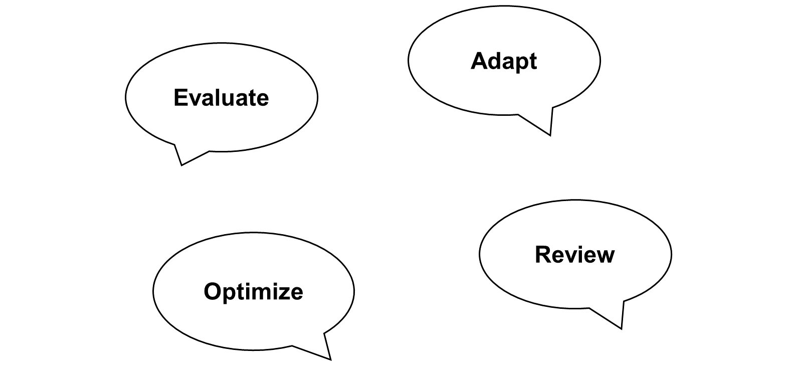

# 🌸 5 [VALIDATING CLEAN CORE WORKSTREAMS](https://learning.sap.com/learning-journeys/practicing-clean-core-extensibility-for-sap-s-4hana-cloud/validating-clean-core-workstreams_f7022a5b-f184-44f4-b57c-8554313b1d62)

> 🌺 Objectifs
>
> - [ ] Vous serez en mesure d'évaluer les flux de travail de base propres

## 🌸 CLEAN CORE WORKSTREAMS

Une nouvelle implémentation dispose par défaut d'un noyau propre. Cependant, même lors d'une conversion de système, il est recommandé de maintenir un noyau aussi propre que possible. Comment y parvenir ? En utilisant les flux de travail recommandés par SAP.

Une fois la conversion technique terminée, SAP recommande aux équipes de mise en œuvre du projet d'utiliser quatre axes de travail pour procéder à la migration, conformément à l'approche « clean core » :

#### 💮 **Evaluate** :

Évaluer le code personnalisé à l'aide du moniteur d'appels ABAP et de l'application de migration de code personnalisé.

#### 💮 **Adapt** :

Adapter le code personnalisé automatiquement à l'aide de la fonctionnalité Quick Fix intégrée aux outils de développement ABAP pour Eclipse, ou manuellement lorsque l'adaptation automatique n'est pas possible.

#### 💮 **Review** :

Examiner les modifications existantes afin d'identifier celles qui sont obsolètes, inutilisées, non pertinentes ou remplaçables.

#### 💮 **Optimize** :

Optimiser tout le code qui sera conservé après la conversion à l'aide d'outils ABAP tels que le moniteur SQL, SQL Trace et le moniteur de performances.
