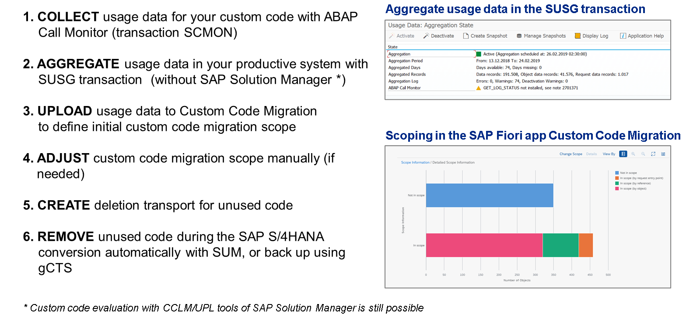

# 🌸 6 [COLLECTING USAGE DATA FOR CUSTOM CODE](https://learning.sap.com/learning-journeys/practicing-clean-core-extensibility-for-sap-s-4hana-cloud/collecting-usage-data-for-custom-code_e9bc634f-d673-49ce-a917-983ca50c4e47)

> 🌺 Objectifs
>
> - [ ] Vous pourrez collecter des données d'utilisation avec ABAP Call Monitor

## 🌸 CUSTOM CODE EVALUATION

Dans la première leçon, nous avons examiné les différents types de sorties traditionnellement mises en œuvre par les clients pour améliorer les fonctionnalités des applications SAP livrées. SAP S/4HANA utilise des applications entièrement redéfinies, basées sur l'expérience utilisateur grand public (SAP Fiori, dont nous parlerons plus loin), ainsi que de nouveaux modèles de données et de nouveaux codes. Nous pouvons donc supposer que certaines extensions ne sont plus nécessaires. Cela peut être dû au fait que l'objectif fonctionnel initial de l'extension est désormais couvert par les fonctionnalités standard de SAP S/4HANA, ou que des processus métier modifiés rendent la fonctionnalité inutile. Dans tous les cas, le code contenu dans ces sorties doit être systématiquement supprimé du système. Mais comment trouver et évaluer ce code ? SAP recommande l'approche suivante :

- Collecte et agrégation des données d'utilisation des extensions

- Détermination des extensions pouvant être supprimées via une analyse de code personnalisée

- Préparation de la procédure de sauvegarde et de restauration

- Vérification des fonctionnalités souhaitées de l'application après suppression de l'extension

- Suppression de l'extension lors de la conversion du système

### COLLECTION AND AGGREGATION OF EXTENSION USAGE DATA

Deux outils ont été créés pour aider les équipes projet à collecter les données d'utilisation des extensions. L'un ou l'autre peut être utilisé. Le premier est Usage and Procedure Logging (UPL) et le second ABAP Call Monitor (code de transaction `SCMON`). Tous deux collectent des informations sur l'exécution du code ABAP, quelle que soit sa forme (méthodes de classe, modules de fonction), et fournissent des informations sur le code ABAP exécuté et son contexte. ABAP Call Monitor est le plus récent des deux outils et va plus loin en fournissant des informations sur l'appelant du code ABAP. Cependant, il est déconseillé d'utiliser les deux outils simultanément (afin de minimiser les risques de performances système). Par conséquent, si UPL est actuellement utilisé et que le client souhaite le conserver, c'est possible. Il est important de s'assurer que le client utilise l'outil choisi dans le système de production. L'utilisation réelle de l'extension par les utilisateurs finaux est le facteur déterminant. Notez que les deux outils sont capables d'intégrer leurs données à Solution Manager. En règle générale, SAP recommande d'utiliser l'outil privilégié pendant 6 à 18 mois, incluant au moins une clôture annuelle.

Une fois les données d'utilisation collectées, le code de transaction `SUSG` peut être utilisé pour les agréger et les gérer. Cette étape est importante car les données collectées via le code de transaction `SCMON` sont supprimées rapidement.

### DETERMINATION OF EXTENSIONS THAT CAN BE REMOVED VIA CUSTOM CODE ANALYSIS

L'équipe projet dispose de deux options pour réaliser une analyse de code personnalisée. La première consiste à utiliser l'application SAP Fiori Custom Code Migration. L'application est disponible sur un système SAP S/4HANA sandbox récemment converti, utilisé pour les tests (nous y reviendrons plus loin). Si aucun système SAP S/4HANA sandbox n'est encore disponible, l'application peut être trouvée et utilisée depuis SAP Business Technology Platform, l'environnement ABAP et exécutée sur un système SAP ERP via RFC et Cloud Connector. La seconde option consiste à utiliser le cockpit de test ABAP, disponible dans les outils de développement ABAP pour Eclipse. L'un des avantages de l'application SAP Fiori est qu'elle permet d'identifier les extensions inutilisées grâce aux statistiques d'utilisation collectées par Usage And Procedure Logging (UPL) et ABAP Call Monitor. Ces extensions peuvent ensuite être supprimées lors de la conversion du système (voir la section « Suppression d'une extension lors de la conversion du système »).

### PREPARATION OF BACKUP AND RESTORATION PROCEDURE

Il est compréhensible que la suppression de code inutilisé puisse susciter des inquiétudes légitimes, notamment s'il est possible qu'il soit à nouveau nécessaire ultérieurement. Par conséquent, une procédure de sauvegarde et de restauration peut être conçue et adoptée par l'équipe projet. Plusieurs approches sont envisageables : un système ABAP distinct, spécifiquement provisionné pour la sauvegarde, ou un système de sauvegarde de produits tiers. Si les deux options sont envisageables, le coût de maintenance (ou d'achat) d'un système dédié à la sauvegarde est un facteur potentiel à prendre en compte. Pour répondre à cette préoccupation, SAP a créé l'option [« Git-enabled Change and Transport System » (gCTS)](https://blogs.sap.com/2021/10/19/how-to-backup-custom-code-with-gcts/) à l'intention des clients. Cette option utilise un dépôt Git externe pour stocker le code inutilisé. Pour plus d'informations sur la sauvegarde de code personnalisé avec gCTS, consultez la section « Comment sauvegarder du code personnalisé avec gCTS ». Il est important de garder à l'esprit que, quelle que soit l'approche de sauvegarde adoptée, si une restauration est nécessaire, celle-ci doit inclure des vérifications ABAP du code (ATC doit être utilisé à cette fin) et des tests du code. Une fois ces contrôles et tests terminés et qu'aucun problème n'est découvert, l'amélioration restaurée peut être transportée vers la production.

### VERIFICATION OF DESIRED APP FUNCTIONALITY WITH EXTENSION REMOVED

Il s'agit d'un test normal effectué par l'équipe d'assurance qualité pour s'assurer que l'extension supprimée ne présente aucun problème technique.

### DELETION OF EXTENSION DURING SYSTEM CONVERSION

L'application SAP Fiori Custom Code Migration mentionnée précédemment peut générer une demande de transport contenant toutes les améliorations à supprimer. Pendant le processus de conversion, l'outil Software Update Manager demande la demande de transport et les objets de développement concernés sont supprimés.
