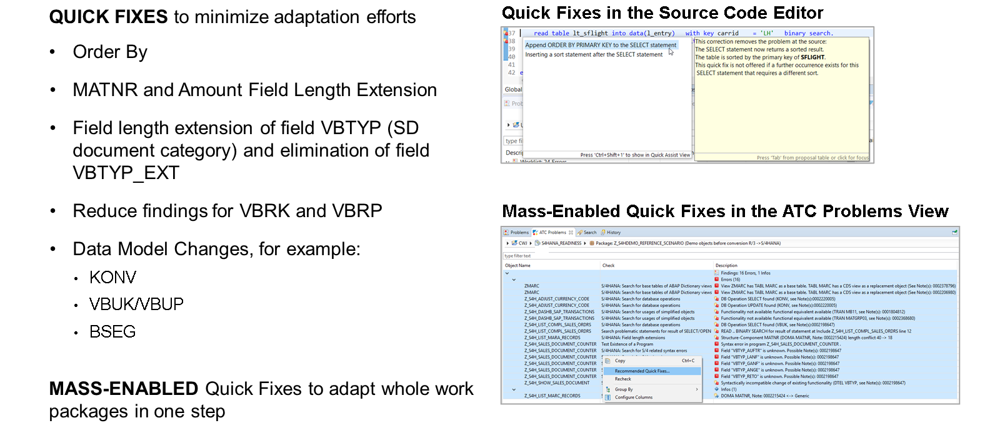

# 🌸 7 [ADAPTING CUSTOM CODE](https://learning.sap.com/learning-journeys/practicing-clean-core-extensibility-for-sap-s-4hana-cloud/adapting-custom-code_bc14533d-afca-497f-9924-d6457822f2e3)

> 🌺 Objectifs
>
> - [ ] Vous pourrez adapter du code personnalisé en utilisant des méthodes manuelles et automatiques

## 🌸 CUSTOM CODE ADAPTATION

Ce flux de travail est né des différences significatives entre le modèle de données et la base de code de SAP ERP et SAP S/4HANA. Les extensions jugées nécessaires et donc conservées (ou les extensions supprimées mais devant être restaurées ultérieurement) doivent faire l'objet d'un processus d'adaptation. Ce processus peut prendre deux formes :

- Adaptation automatique du code personnalisé

- Adaptation manuelle du code personnalisé

Avant de différencier les deux approches, un point préliminaire doit être abordé. Dans la plupart des cas, l'équipe de mise en œuvre du projet crée une copie du système SAP ERP de production dans un environnement sandbox dédié. Cet environnement sandbox est ensuite utilisé pour tester la conversion avant de l'appliquer au système de production réel. Cette approche est judicieuse, car le système de test doit reproduire au maximum la production. Il est également judicieux d'adapter le code de ce système sandbox, ce que SAP recommande généralement aux équipes projet. Cependant, cela peut entraîner des complications. Pendant la migration vers le nouveau SAP S/4HANA, le système SAP ERP existant nécessite encore ses activités normales de maintenance et de support. Lorsque l'équipe projet est prête à effectuer la conversion en production, des différences significatives peuvent apparaître entre le système de production et l'environnement sandbox utilisé pour les tests. Trois solutions possibles permettent de résoudre ce problème :

1. Gel du développement

   Une solution à ce problème consiste à geler le développement dans le système SAP ERP (bientôt hérité). Bien que cette option soit théoriquement efficace, elle impliquerait l'interruption des activités de maintenance, de support et, surtout, d'innovation habituelles, pour une durée indéterminée. Il est fort probable que les équipes métier s'y opposeraient.

2. Double travail

   Une autre solution consisterait à refaire tout le travail d'adaptation du code personnalisé effectué dans le système sandbox dans le système SAP S/4HANA nouvellement converti. Là encore, cette option serait théoriquement efficace, mais selon l'ampleur du travail d'adaptation à effectuer, elle pourrait également s'avérer très laborieuse.

3. Rétrofit de Solution Manager

   La solution privilégiée consiste à utiliser la fonctionnalité de rétrofit avec Solution Manager (version 7.2 Ehp 8 ou supérieure).

### AUTOMATED CUSTOM CODE ADAPTATION

Comme mentionné précédemment, les équipes projet disposent de trois options pour l'analyse de code personnalisée : l'application SAP Fiori Custom Code Migration (sur SAP S/4HANA ou la même application sur SAP Business Technology Platform, environnement ABAP) et le cockpit de test ABAP, disponible dans les outils de développement ABAP pour Eclipse. L'application SAP Fiori Custom Code Migration est intégrée au cockpit de test ABAP en arrière-plan. Les trois options peuvent donc utiliser la fonctionnalité Quick Fix du cockpit pour corriger automatiquement (et, si nécessaire, activer) le code ABAP afin de le rendre conforme aux modifications SAP S/4HANA.

### MANUAL CUSTOM CODE ADAPTATION

Le code qui ne peut pas être adapté automatiquement doit être adapté manuellement. La procédure varie d'un projet à l'autre et selon les organisations, en fonction de différents facteurs. La procédure suivante peut servir de point de départ à l'analyse :

- Utilisez l'outil SAP Readiness Check de l'application SAP Fiori pour obtenir la liste des notes SAP pertinentes décrivant l'impact du code personnalisé.

- Après avoir étudié ces notes, différenciez celles qui spécifient des corrections techniques du code de celles qui nécessitent des connaissances applicatives plus spécialisées. Utilisez cette distinction pour organiser les équipes d'adaptation en conséquence.

- De plus, la spécialisation de développeurs individuels dans certains types de modifications de code (selon les notes SAP pertinentes) peut optimiser le processus d'adaptation manuelle. Cependant, cela n'est pas toujours possible.

- Il est irréaliste (et probablement erroné) de déterminer le temps exact nécessaire à la réalisation de toutes les adaptations manuelles demandées. Une estimation du délai doit être communiquée aux parties prenantes du projet de migration.
