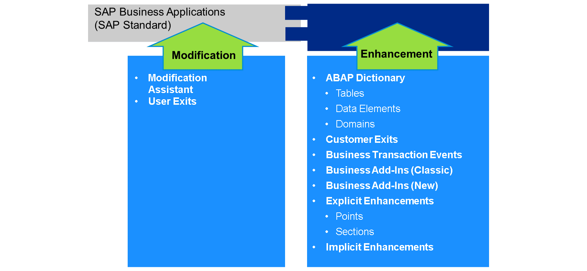

# 🌸 8 [REVIEWING LEGACY MODIFICATIONS, COPIES AND ENHANCEMENTS](https://learning.sap.com/learning-journeys/practicing-clean-core-extensibility-for-sap-s-4hana-cloud/reviewing-legacy-modifications-copies-and-enhancements_f55306cd-c7bc-4a91-a4ae-9dfa2ce610d1)

> 🌺 Objectifs
>
> - [ ] Vous pourrez effectuer une revue de code hérité

## 🌸 REVIEN OF LEGACY MODIFICATIONS, COPIES AND IMPLICIT ENHANCEMENTS

Ce flux de travail englobe plusieurs options utilisées par les clients au fil des ans.

Une modification est soit directe, soit indirecte. Une modification directe est une modification d'un objet SAP. Parfois, la modification est effectuée par un client dans le cadre d'une directive SAP Note. D'autres fois, les modifications visent à modifier directement le comportement d'un objet.

Une modification indirecte couvre trois possibilités :

- Copies d'objets SAP (« clones »)

- Améliorations implicites au début et à la fin

- Écrasements de méthodes de classe

Plusieurs outils permettent de trouver le code correspondant à ces catégories : codes de transaction `SPDD` et `SPAU` (ou `SPAU_ENH`). Un outil de recherche de clones est également disponible.

Comme mentionné précédemment, l'un des principes fondamentaux d'un noyau propre est l'approche zéro modification. L'équipe projet doit donc procéder comme si le code correspondant à ces catégories devait être éliminé. Cette approche est validée par analyse : dans la quasi-totalité des cas, l'équipe projet détermine qu'une modification est (1) obsolète (car identique à une version SAP), (2) inutilisée (selon les statistiques d'utilisation), (3) non pertinente (c'est-à-dire que les index sont rares sur SAP S/4HANA) ou (4) remplaçable (c'est-à-dire qu'elle peut être reconçue comme une extension utilisateur clé (in-app)). Si une modification antérieure est nécessaire à la prise en charge des fonctionnalités métier et ne peut être reconçue avec les options d'extensibilité de SAP S/4HANA, le client doit contacter SAP pour obtenir des conseils sur la marche à suivre.
