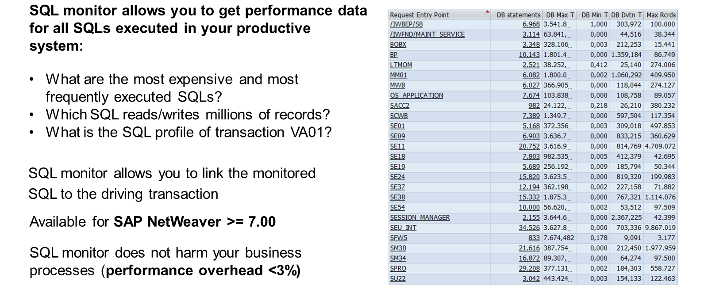

# 🌸 9 [OPTIMIZING CODE PERFORMANCE](https://learning.sap.com/learning-journeys/practicing-clean-core-extensibility-for-sap-s-4hana-cloud/optimizing-code-performance_f546330d-6c06-46d4-a3f9-36b5b3d09234)

> 🌺 Objectifs
>
> - [ ] Vous serez capable de décrire l'outil de surveillance SQL

## 🌸 PERFORMANCE OPTIMIZATIONS

Le dernier flux de travail utilise plusieurs outils familiers que les développeurs ABAP utilisent depuis des années. ABAP Test Cockpit, intégré aux outils de développement ABAP pour Eclipse, permet de vérifier les performances du code ABAP. L'outil SQL Monitor peut également être utilisé. Il identifie les instructions SQL coûteuses et les objets ABAP correspondants. La trace SQL est disponible et permet d'analyser les performances de chaque instruction SQL.
