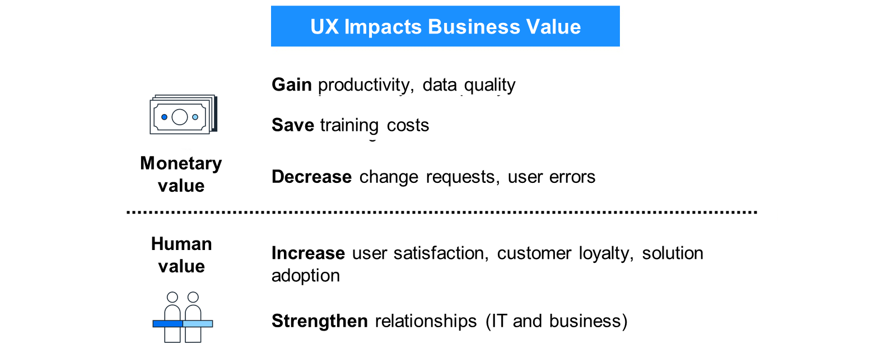

# 🌸 1 [EVALUATING SAP FIORI](https://learning.sap.com/learning-journeys/practicing-clean-core-extensibility-for-sap-s-4hana-cloud/evaluating-sap-fiori_ea5722e6-9c73-4d9d-b0f4-544b36fc56d2)

> 🌺 Objectifs
>
> - [ ] Décrire l'importance d'une expérience utilisateur de qualité grand public
>
> - [ ] Différencier les différentes solutions UX SAP Fiori disponibles

## 🌸 THE IMPORTANCE OF A CONSUMER-GRADE UX

Quelle que soit l'innovation d'une application logicielle, c'est son adoption par les utilisateurs finaux qui détermine son succès ou son échec. Or, rien n'est plus déterminant pour cette adoption que l'expérience utilisateur (UX) qu'elle offre.

Pourquoi l'UX est-elle si importante ? Aujourd'hui, contrairement à hier, les utilisateurs finaux s'attendent à ce que les applications d'entreprise aient la même apparence visuelle que celles qu'ils utilisent quotidiennement sur leurs téléphones, tablettes et sites web.

Comme expliqué dans la leçon « Présentation de l'approche Clean Core », les besoins des utilisateurs finaux, bien qu'importants, doivent être mis en balance avec ceux de l'entreprise et du service informatique. Heureusement, dans ce cas précis, cet équilibre est gagnant-gagnant pour tous. Au-delà de la satisfaction des utilisateurs finaux, une UX bien conçue réduit les coûts de formation, car ils ont besoin de moins de temps pour se familiariser avec l'application. Les applications bien conçues présentent également moins d'erreurs, ce qui permet au service informatique de passer moins de temps à traiter les tickets de support, sans parler d'une productivité accrue pour les utilisateurs finaux. Enfin, moins d’erreurs entraînent moins de plaintes des clients, ce qui conduit à un Net Provider Score plus élevé, ce que toutes les entreprises apprécient.

### WHAT IS UX?

Maintenant que nous comprenons l'importance de l'UX, examinons ce qu'elle est exactement. Il existe plusieurs définitions, compréhensibles et pas forcément problématiques. L'Organisation internationale de normalisation (ISO) constitue un bon point de départ. La norme ISO 9241 définit l'expérience utilisateur comme « les perceptions et les réponses de l'utilisateur résultant de l'utilisation et/ou de l'utilisation anticipée d'un système, d'un produit ou d'un service ». Les perceptions mentionnées dans la définition ISO sont influencées par l'application utilisée, son utilisation et son contexte.

Cette définition constitue un bon point de départ pour l'UX grand public de SAP, l'un des piliers de la stratégie produit de SAP S/4HANA Cloud. Pour SAP, l'UX grand public désigne les applications d'entreprise offrant l'apparence et la convivialité « grand public » souhaitées par les utilisateurs finaux. SAP Fiori incarne parfaitement cette UX grand public. SAP Fiori est un système de conception englobant tous les aspects nécessaires à un développement UX efficace. Ces aspects incluent les éléments visuels constituant une application, les concepts de navigation, les options de provisionnement d'applications, etc.

Outre la stratégie produit, SAP Fiori joue également un rôle important dans l'approche « clean core ». Rappelons que dans la leçon « Présentation de l'approche « clean core », nous avons mentionné que l'un des aspects de cette approche est l'utilisation d'interfaces bien définies et stables en termes de mise à niveau. Les données SAP S/4HANA Cloud sont fournies à une application SAP Fiori via des interfaces, notamment des API distantes, dont nous verrons l'exploration dans une prochaine leçon.

## 🌸 SAP FIORI BENEFITS

### CONSISTENCY OF SAP FIORI AND SAP FIORI ELEMENTS APPS

Les applications SAP Fiori et SAP Fiori Elements sont développées avec SAPUI5. SAPUI5 s'appuie sur des technologies web standardisées. SAPUI5 utilise HTML5, CSS3 et JavaScript. Il exploite également deux bibliothèques connues et populaires : LESS et jQuery. SAPUI5 propose près de 200 contrôles standard permettant aux développeurs de créer des interfaces utilisateur. Leur apparence et leur comportement sont identiques quelle que soit l'application utilisée. Ainsi, qu'il s'agisse de l'application Cash Flow Analyzer utilisée par le service financier ou de l'application Count Physical Inventory utilisée par un magasinier, les types d'éléments sont identiques.

### SAP BUSINESS APPLICATION STUDIO

SAP Business Application Studio est un service disponible sur SAP Business Technology Platform (BTP). SAP Business Application Studio est un environnement de développement moderne et intégré permettant de créer des applications SAP Fiori. Grâce à un ensemble d'outils et d'assistants intégrés, la structure du projet, ainsi que les fichiers contenant le code, peuvent être générés automatiquement en quelques clics. Cela permet de réduire considérablement le temps de développement par rapport à la création de tous les composants nécessaires au projet de A à Z.

### SAP FIORI ELEMENTS AND FIORI TOOLS

Les éléments SAP Fiori peuvent réduire encore davantage le temps de développement. Lorsqu'une équipe projet conçoit une application SAP Fiori, elle doit notamment décider si elle souhaite la développer de manière autonome ou avec des éléments SAP Fiori. Si SAP Business Application Studio génère tous les composants nécessaires au projet dans les deux cas, les éléments SAP Fiori permettent d'adapter le développement SAP Fiori grâce à une approche de création d'applications basée sur des modèles et des métadonnées. Cela réduit le développement front-end requis (par rapport à l'approche autonome) pour créer votre application, vous permettant ainsi de vous concentrer sur la logique métier et les services back-end requis.

Les applications SAP Fiori Elements sont automatiquement de niveau entreprise. Le framework garantit un code d'interface utilisateur de haute qualité, stable et optimisé. Il offre également de nombreuses fonctionnalités prêtes à l'emploi, attendues dans un environnement d'entreprise, mais généralement coûteuses à mettre en œuvre, telles que l'accessibilité, la gestion des variantes ou le mode édition.

Les éléments SAP Fiori classent les applications par objectif (analyse, liste de travail) dans l'un des nombreux plans d'étage. Le plan d'étage est choisi par le développeur dans SAP Business Application Studio lors du développement de l'application. Cependant, contrairement à une génération libre UI5, les fichiers HTML5, CSS et JavaScript ne sont pas générés. À la place, une série de fichiers contenant des annotations XML est créée. Ces annotations sont évaluées lors de l'exécution par l'environnement d'exécution SAPUI5 lorsque l'utilisateur final lance l'application, et l'interface utilisateur est rendue dynamiquement.

Parmi les plans d'étage disponibles :

- Liste analytique

- Page

- Page initiale

- Rapport de liste

- Page d'objet

- Page de présentation

- Assistant

- Liste de travail

Si l'équipe projet doit étendre une application SAP Fiori Elements pour son cas d'utilisation, elle a toujours la possibilité d'y ajouter du code personnalisé. Avec le modèle de programmation flexible, un développeur peut le faire dans Freestyle UI5 en s'appuyant sur le framework JavaScript et la bibliothèque d'interface utilisateur UI5.

Outre le modèle de programmation flexible, le développeur peut utiliser une approche supplémentaire pour enrichir l'application avec les fonctionnalités requises. Une application SAP Fiori Elements peut être « liée » à un service OData implémenté sur la plateforme ABAP (plus précisément, une vue Core Data Services (CDS)). Des annotations peuvent être placées dans la vue CDS, qui sera évaluée par l'environnement d'exécution UI5. Outre la possibilité d'insérer des annotations dans le projet SAP Business Application Studio, ces deux options offrent au développeur une flexibilité dans la conception de son application. Les annotations plus globales peuvent être placées au niveau ABAP, évitant ainsi au développeur de les copier à plusieurs reprises dans plusieurs applications. Des annotations plus spécifiques (pouvant varier d'une application à l'autre, selon les besoins de l'utilisateur final) peuvent être intégrées à chaque application. Les avantages potentiels de ce couplage entre la couche ABAP et la couche UX seront mis en évidence dans une unité ultérieure, lorsque nous explorerons les différents types d'extensions possibles dans le cadre du modèle d'extensibilité de SAP S/4HANA Cloud.

### EASIER TEST PROCESS

SAP Business Application Studio propose une multitude d'outils de test pour aider les développeurs. Les codes XML, JavaScript et JSON bénéficient tous de l'insertion et de la saisie semi-automatiques. Leur syntaxe est vérifiée grâce à des outils intégrés. Les développeurs peuvent lancer les applications SAP Fiori sur lesquelles ils travaillent directement depuis l'environnement de développement intégré.

### STANDARDIZED DEVELOPEMENT TERMINOLOGY

SAP Fiori repose sur la philosophie de développement « en couches » bien connue. Une couche de données assure la persistance. Une couche de service implémente les opérations de création, de lecture, de mise à jour et de suppression (CRUD). La couche visuelle est implémentée selon le modèle MVC (Model View Controller), que la plupart des développeurs connaissent bien et que les autres trouvent facile à maîtriser. Chaque élément du modèle MVC est associé à un ensemble défini d'objets de développement dotés de fonctionnalités spécifiques. Cette standardisation facilite la communication entre les membres de l'équipe projet. Le développement et la maintenance des applications sont plus efficaces.

## 🌸 DESIGN PRINCIPLES

L'expérience utilisateur (UX) grand public mise en œuvre via SAP Fiori repose sur les cinq piliers suivants :

- Adéquation au rôle

- Adaptabilité

- Simplicité

- Cohérence

- Plaisir

### ROLE-BASED

Les applications SAP Fiori sont attribuées aux utilisateurs finaux via le concept de rôle géré par la transaction `PFCG`. Le code de transaction `PFCG` est bien connu des administrateurs SAP Basis et des experts en autorisations ; la prise en main de SAP Fiori est donc minimale. Les applications SAP Fiori sont attribuées à deux types d'artefacts : les catalogues et les groupes. L'un ou l'autre, ou les deux, peut être attribué à un rôle, qui est ensuite attribué aux utilisateurs via le code de transaction `PFCG`. La simplicité du processus d'attribution permet aux entreprises de garantir l'harmonisation des exigences de travail avec les exigences de conformité et de contrôle organisationnel.

### ADAPTIVE

L'une des principales exigences des utilisateurs finaux aujourd'hui est de pouvoir utiliser l'appareil de leur choix pour travailler. Non seulement les utilisateurs utilisent des téléphones, des tablettes et des ordinateurs de bureau, mais ils souhaitent également pouvoir démarrer un processus sur un appareil et le terminer sur un autre. SAP Fiori intègre l'adaptabilité. Une application s'affiche en fonction du type d'appareil sur lequel elle est utilisée. Les fonctionnalités de brouillon inhérentes à la couche ABAP permettent aux utilisateurs d'interrompre temporairement l'exécution de l'application et de la terminer ultérieurement.

### SIMPLE

Dans l'univers SAP ERP, les applications SAP GUI peuvent parfois être composées d'un grand nombre d'écrans, avec un nombre conséquent de champs, de menus et de boutons. Dans l'univers SAP Fiori, ces applications sont décomposées en petites applications modulaires, selon le principe de l'unité : une application unique pour un usage spécifique.

### COHERENT

Quelle que soit l'application SAP Fiori utilisée par un utilisateur final et quel que soit le but pour lequel il l'utilise, il bénéficie d'une interaction et d'une expérience visuelle cohérentes dans toute l'entreprise.

### DELIGHTFUL

Comme mentionné précédemment, c'est l'utilisateur final qui réalise la valeur ultime des logiciels d'entreprise. SAP Fiori lui permet de travailler en toute simplicité, ce qui enrichit son expérience professionnelle.

### FURTHER LEARNING

Pour approfondir vos connaissances sur SAP Fiori, suivez les parcours d'apprentissage suivants :

- [Learning The Basics Of SAP Fiori](https://learning.sap.com/learning-journeys/learn-the-basics-of-sap-fiori)

- [Developing an SAP Fiori Elements App Based on a CAP OData V4 Service](https://learning.sap.com/learning-journeys/developing-an-sap-fiori-elements-app-based-on-a-cap-odata-v4-service)

- [Developing SAPUI5 Applications](https://learning.sap.com/learning-journeys/develop-sapui5-applications)
