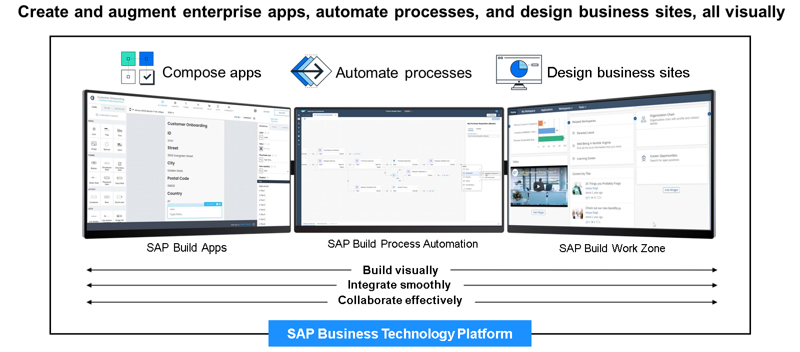
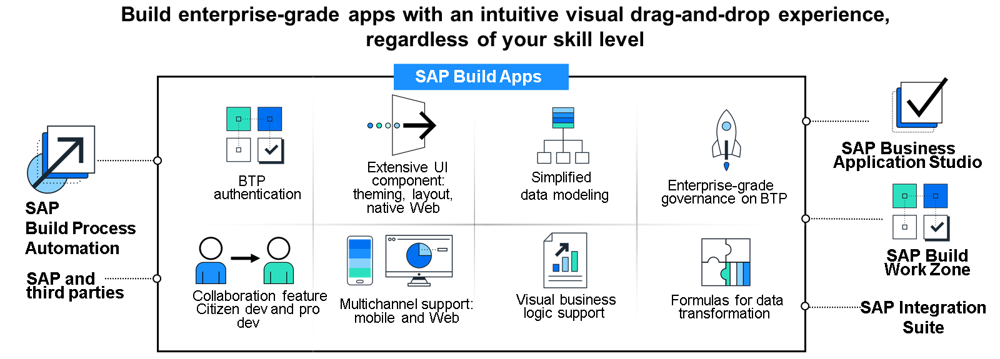
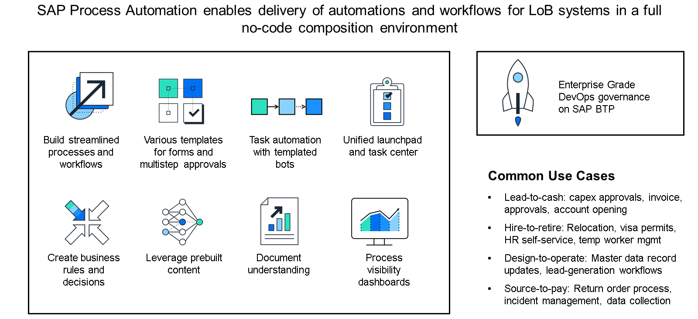
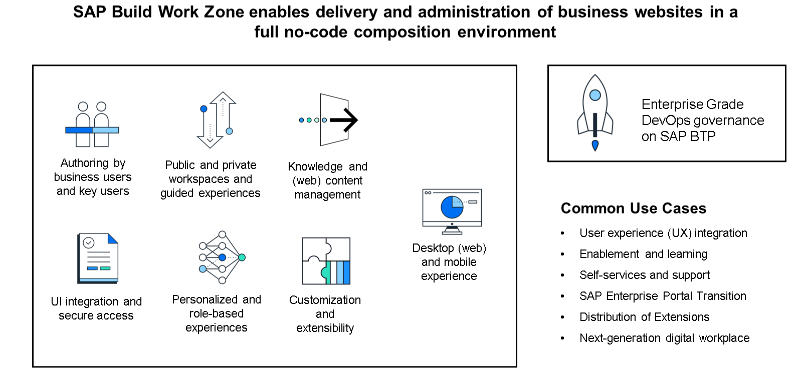

# 🌸 2 [EVALUATING SAP BUILD](https://learning.sap.com/learning-journeys/practicing-clean-core-extensibility-for-sap-s-4hana-cloud/evaluating-sap-build_d6aca950-1bda-4d3f-abd6-337924f5a802)

> 🌺 Objectifs
>
> - [ ] Comparer le développement citoyen et le développement traditionnel
>
> - [ ] Différencier les différents produits de la solution SAP Build

## 🌸 THE EMERGENCE OF THE BUILDER

Dans la leçon « Présentation de SAP S/4HANA Cloud », nous avons appris que l'un des avantages du cloud computing est la rapidité d'innovation grâce à des mises à jour logicielles fréquentes et régulières. De plus, dans la leçon précédente, nous avons expliqué comment une stratégie UX grand public bien conçue et exécutée favorise l'adoption réussie des logiciels, et nous avons vu comment les applications SAP Fiori offrent aux clients un moyen de garantir cette adoption. Il existe une autre voie d'adoption tout aussi importante et accessible aux clients, que nous explorons dans cette section.

Les innovations rapides issues du cloud computing entraînent inévitablement une évolution rapide des besoins métier. Ces besoins métier en constante évolution impliquent la création et la modification rapide d'applications logicielles. Si ce n'est pas forcément une mauvaise chose, une réelle contrainte de ressources existe : la capacité informatique. Si les capacités physiques, telles que la puissance de calcul, la mémoire, etc., peuvent être adaptées à l'évolution des besoins en ressources, les ressources humaines (notamment les développeurs) ne s'adaptent pas aussi facilement. Cela a entraîné une pénurie de développeurs dans de nombreux services informatiques, voire la plupart des entreprises.

Cette tension entre la nécessité de développer un nombre croissant d'applications et leur rythme rapide a nécessité une refonte de la façon dont les développeurs interviennent. C'est là qu'intervient le Citizen Developer, que SAP appelle un « Builder ». Un builder est une personne qui développe des applications (souvent pour un domaine d'activité spécifique) à l'aide d'outils spécialisés, pré-approuvés par le service informatique et mis à disposition pour le développement. Cela offre aux entreprises une option de développement d'applications supplémentaire, au-delà de l'achat d'applications pré-packagées ou de la création d'applications de toutes pièces (deux options nécessitant la maîtrise des développeurs).

Les développeurs ont toujours besoin d'outils spécialisés, basés sur un langage et un modèle de programmation spécifiques, avec des débogueurs intégrés et des capacités de test avancées. Les builders n'ont pas besoin du même type d'outils. Les outils pré-approuvés par le service informatique sont souvent appelés outils low-code/no-code, souvent abrégés LCNC.

Le low-code est une méthode de conception et de développement d'applications utilisant des outils graphiques intuitifs et des fonctionnalités intégrées qui réduisent les exigences d'écriture traditionnelles (ou pro-code).

Le no-code est une méthode qui offre une expérience utilisateur similaire au low-code, mais qui va plus loin en permettant aux utilisateurs professionnels non techniques de développer des applications sans avoir à écrire une seule ligne de code.

## 🌸 SAP BUILD

### SAP'S LOW-CODE/NO-CODE TOOLSET

Bien que SAP Fiori soit le framework UX qui intègre la grande majorité des applications SAP S/4HANA, LCNC constitue désormais une stratégie légitime et viable pour les clients. Pour les aider à tirer parti du développement citoyen, SAP propose la solution SAP Build, parfaitement adaptée aux besoins des développeurs.

La solution SAP Build est composée des trois outils suivants, qui fonctionnent ensemble :

- SAP Build Apps

- SAP Build Process Automation

- SAP Build Work Zone

Ces trois solutions sont disponibles sous forme de services via SAP Business Technology Platform (BTP) et s'inscrivent ainsi dans le cadre de l'unification des capacités de développement d'applications, de données et d'analyse, d'intégration, d'automatisation et d'intelligence artificielle de SAP BTP.

### SAP BUILD APPS

SAP Build Apps est une solution sans code pour la création d'applications. Les développeurs peuvent l'utiliser pour créer facilement des interfaces utilisateur par glisser-déposer. Les modèles de données et la logique métier correspondants s'intègrent parfaitement et sans code. Les applications se connectent à SAP S/4HANA Cloud facilement et en toute sécurité grâce à des connecteurs prédéfinis et des API standardisées. Intégré à SAP BTP, SAP Build Apps s'intègre parfaitement à SAP BTP pour les services d'authentification lorsque des API SAP standardisées et publiques sont utilisées pour le développement d'applications.

### SAP BUILD AUTOMATION

Similaire à SAP Build Apps, SAP Build Process Automation est une solution sans code permettant de créer des workflows automatisés. Les développeurs peuvent utiliser SAP Build Process Automation pour automatiser leurs processus et tâches métier sans écrire de code. Cette automatisation s'effectue par glisser-déposer et grâce à des fonctionnalités d'IA. De plus, comme pour SAP Build Apps, des connecteurs prédéfinis et des API SAP standardisées et publiques de SAP S/4HANA Cloud peuvent être utilisés.

### SAP BUILD WORK ZONE

Le dernier outil de la gamme LCNC de SAP est SAP Build Work Zone. Presque toutes les organisations proposent un ou plusieurs portails, offrant aux utilisateurs finaux un point d'accès standardisé pour exécuter toutes les applications liées à leur rôle. Pour SAP Fiori, le principal produit de portail est le SAP Fiori Launchpad. Pour la gamme LCNC de SAP, il s'agit de SAP Build Work Zone. Les développeurs peuvent utiliser cet outil pour créer des sites d'accès dynamiques et attrayants, basés sur les rôles, accessibles rapidement et facilement depuis n'importe quel appareil.
