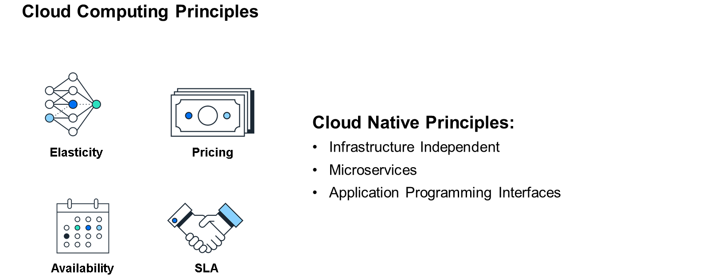
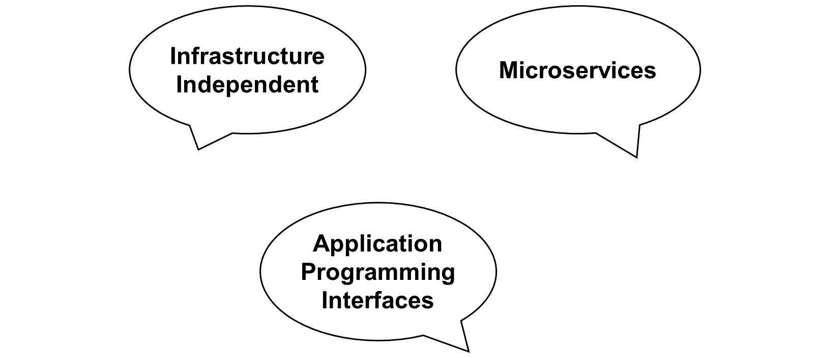
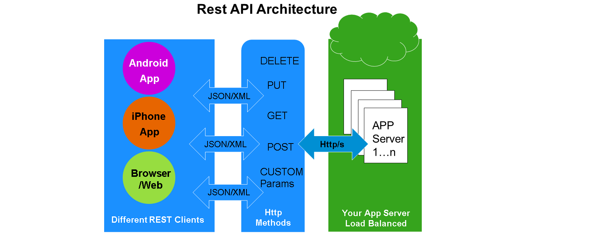

# 🌸 1 [EVALUATING CLOUD NATIVE AND REST](link)

> 🌺 Objectifs
>
> - [ ] Expliquer les fonctionnalités du cloud natif
>
> - [ ] Évaluer les principes de l'architecture REST

## 🌸 CLOUD NATIVE PRINCIPLES

Dans cette unité, nous explorons le modèle de développement ABAP Cloud (ABAP Cloud), qui permet aux applications cloud natives d'être intégrées et exécutées sur ABAP. Cependant, comme ABAP Cloud s'inspire en partie de l'émergence du cloud computing et du paradigme cloud natif, une brève discussion sur ces deux sujets est nécessaire.

Comme expliqué dans le cours S4CP01 : Exploration de SAP Cloud ERP, dans le contexte économique actuel, les entreprises doivent adapter rapidement leurs processus métier pour répondre à l'évolution des conditions commerciales et des demandes clients. Ce besoin d'adaptation nécessite des applications évolutives, robustes et, surtout, flexibles. Les environnements cloud computing constituent une solution pour répondre à ce besoin. L'autre solution est le cloud natif.

### CLOUD COMPUTING

Le cloud computing reste de l'informatique, mais sa conception diffère de l'infrastructure classique des centres de données sur site, traditionnellement utilisée par le personnel informatique. Avec une infrastructure sur site (souvent appelée « centre de données sur site »), le client est responsable de l'installation et de la maintenance des éléments physiques, tels que les serveurs et les équipements réseau. Avec le cloud computing, ces composants d'infrastructure sont fournis par un fournisseur de cloud externe.

En général, les composants suivants sont fournis par le fournisseur de cloud :

- Réseau

- Serveurs (fournissant les capacités de calcul et de mémoire)

- Stockage

- Systèmes d'exploitation et virtualisation

La configuration initiale de ces composants, ainsi que leur exploitation, leur maintenance et leurs mises à niveau continues, sont prises en charge par le fournisseur de cloud.

### CLOUD COMPUTING PRINCIPLES

Ces composants sont mis à disposition du client selon les principes suivants :

- Élasticité

  La plupart des organisations connaissent des pics et des creux d'utilisation des ressources. Par exemple, la paie peut être effectuée deux fois par mois, ce qui justifie une augmentation de la capacité réseau et serveur. Les fournisseurs de cloud proposent généralement une fonctionnalité d'élasticité à leurs clients dans le cadre de leurs offres. Ainsi, lorsque des ressources supplémentaires sont nécessaires, elles peuvent être allouées et les performances des applications, individuelles et globales, peuvent être maintenues aux niveaux souhaités.

- Tarification

  Les composants de cloud computing sont proposés aux clients selon un tarif et un plan de consommation convenus. Ces derniers peuvent varier d'un fournisseur à l'autre. SAP, par exemple, propose différents environnements d'exécution et services dans le cadre de son offre PaaS (Platform as a Service) SAP BTP, non seulement sous forme d'abonnement, mais également avec deux types de plans d'achat à la consommation.

- Disponibilité

  Pour revenir à l'exemple de la paie mentionné précédemment, la disponibilité des ressources cloud est bimensuelle (en supposant que la paie soit effectuée deux fois par mois). Pour d'autres types de processus métier (processus de gestion de la chaîne logistique, par exemple), la disponibilité varie en fonction du type de processus concerné et du mode de fonctionnement choisi par l'entreprise. Pour les grandes organisations en particulier, on peut affirmer que, 24 heures sur 24, 7 jours sur 7, au moins un processus nécessite des ressources pour fonctionner. C'est là que la disponibilité entre en jeu. Dans le cadre de leur offre, les fournisseurs de cloud communiquent en toute transparence la disponibilité attendue de leurs composants à leurs clients. Là encore, bien que techniquement non obligatoire, la quasi-totalité des fournisseurs proposent une option de disponibilité 24h/24 et 7j/7, offrant aux clients une flexibilité maximale si certaines opérations doivent être exécutées en continu ou à intervalles imprévisibles.

- Accord de niveau de service (SLA)

  L'accord de niveau de service (SLA) est étroitement lié à la disponibilité. Alors que la disponibilité est généralement exprimée sous forme de nombre (24h/24 et 7j/7), le SLA inclut une dimension temporelle (soit 24h/24 et 7j/7 pendant 99,99 % du mois). Dans cet exemple, si un mois compte 30 jours, cela correspond à 43 200 minutes (30 jours multiplié par 24 heures multiplié par 60 minutes). Avec un SLA de 99,99 %, le système ne serait pas disponible (au cours de ce mois) pendant environ quatre minutes et demie (0,0001 multiplié par 43 200).

### IS THERE A DIFFERENCE?

Bien qu'il puisse être tentant de penser, à première vue, qu'« hormis le fournisseur, il semble n'y avoir aucune différence pratique entre le cloud computing et un centre de données fourni par le client », ce n'est pas le cas. L'infrastructure informatique fournie par un fournisseur de cloud implique que les applications logicielles doivent être conçues pour être indépendantes de l'infrastructure. Elles doivent fonctionner de la même manière, quel que soit le serveur, le système d'exploitation ou le système de stockage fourni par le fournisseur. Il est tout à fait concevable qu'un fournisseur de cloud modifie fréquemment son infrastructure. De plus, un client peut décider de changer de fournisseur de cloud (c'est-à-dire qu'un autre fournisseur offre des performances SLA supérieures). De plus, la nécessité d'adapter rapidement les applications signifie qu'il ne devrait pas être nécessaire de tester une application sur différents types d'infrastructures pour garantir leur compatibilité, sans parler du temps et du coût liés au développement de différentes versions d'une application simplement pour qu'elle puisse fonctionner sur différents types d'infrastructures, ce qui, là encore, est un échec. Du point de vue du développeur (et, in fine, de l'utilisateur final), les composants d'infrastructure utilisés dans le cloud computing sont une abstraction.

Pour garantir cette abstraction, une refonte complète des modèles de programmation, des outils et des technologies utilisés pour le développement et la maintenance des applications en cloud computing est nécessaire. Le cloud natif est né de cette refonte.

### WHAT IS CLOUD NATIVE?

Le cloud natif est avant tout une approche de développement, de déploiement et de maintenance d'applications logicielles dans un environnement cloud, qui permet une adaptabilité et une flexibilité rapides des applications. Bien que la définition spécifique du cloud natif varie d'une source à l'autre, selon la définition utilisée, certains éléments font généralement consensus et sont essentiels à la compréhension du modèle de développement ABAP Cloud :

- Indépendant de l'infrastructure

- Microservices

- Interfaces de programmation d'applications (API)

### INFRASTRUCTURE INDEPENDENT

Comme mentionné précédemment, le fournisseur de cloud fournit les composants d'infrastructure, qui comprennent un environnement de cloud computing (c'est-à-dire le réseau, les serveurs (fournissant les capacités de calcul et de mémoire), le stockage, les systèmes d'exploitation et la virtualisation). Différents fournisseurs de cloud fournissent ces ressources en utilisant des techniques, des configurations, des marques, etc. Une application cloud native fonctionne de la même manière, quelles que soient ces différences et quel que soit le fournisseur de cloud.

### MICROSERVICES

De nombreux modèles de programmation cloud native adoptent une approche à trois couches pour le développement d'applications. La première est la couche utilisateur (parfois appelée couche de consommation), responsable du rendu visuel de l'interface utilisateur avec laquelle les utilisateurs finaux interagissent. La seconde est la couche de données, où les données nécessaires à l'application sont stockées de manière permanente dans une source de données (généralement une base de données). Entre ces deux couches se trouve la couche de service. Cette dernière répond aux requêtes déclenchées par la couche utilisateur et, ce faisant, effectue des opérations sur les données de sa source au niveau de la couche de données. Ces opérations sont généralement classées en quatre types, souvent appelés opérations CRUD :

- Create

- Read

- Update

- Delete

Bien que non obligatoires, ces couches sont souvent conçues pour s'exécuter à différents emplacements et dans différents types d'environnements d'exécution. Certains de ces emplacements et environnements peuvent être basés sur le cloud, d'autres sur site. Cette approche hybride est courante et utilisée par de nombreux clients. La conception en microservices implique que chaque couche est implémentée de manière autonome. Ainsi, elle peut être maintenue et adaptée indépendamment des autres couches, tout en étant capable de communiquer et de se coordonner avec elles au sein d'une application complète.

### APPLICATION PROGRAMMING INTERFACES (API)

La communication et la coordination évoquées dans la section précédente sont assurées par l'utilisation d'API. Une API est une technique permettant à deux logiciels de communiquer entre eux et d'échanger ou de manipuler des informations à l'aide de définitions et de représentations de données convenues (souvent appelées protocoles). Par exemple, une application bancaire, très utilisée, permet à l'utilisateur d'exécuter diverses fonctions, comme consulter le solde de son compte ou effectuer un virement pour régler une facture. L'application est accessible gratuitement sur Internet via le site web de la banque ou installée sur un téléphone mobile. Quoi qu'il en soit, la conception de l'application est telle qu'elle utilise en arrière-plan une ou plusieurs API pour exécuter les différentes fonctions bancaires demandées par l'utilisateur final. Chaque API est conçue pour effectuer une tâche spécifique à l'application et est généralement disponible à la demande. Son utilisation repose généralement sur un processus d'appel et de réponse (c'est-à-dire que l'application appelle l'API et que celle-ci répond d'une manière ou d'une autre).

Dans ce scénario, la banque fournit les API (puisqu'elle assure la gouvernance légale des comptes bancaires) et peut, à sa discrétion, les mettre à disposition de tiers (développeurs qui conçoivent des produits intégrant des fonctionnalités bancaires, par exemple) ou les utiliser elle-même pour développer ses propres applications. Les API existent depuis des décennies et sont antérieures au cloud computing. Cependant, le concept d'API a évolué pour englober les besoins du cloud computing et du développement de microservices. Cette évolution s'est notamment manifestée par l'adoption de l'une des architectures d'API les plus courantes aujourd'hui : le transfert d'état représentatif (REST).

## 🌸 REST ARCHITECTURAL PRINCIPLES

Poursuivons avec l'exemple de l'application bancaire utilisant une API, par exemple pour consulter le solde de ses comptes. La terminologie REST est importante. Dans REST, un terme spécifique désigne les informations dont une application peut avoir besoin : une « ressource » (ici, un compte bancaire). Cette ressource possède un « état » (un compte bancaire a un solde en permanence) et cet état peut changer (les soldes bancaires fluctuent), mais il existe à tout moment. Dans la terminologie REST, cet état est communément appelé « représentation de la ressource ». Cet état peut être demandé (« Veuillez me communiquer mon solde ») et même modifié (« Voici un chèque à déposer sur mon compte ; veuillez me communiquer mon solde actualisé »). Enfin, toute cette communication entre l'application et l'API s'effectue via Internet, ce qui signifie que l'état doit être « transféré » dans les deux sens. Et voilà : [Ressource] « Représentation » « État » « Transfert ».

### REPRESENTATIONAL STATE TRANSFER SUMMARY

- Un ensemble de contraintes architecturales

- Un ensemble de règles que les développeurs suivent lors de la création de leur API

- Une architecture client-serveur composée de clients, de serveurs et de ressources, avec des requêtes gérées via HTTP

- Une communication client-serveur sans état, ce qui signifie qu'aucune information client n'est stockée entre les requêtes et que chaque requête est distincte et indépendante.

### REST ARCHITECTURAL PRINCIPLES

Les API REST sont développées selon un modèle architectural basé sur les principes suivants :

- Uniform Resource Interface

  Une ressource (un compte bancaire, dans notre cas) est identifiée de manière unique grâce à un mécanisme d'adressage unique. Par exemple, http://www.somebankserver.com/Account.

- Client-Server

  Conformément à une approche de conception par microservices, le client (ici, l'application) et le serveur (où se trouve l'API) sont des couches distinctes communiquant entre elles via Internet.

- Stateless

  Une procédure de transfert sans état signifie que le client effectue une requête (une application demande un relevé de solde bancaire) et que, lorsque l'API hébergée sur le serveur transfère le solde en réponse, l'API ne stocke aucune information relative à cette requête. Si, une fraction de seconde plus tard, l'application demande à nouveau un relevé de solde bancaire sur le même compte, l'API la traitera comme une nouvelle requête, sans utiliser aucune donnée de la requête précédente (sans même s'en rendre compte).

  L'application la plus populaire sur Internet est le World Wide Web (Web), qui utilise le protocole HTTP pour transférer des informations entre différents clients et serveurs. Étant sans état, le protocole HTTP est utilisé par REST pour le transfert.

- Cacheable

  Pour améliorer l'évolutivité et les performances, la mise en cache peut être implémentée pour une API REST. Certaines données peuvent être stockées de manière à permettre un accès rapide et répondre plus rapidement aux requêtes. Par exemple, les soldes bancaires peuvent être stockés en cache plutôt que récupérés depuis une base de données distante.

- Layered System

  Les systèmes intermédiaires sont autorisés (pour l'équilibrage de charge ou l'authentification, par exemple). Le client peut ignorer l'existence de ces systèmes intermédiaires et la communication client-serveur ne sera ni affectée ni compromise.

- Code on Demand

  Les serveurs peuvent transférer du code exécutable (JavaScript, par exemple) au client pour étendre ses fonctionnalités. C'est le seul principe facultatif.

### REST AND CRUD

Comme indiqué précédemment, la couche service se situe entre la couche utilisateur et la couche données, et assure la communication entre les deux. Les API REST résident au niveau de la couche service et fonctionnent comme serveur dans les communications client-serveur (la couche utilisateur faisant office de client). Puisque REST utilise HTTP comme protocole de transfert et de communication sous-jacent, toutes les requêtes de l'API REST sont également des requêtes HTTP. Les clients utilisent quatre méthodes HTTP de base pour interagir avec une API REST :

- HTTP POST pour créer une ressource

- HTTP GET pour récupérer une ressource spécifique

- HTTP PUT pour mettre à jour une ressource

- HTTP DELETE pour supprimer une ressource

Les clients envoient des requêtes HTTP basées sur ces méthodes à l'API REST, qui exécute à son tour les opérations demandées sur les ressources concernées et renvoie les réponses HTTP aux clients.

Comme mentionné précédemment, REST est devenue l'une des architectures d'API les plus populaires utilisées dans le cadre de l'approche cloud native. Les applications cloud natives utilisant une conception de microservices et des API REST sont parfaitement adaptées aux attentes des consommateurs modernes en matière d'applications fonctionnant sur mobile et sur ordinateur, avec une interface utilisateur moderne et élégante. SAP et ABAP, en particulier, n'échappent pas à ces attentes. Par conséquent, il est devenu nécessaire qu'ABAP évolue pour intégrer les concepts du cloud computing et du cloud natif.
