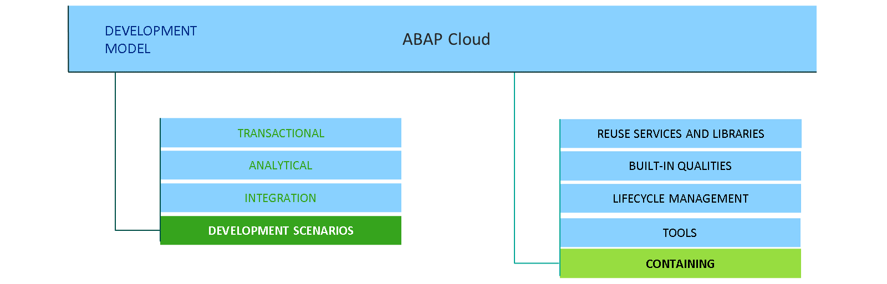
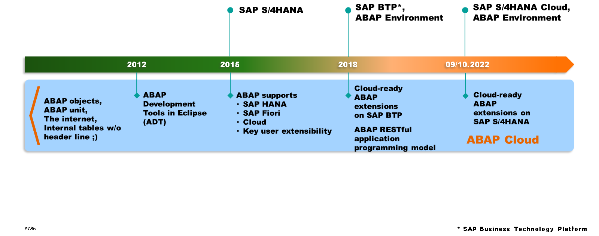
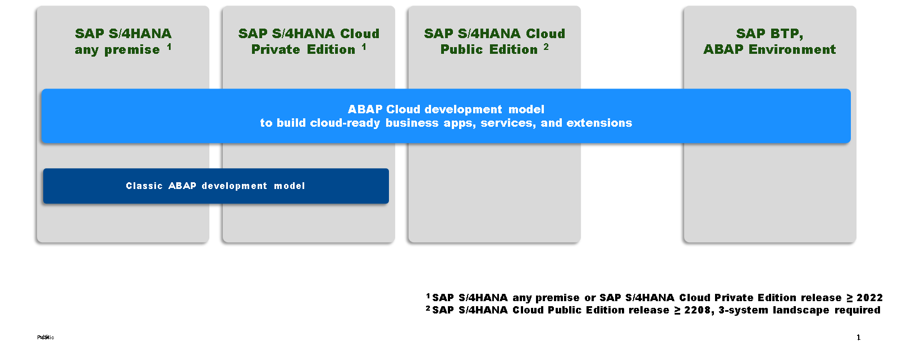
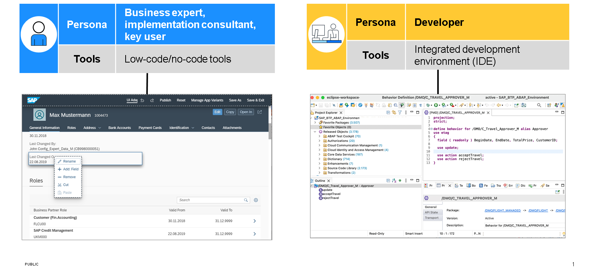
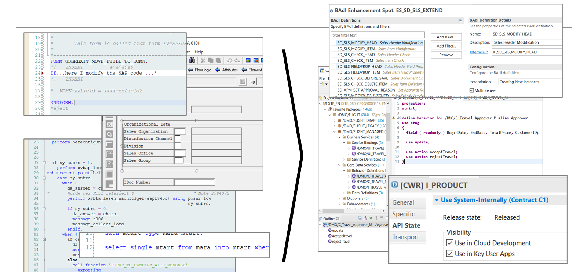
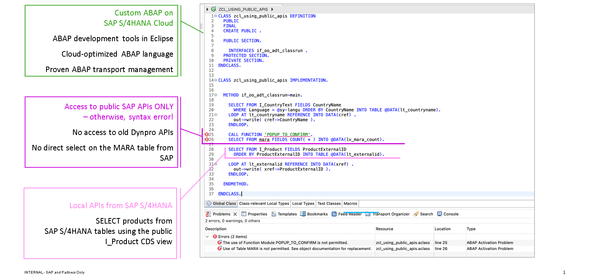

# 🌸 2 [EXPLORING ABAP CLOUD](https://learning.sap.com/learning-journeys/practicing-clean-core-extensibility-for-sap-s-4hana-cloud/exploring-the-abap-cloud-development-model_cd64db9d-409e-4f09-8ffa-3597a3cf3960)

> 🌺 Objectifs
>
> - [ ] Vous pourrez évaluer les fonctionnalités distinctes d'ABAP Cloud

## 🌸 FEATURES OF THE ABAP CLOUD DEVELOPMENT MODEL

### FROM ABAP CLASSIC TO THE ABAP CLOUD DEVELOPMENT MODEL

Tout au long du cours, nous avons souligné à plusieurs reprises l'importance cruciale pour les entreprises d'avoir des applications flexibles et facilement adaptables à l'évolution des besoins des clients. SAP S/4HANA Cloud répond à ce besoin, et l'extensibilité du noyau propre est le principe qui permet cette flexibilité. Dans la leçon précédente, nous avons vu que le cloud computing a joué un rôle central en devenant une plateforme de développement et d'exploitation d'applications. Nous avons également vu comment le cloud computing a conduit à l'évolution d'une nouvelle approche du développement et de la maintenance d'applications : le cloud natif. Enfin, nous avons vu qu'un aspect particulier du cloud natif, les API REST, est essentiel à son succès.

### EVOLUTION NOT REVOLUTION

L'émergence du cloud computing, du cloud natif et de REST, ainsi que le principe d'extensibilité du noyau propre, ont nécessité une évolution du langage ABAP et des modèles de développement ABAP utilisés par les développeurs au fil des ans. Heureusement, ABAP a la capacité d'évoluer en fonction de l'évolution des technologies et des besoins. À ses débuts, en tant que langage de programmation de quatrième génération (dans les années 1980), ABAP était principalement utilisé pour générer des rapports sur la plateforme SAP R/2. Avec l'émergence de SAP R/3 (dans les années 1990), le langage a été amélioré afin que SAP et ses clients puissent l'utiliser pour créer des programmes et des extensions. Des Service Packs aux packs d'améliorations, en passant par les mises à jour de versions, le langage ABAP a continuellement évolué pour répondre aux besoins du moment. Si le passage au cloud computing a constitué un changement fondamental, la stratégie de SAP pour ABAP est néanmoins centrée sur « l'évolution et non la révolution », ce qui signifie que les modifications apportées à ABAP pour l'adapter au cloud computing ont été précises, contrôlées, réfléchies et progressives. Plus important encore, les besoins des clients ont toujours été au cœur de ses préoccupations.

### A PREVIOUS EVOLUTION OF ABAP

À ce propos, avant d'examiner les changements apportés à ABAP par le cloud computing, il convient de s'arrêter un instant sur une situation antérieure où ABAP a dû évoluer en fonction d'un changement de paradigme. Il s'agissait de l'émergence des concepts orientés objet, largement répandus dans les années 1990. Jusque-là, le langage ABAP était procédural. Lorsque la nécessité pour ABAP de prendre en charge les concepts orientés objet est devenue évidente, plusieurs mots-clés ont été ajoutés au langage pour permettre aux développeurs de les implémenter. Ces mots-clés ont été soigneusement conçus pour faire évoluer le langage ABAP tout en reconnaissant et en respectant le code ABAP existant dans les systèmes clients, afin de minimiser les perturbations pour ces derniers. Ainsi, un développeur ABAP pouvait écrire du code procédural et orienté objet, tout en disposant de la flexibilité nécessaire pour trouver le juste équilibre entre les deux pour chaque tâche. Ainsi, si, par exemple, une entreprise se fixe comme objectif de rendre 90 % de son code personnalisé ABAP orienté objet d'ici une date donnée, cet objectif peut être atteint à son rythme, sans être imposé de manière descendante. Ce dernier point est important. ABAP a toujours évolué de manière à être généralement rétrocompatible. Cela signifie que les modifications sont généralement prospectives. Le code existant n'a pas nécessairement besoin d'être ajusté pour être conforme aux nouvelles normes ou fonctionnalités ABAP. Les développeurs utilisent simplement les nouvelles fonctionnalités pour développer leurs projets.

### THE ABAP CLOUD DEVELOPMENT MODEL (ABAP CLOUD)

L'émergence et la généralisation du cloud computing, du cloud natif et de REST ont fait émerger un besoin d'évolution pour ABAP. Ce besoin s'est concrétisé par le modèle de développement ABAP Cloud (ABAP Cloud). Les différents aspects et composants d'ABAP Cloud offrent tout ce dont un développeur ABAP a besoin pour un environnement cloud natif. Les principales fonctionnalités d'ABAP Cloud sont les suivantes :

- Un langage cloud natif : ABAP for Cloud Development – une version du langage ABAP optimisée pour le cloud

- Modèles de programmation cloud natifs : le modèle de programmation d'applications ABAP RESTful et l'analytique ABAP

- Fonctionnalités de plateforme en tant que service (PaaS) intégrées à la plateforme ABAP : services de réutilisation, gestion des identités et des accès, et connectivité

- Fonctionnalités SAP S/4HANA Cloud intégrées : API métier, points d'extension et événements

- Outils : outils de développement ABAP pour Eclipse comme environnement de développement intégré

Au cœur du modèle de développement ABAP Cloud se trouve son modèle de programmation, qui définit l'architecture de conception et d'exécution de l'ensemble des extensions, services et applications. Ce modèle de programmation s'articule généralement autour de trois cas d'utilisation :

- Transactionnel (OLTP) : ABAP Cloud permet de créer des objets métier et de les exposer sous forme de services, afin de les utiliser dans des interfaces utilisateur et des scénarios d'intégration. Tous les comportements standards sont pris en charge (création, lecture, mise à jour, suppression). Prenons l'exemple du célèbre objet métier « Commande Client ». Ces fonctionnalités sont obtenues grâce au modèle de programmation d'applications RESTful d'ABAP.

- Analytique (OLAP) : ABAP Cloud permet également de créer des services et des interfaces utilisateur pour l'analyse de données, l'exploration multidimensionnelle, etc. L'intégration de données dans SAP Analytics Cloud est un cas d'utilisation privilégié, rendu possible par l'analyse ABAP.

- Intégration : Ces deux aspects sont complétés par une intégration robuste des données et des applications pour répondre aux environnements orientés services actuels.

Le modèle de programmation n'est pas autonome : il s'accompagne de deux différenciateurs clés :

- Réutilisation des services et bibliothèques avec des services métier clés tels que les plages de numéros, les tâches applicatives, une plateforme de lancement SAP Fiori intégrée ABAP et un référentiel d'interface utilisateur pour déployer les interfaces utilisateur SAPUI5 et SAP Fiori.

- Qualités intégrées offrant une extensibilité de bout en bout au modèle de programmation, atouts majeurs du cloud comme l'évolutivité et la stabilité des mises à niveau, et bien plus encore.

### THE EVOLUTION TO ABAP CLOUD

ABAP Cloud est le fruit de nombreuses innovations au cours de la dernière décennie. Les outils de développement ABAP pour Eclipse ont été lancés en 2012, offrant aux développeurs un environnement supplémentaire pour créer, déboguer, tester et exécuter leur code ABAP. Peu après, Core Data Services a été lancé, offrant aux développeurs un moyen déclaratif de créer des modèles de données pour la création d'applications optimisées pour SAP HANA. REST, devenu un style architectural largement répandu, a conduit, comme nous l'avons vu dans l'unité précédente, au développement du modèle de programmation d'applications ABAP RESTful. Ce modèle permet aux développeurs ABAP de créer efficacement des services REST ABAP de bout en bout pour le développement d'applications transactionnelles SAP Fiori et d'API Web.

Chacune de ces innovations est précieuse. Mais, comme on le dit souvent, « le tout est plus grand que la somme de ses parties ». Il en va de même ici. ABAP Cloud rassemble non seulement toutes ces innovations, mais en ajoute également plusieurs autres, les combinant de manière holistique. Les développeurs peuvent désormais bénéficier d'un développement cloud natif efficace de bout en bout grâce à ABAP. ABAP Cloud permet de développer des applications et des services personnalisés, ainsi que de créer des extensions pour les applications SAP S/4HANA Cloud.

### AVAILABILITY OF ABAP CLOUD

ABAP Cloud est disponible comme option par défaut (et unique) dans les environnements SAP BTP et ABAP, ainsi que dans SAP S/4HANA Cloud Public Edition. Pour SAP S/4HANA Cloud Private Edition et SAP S/4HANA, ABAP Cloud coexiste avec ABAP Classic, et les clients peuvent choisir quand utiliser quel modèle. Les spécificités seront abordées dans l'unité 5, « Évaluation des considérations spécifiques à SAP S/4HANA Cloud Private Edition et SAP S/4HANA ». Encore une fois, il s'agit d'une évolution, pas d'une révolution.

Dans l'unité 2, leçon 2, « Évaluation de SAP Build », nous avons exploré la différence entre le « développeur citoyen » (c'est-à-dire un « constructeur ») et le « développeur » plus traditionnel, en termes de support d'outils. Les constructeurs ont besoin d'outils principalement de type « low code », tandis que les développeurs ont besoin d'outils plus orientés « pro-code ». ABAP Cloud est orienté vers le profil du développeur.

### CLOUD OPTIMIZED ABAP LANGUAGE

Du fait de sa longue et riche histoire, ABAP propose une grande variété de mots-clés, d'artefacts et de techniques pour fournir les fonctionnalités nécessaires au développement d'applications professionnelles. Cependant, tous ne sont pas compatibles avec les besoins d'une approche cloud native ; seul un sous-ensemble d'entre eux est donc utilisé dans ABAP Cloud. Par exemple, les mots-clés obsolètes comme l'instruction TABLES sont interdits. Dynpros et Web Dynpros sont également interdits, au lieu des interfaces utilisateur SAP Fiori basées sur des services REST créés à l'aide du modèle de programmation d'applications ABAP RESTful. Les instructions SELECT directement sur les tables SAP sont interdites, au lieu d'utiliser Core Data Services.

Pour clarifier cette différence, les développeurs doivent désormais attribuer la version linguistique aux objets de développement lors de leur création. Ce langage peut être « ABAP Standard » (« ABAP Classic »), « ABAP For Cloud Development » (pour le développement ABAP Cloud) ou « ABAP for Key Users » (également pour le développement ABAP Cloud ; nous l'aborderons dans la prochaine unité). En effectuant une affectation explicite, les vérifications appropriées peuvent être effectuées pour garantir que le travail de développement est conforme à ABAP Cloud.

### ABAP DEVELOPEMENT TOOLS FOR ECLIPSE

Traditionnellement, les développeurs utilisaient ABAP Workbench pour créer les différents artefacts nécessaires à une application, ainsi que pour vérifier la syntaxe et les déboguer. Comme mentionné précédemment, la plateforme Eclipse, accompagnée d'un plugin dédié, les outils de développement ABAP pour Eclipse, a été lancée en 2012 comme environnement alternatif « pro-code » pour le développement ABAP. Le développement ABAP Cloud s'effectue exclusivement avec les outils de développement ABAP pour Eclipse. Ces outils vérifient la compatibilité ABAP Cloud via une combinaison de vérifications du compilateur ABAP, de l'environnement d'exécution ABAP et du cockpit de test ABAP, selon le cas. Ces fonctionnalités, combinées aux fonctionnalités déjà existantes et connues des outils de développement ABAP pour Eclipse, telles que la saisie semi-automatique du code, la vérification de la syntaxe et le débogage, facilitent la transition vers le développement ABAP Cloud pour les développeurs. Pour plus d'informations sur la migration fluide d'ABAP Workbench vers les outils de développement ABAP pour Eclipse, consultez la FAQ destinée aux [experts SE80 utilisant ADT](https://help.sap.com/docs/ABAP_PLATFORM_NEW/c238d694b825421f940829321ffa326a/bd5c5b75eeab4b7892eff1e1abce7485.html).
