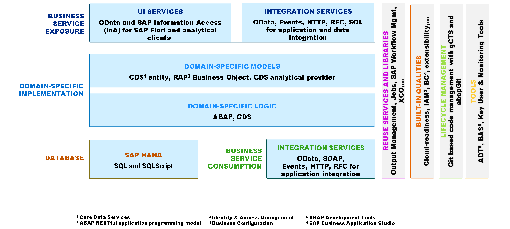

# 🌸 3 [DESCRIBING THE DIFFERENT USE CASES FOR ABAP CLOUD](https://learning.sap.com/learning-journeys/practicing-clean-core-extensibility-for-sap-s-4hana-cloud/describing-the-different-aspects-of-the-abap-cloud-development-model_f1e03a57-f23a-493a-b36c-4838221678ad)

> 🌺 Objectifs
>
> - [ ] Vous serez capable de décrire les différents cas d'utilisation d'ABAP Cloud

## 🌸 THE DIFFERENT USE CASES FOR DEVELOPMENT UTILIZING THE ABAP CLOUD DEVELOPMENT MODEL

### ABAP CLOUD - TRANSACTIONAL (OLTP) USE CASES: THE ABAP RESTFUL APPLICATION PROGRAMMING MODEL

Nous avons vu comment le cloud natif a nécessité une évolution du langage de programmation ABAP (version ABAP « ABAP for Cloud Development » ou « ABAP for Key Users » par opposition à « ABAP Classic ») et de l'IDE principal (outils de développement ABAP pour Eclipse). Il n'est donc pas surprenant que le modèle de programmation principal utilisé par ABAP doive également évoluer. Les technologies ABAP classiques telles que SAP GUI ou Web Dynpro ne sont pas compatibles avec les besoins du cloud natif.

Comme mentionné dans la leçon précédente, REST s'est imposé comme l'un des modèles architecturaux d'API les plus populaires auprès des développeurs, et l'une de ses implémentations les plus répandues est le protocole OData (Open Data Protocol). Souvent appelé « ODBC pour le Web », OData est conçu dès le départ pour optimiser le type de traitement et de manipulation de données qu'un programme métier doit effectuer. Bien que cela ne soit pas techniquement requis, les données métier manipulées via OData résident le plus souvent dans une base de données. La base de données SAP HANA étant la base de données sous-jacente de SAP S/4HANA Cloud, REST en général et OData en particulier constituent des orientations naturelles pour un modèle de programmation ABAP évolué prenant en compte les besoins du cloud natif. Le résultat de cette évolution est le modèle de programmation d'applications ABAP RESTful.

Mais il y avait d'abord un petit arrêt.

La première génération de services OData compatibles REST reposait sur le modèle de programmation précurseur du modèle de programmation d'applications ABAP RESTful, le modèle de programmation ABAP pour SAP Fiori. Bien qu'à l'époque de sa création, ce modèle constituait une bonne pratique pour la création de services, il présentait quelques difficultés. Le développement utilisant le modèle de programmation ABAP pour SAP Fiori avec des scénarios de développement en site propre n'était pas pris en charge et la prise en charge des outils consistait en plusieurs codes de transaction, au lieu d'un environnement d'outils unifié. De plus, certains aspects du modèle de programmation utilisaient une implémentation de framework offrant un peu moins de transparence vis-à-vis du code ABAP que celle à laquelle les développeurs ABAP sont habitués.

Bien que ces défis aient été maîtrisés, l'étape suivante de l'évolution a consisté à les éliminer en consolidant l'ensemble du flux de développement dans Eclipse avec les outils de développement ABAP pour Eclipse, ainsi qu'en simplifiant et en consolidant les artefacts de développement dans une liste simple et intuitive. Le modèle de programmation d'applications ABAP RESTful succède au modèle de programmation ABAP pour SAP Fiori et est le modèle de programmation utilisé dans ABAP Cloud pour les cas d'utilisation transactionnels.

Le modèle de programmation d'applications ABAP RESTful permet de créer des services OData compatibles REST à partir d'un nombre limité d'artefacts simples et intuitifs. Ces services peuvent être utilisés soit comme couche de service pour les applications SAP Fiori exécutées au niveau utilisateur, soit comme API Web autonome (utilisable par tout type de client, qu'il soit basé sur une interface utilisateur ou non). Les objets métier créés avec le modèle de programmation d'applications ABAP RESTful peuvent être utilisés comme API locales (nous en parlerons prochainement).

Dans la leçon précédente, nous avons mentionné qu'une conception de microservices, où une application est partitionnée en une couche utilisateur, une couche service et une couche données distinctes, est un élément important du développement cloud natif. Le modèle de programmation d'applications ABAP RESTful est conçu dès le départ pour être cohérent avec le concept de microservices.

### ABAP RESTFUL APPLICATION PROGRAMMING MODEL

Les artefacts du modèle de programmation d'applications ABAP RESTful sont organisés autour des quatre couches suivantes :

- Data Access

- Domain Model and Implementation

- Business Service Exposure

- Business Service Consumption

Comprenons les différentes couches.

- Data Access

  La couche de base du modèle de programmation d'applications ABAP RESTful repose sur des tables de base de données, qui contiennent les données métier nécessaires aux transactions et aux analyses. Cette base de données est bien sûr SAP HANA. Grâce à SAP HANA, le modèle de programmation d'applications ABAP RESTful bénéficie automatiquement de l'architecture en mémoire, du stockage en colonnes, des données en temps réel et de l'apprentissage automatique, entre autres technologies.

- Domain Model and Implementation

  Le modèle de domaine et sa mise en œuvre comprennent la représentation des différents concepts impliqués dans un scénario commercial (par exemple les clients et les commandes), leurs relations (par exemple, la relation parent-enfant entre les clients et les commandes) et enfin la mise en œuvre de ces entités et relations.

- Domain-Specific Programming

  Le langage ABAP et ABAP Core Data Services (CDS) sont les principaux langages utilisés pour l'implémentation spécifique au domaine des requêtes en lecture seule et des objets métier transactionnels dans le contexte du modèle de programmation d'applications ABAP RESTful.

  La version ABAP « ABAP for Cloud Development » fournit des constructions de langage optimisées pour le cloud, utilisées dans le contexte d'ABAP Cloud pour implémenter la logique métier. Le langage ABAP est enrichi d'un langage de manipulation d'entités (EML) permettant de contrôler nativement le comportement transactionnel des objets métier créés avec le modèle de programmation d'applications ABAP RESTful.

  CDS fournit une puissante infrastructure de modélisation de données permettant de définir des modèles de données sémantiquement riches sur le serveur d'applications ABAP. Les différents artefacts CDS sont définis à l'aide des éléments suivants :

  - CDS Type Definition Language (TDL)

  - CDS Data Definition Language (DDL)

  - CDS Service Definition Language (SDL)

  - CDS Data Control Language (DCL)

  - CDS Annotations

- Domain-Specific Data Modeling

  Les modèles spécifiques à un domaine déterminent les artefacts de conception de votre modèle de données en fonction de l'aspect du modèle de programmation. Vous pouvez développer des requêtes en lecture seule et des objets métier transactionnels avec le modèle de programmation d'applications ABAP RESTful. Chaque entité réelle est représentée par un objet métier (BO), composé d'un ou plusieurs nœuds reliés par une relation parent-enfant. Un objet métier commence toujours par un nœud racine.

  Prenons l'exemple des clients et des commandes mentionné précédemment. Pour chacun d'eux, deux possibilités existent dans le modèle de programmation d'applications RESTful ABAP : des scénarios en lecture seule (fonctionnalité de requête) et des scénarios transactionnels (fonctionnalités de création, de mise à jour et de suppression). Les requêtes sont modélisées à l'aide d'ABAP CDS. La fonctionnalité transactionnelle est définie par une définition de comportement CDS, en langage ABAP et en EML. Sur le plan conceptuel, un nœud BO se compose donc d'un modèle de données défini par des entités ABAP CDS et de la capacité transactionnelle associée, définie par une définition de comportement CDS, et implémentée en langage ABAP et en EML. Le modèle de données de chaque nœud BO est représenté par une entité de vue CDS définie au-dessus d'une table datable ou d'autres entités CDS. Ainsi, dans un scénario clients/commandes, par exemple, il y aurait deux entités de vue CDS principales, une pour chaque nœud.

- Business Service Exposure

  Un service métier est le lieu où les capacités REST du modèle de programmation d'applications ABAP RESTful prennent tout leur sens. Il comprend les éléments suivants :

  - Une définition de service exposant les capacités de requête et de transaction accessibles via REST ;

  - Une liaison de service associant une définition de service à un protocole REST, permettant ainsi la consommation du service.

  Une définition de service peut être publiée plusieurs fois par différentes liaisons de service utilisant différents protocoles, selon le type de consommation souhaité.

- Business Service Consumption

La consommation est possible grâce à diverses options. Comme mentionné précédemment, une liaison de service basée sur OData permet le développement d'applications SAP Fiori. OData peut également être utilisé pour l'intégration d'application à application (ou de système à système). Dans ce cas, les métadonnées d'interface utilisateur de la couche de modélisation et d'implémentation du domaine sont ignorées. L'architecture pilotée par événements permet une communication asynchrone entre un fournisseur et un consommateur d'événements dans les cas d'utilisation où aucune réponse directe du consommateur n'est requise. Grâce à SAP Event Mesh, un service de SAP BTP, un modèle de programmation d'applications RESTful ABAP, BO peut agir comme consommateur ou fournisseur d'événements.

### ABAP CLOUD - ANALYTICAL (OLAP) USE CASES

Outre ses cas d'usage transactionnels, ABAP Cloud est également capable de relever le défi des scénarios analytiques. Ces cas d'usage analytiques impliquent l'analyse et l'évaluation de modèles de données multidimensionnels afin de prendre des décisions métier en temps réel, basées sur les données. L'aspect « modèle de programmation analytique » se concentre sur la création de modèles de données permettant d'analyser les données métier dans des configurations embarquées ou inter-systèmes, et de visualiser les données dans des tableaux de bord ou au sein d'applications.

ABAP Cloud permet le développement de bout en bout de ces cas d'usage analytiques. Des fournisseurs analytiques, tels qu'un schéma réutilisable en étoile ou en flocon (basé sur des cubes, des dimensions et des hiérarchies), peuvent être conçus pour créer des modèles multidimensionnels spécifiques à un domaine. La logique spécifique au domaine est implémentée avec CDS. Le fournisseur analytique CDS peut être exposé via le service de protocole Information Access (InA) pour différents clients analytiques, tels que SAP Analytics Cloud ou SAP Analysis for Office. De plus, l'exposition OData pour l'accès via les interfaces utilisateur SAP Fiori est possible.

### ABAP CLOUD - INTEGRATION USE CASES

### THE INTELLIGENT, SUSTAINABLE ENTERPRISE

Enfin, nous examinons les cas d'utilisation de l'intégration. Comprendre ce scénario permet de définir le terme « entreprise intelligente et durable ». Une entreprise intelligente et durable est une entreprise qui applique systématiquement les technologies avancées et les meilleures pratiques au sein de processus métier agiles et intégrés. SAP accompagne ses clients dans leur transformation en entreprises intelligentes en leur fournissant des solutions pour l'intégration des données et des processus, la création de chaînes de valeur flexibles, l'innovation fondée sur les meilleures pratiques du secteur, la compréhension et l'action des clients, partenaires et employés, et la gestion de l'impact environnemental. En combinant le portefeuille complet de produits SAP, tels que SAP S/4HANA Cloud et SAP Ariba, avec SAP Business Technology Platform, SAP dispose de la capacité unique d'intégrer les processus métier de bout en bout.

L'entreprise intelligente de SAP repose sur les quatre processus clés suivants :

- Lead To Cash

- Design To Operate

- Source To Pay

- Recruit To Retire

Chacun de ces processus nécessite une connectivité entre plusieurs produits et solutions SAP, dont SAP S/4HANA Cloud. Par conséquent, les options de connectivité restent nécessaires et sont fournies dans le cadre d'ABAP Cloud. Les technologies d'intégration obsolètes ne peuvent plus être utilisées dans ABAP Cloud (par exemple, IDoc) ; seuls les frameworks publiés peuvent l'être. Les frameworks de connectivité suivants sont disponibles :

- Services OData

- Événements métier

- Services HTTP

- RFC via WebSocket compatible cloud

- Consommation SOAP (fournisseur de services SOAP prévu)

- Service SQL pour les clients ODBC externes

- Accès aux informations SAP (InA) pour les clients analytiques

Outre ces infrastructures, Cloud Connector permet la connectivité aux systèmes situés dans des environnements internes.

Pour garantir la séparation du contenu entre les identifiants, les clients n'ont pas d'accès direct aux transactions classiques pour les destinations (SM59) et les ports logiques (SOAMANGER) dans SAP S/4HANA Cloud. À la place, une série d'applications SAP Fiori (appelées Cloud Communication Management) est utilisée pour configurer tous les artefacts logiques nécessaires à la mise en œuvre des scénarios de communication, ainsi que les options d'utilisateur et d'authentification nécessaires.

### ABAP CLOUD DEVELOPMENT MODEL VERSUS ABAP RESTFUL APPLICATION PROGRAMMING MODEL

Nous concluons cette leçon en reconnaissant qu'à première vue, les termes « modèle de développement ABAP Cloud » et « modèle de programmation d'applications ABAP RESTful » peuvent sembler identiques. Or, ce n'est pas le cas. Ces deux termes désignent des concepts différents, qu'il est important de comprendre.

ABAP Cloud a une portée plus large. Il englobe le modèle de développement complet. Cela inclut (sans s'y limiter) les modèles de programmation, les spécificités du cycle de vie, les API, les règles de développement personnalisé et d'extensions, et même les spécificités liées à la gestion des identités et des accès.

En revanche, le modèle de programmation d'applications ABAP RESTful a une portée plus restreinte et plus spécifique. Il désigne un modèle de programmation spécifique (outils, technologies et techniques) permettant de créer des artefacts de développement spécifiques à des fins spécifiques. Le modèle de programmation fait partie intégrante d'ABAP Cloud et y est intégré. Il est tout aussi pertinent de définir la relation inverse (c'est-à-dire qu'ABAP Cloud fait référence au modèle de programmation d'applications ABAP RESTful pour implémenter des cas d'utilisation transactionnels, analytiques et d'intégration).
