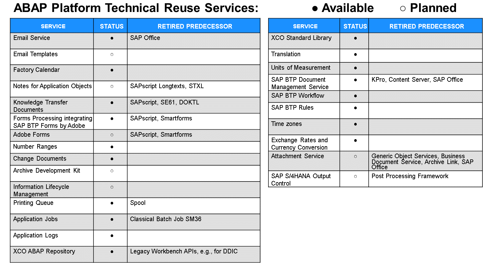

# 🌸 4 [DESCRIBING ABAP PLATFORM REUSE SERVICES](https://learning.sap.com/learning-journeys/practicing-clean-core-extensibility-for-sap-s-4hana-cloud/describing-abap-platform-reuse-services_dfed68b3-33c9-4841-9804-ea7c27173828)

> 🌺 Objectifs
>
> - [ ] Vous serez capable de décrire les services de réutilisation de la plateforme ABAP

## 🌸 ABAP PLATFORM TECHNICAL REUSE SERVICES

### REUSE SERVICES

Au fil des ans, les développeurs ABAP se sont habitués à une variété de services techniques fournis par la plateforme SAP Basis / SAP NetWeaver. Heureusement, la conception du cloud computing offre une couche appropriée (Platform as a Service) pour assurer la continuité de ces services. Par conséquent, la plateforme ABAP continue d'offrir un grand nombre de ces services, permettant ainsi aux développeurs de continuer à les utiliser dans le cadre de développements cloud-natifs. Voici quelques-uns de ces services :

- Email Service

- Number Ranges and Change Documents

- Printing Queue

- Application Jobs and Logs

- Translation

- Units of Measurement

- Time Zones

- Exchange Rates and Currency Conversion

SAP BTP propose les services de réutilisation technique supplémentaires suivants :

- SAP BTP Forms By Adobe

- SAP BTP Document Management Service

- SAP Workflow Management

- SAP BTP Rules
