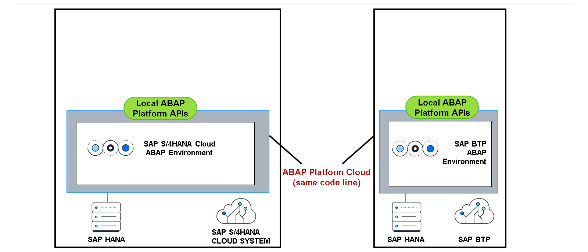
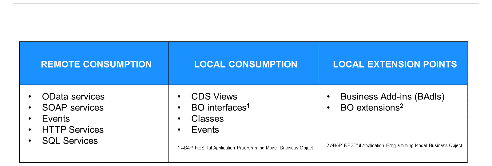
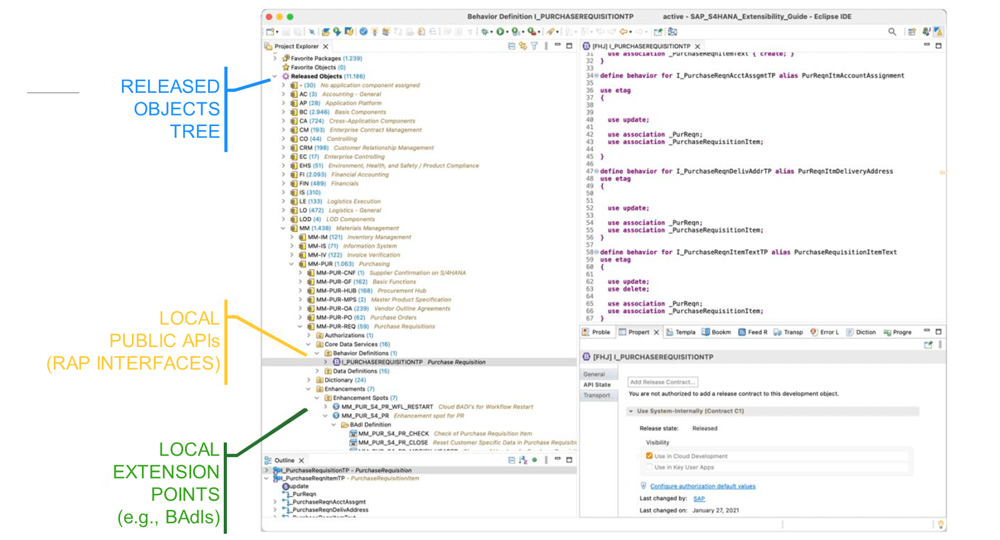

# 🌸 5 [EXPLORING RELEASED APIS](https://learning.sap.com/learning-journeys/practicing-clean-core-extensibility-for-sap-s-4hana-cloud/exploring-released-apis_d80ce197-097e-4e7b-8696-b960738089c7)

> 🌺 Objectifs
>
> - [ ] Vous pourrez explorer différents types d'API publiées

## 🌸 SAP S/4 HANA CLOUD BUSINESS APIS, EXTENTION POINTS AND EVENTS

### RELEASED APIS: LOCAL ABAP PLATFORM APIS

Comme mentionné dans l'Unité 1, Leçon 2, « Présentation de l'approche Clean Core », l'un des aspects les plus importants du concept de Clean Core est l'utilisation d'interfaces stables à la mise à niveau dans SAP S/4HANA Cloud. Cela contribue à des mises à jour logicielles fluides et faciles, sans interruption.

Pour tirer parti de cet avantage, SAP et ses clients collaborent. Côté SAP, SAP fournit des interfaces publiques, de plusieurs types. De plus, SAP garantit la stabilité de ces interfaces d'une version à l'autre, afin que les clients puissent les utiliser en toute confiance. Côté client, les clients s'engagent à utiliser exclusivement les interfaces publiques, tant pour leurs nouveaux développements (artefacts créés par le client) que pour leurs extensions (implémentations). En pratique, cela est assuré par des vérifications de syntaxe et des tests ABAP dans les outils de développement ABAP pour Eclipse, dans le cadre du modèle de développement ABAP Cloud, dont les détails seront abordés dans l'unité suivante.

Ces interfaces publiées proviennent de plusieurs sources. La première est la plateforme cloud ABAP, disponible dans les environnements ABAP SAP BTP et SAP S/4HANA Cloud. On les appelle communément API locales de la plateforme ABAP. Puisque les deux produits utilisent la même ligne de code cloud de la plateforme ABAP, un objet SAP (un élément de données, par exemple) publié est disponible aux deux emplacements. Ainsi, les développeurs peuvent placer le code là où ils le souhaitent, voire aux deux emplacements, si c'est l'approche privilégiée.

Conscient que dans un environnement cloud-natif, certains objets SAP peuvent ne pas être adaptés, SAP les a systématiquement remplacés par des équivalents plus adaptés au cloud.

### SAP S/4 HANA CLOUD BUSINESS APIS

### REMOTE CONSUMPTION

Il existe plusieurs types d'interfaces publiques utilisables dans SAP S/4HANA Cloud, et leur finalité est essentielle pour les comprendre.

La première finalité concerne les interfaces destinées à être utilisées par des sources distantes (non SAP S/4HANA Cloud), telles que des applications personnalisées exécutées sur SAP BTP. Ces interfaces (communément appelées API distantes) peuvent être des services OData créés à l'aide du modèle de programmation d'applications ABAP RESTful, ainsi que des services SOAP. Nous avons exploré comment les services OData peuvent être utilisés par SAP Fiori et SAP Build Apps lors du développement d'applications. Ces deux scénarios étaient des appels directs (synchrones) initiés directement depuis l'application. Cependant, de nombreuses applications sont conçues comme asynchrones (scénario d'appel indirect). Dans un scénario asynchrone, plutôt que de communiquer directement, l'expéditeur et le destinataire utilisent un broker middleware pour échanger des informations sous forme de messages. Cloud Integration, une fonctionnalité de SAP Integration Suite, est un service exécuté sur SAP BTP et spécialement conçu pour être utilisé dans ce type de scénarios. Un adaptateur OData et un adaptateur SOAP sont fournis afin que les développeurs puissent utiliser respectivement les services OData et SOAP.

### EVENTS

SAP Event Mesh, un autre service proposé dans le cadre de SAP BTP, permet aux applications de communiquer entre elles via des événements asynchrones. Ce type de communication permet la conception de processus métier pilotés par événements. Avec une architecture pilotée par événements, vous disposez d'un fournisseur d'événements qui déclenche un événement et d'un consommateur d'événements qui en est informé et réagit en conséquence. SAP Event Mesh fait office de lien entre le fournisseur et le consommateur. Le modèle de programmation d'applications ABAP RESTful prend en charge la conception pilotée par événements dès sa conception, et les BO du modèle de programmation d'applications ABAP RESTful peuvent fonctionner comme fournisseur ou consommateur, selon le scénario de conception.

### LOCAL CONSUMPTION

Le deuxième objectif concerne les interfaces destinées à être utilisées localement (c'est-à-dire basées sur SAP S/4HANA Cloud). L'utilisation de ces interfaces peut prendre la forme d'une application personnalisée développée à l'aide du modèle de programmation d'applications RESTful ABAP, ou d'une implémentation BAdI. Lors de la conception de ces utilisations, les développeurs peuvent utiliser des classes et des vues CDS, entre autres, pour faciliter l'accès aux fonctionnalités SAP S/4HANA Cloud. Ces interfaces locales sont communément appelées API locales. Pour prendre un exemple simple d'API locale, si un développeur a besoin d'accéder à la table des pays, il sélectionne généralement les données directement dans la table T005. Cependant, une vue CDS locale « I_country » existe (et a été publiée) et permet d'accéder à ces données.

### LOCAL EXTENSION POINTS

Enfin, il existe des interfaces utilisées à des fins d'extension (points d'extension locaux). Similaires aux API locales, ces points d'extension existent dans SAP S/4HANA Cloud et les développeurs y créent leurs implémentations d'extension. Les BAdI, initialement introduits avec SAP R/3 4.6(c), sont disponibles dans SAP S/4HANA Cloud, le modèle de programmation d'applications ABAP RESTful étant le modèle de programmation prédominant utilisé par ABAP Cloud. Un modèle d'extensibilité a également été conçu et est disponible pour les développeurs.

Les API publiques locales et distantes, ainsi que les points d'extension locaux pour SAP S/4HANA Cloud, sont visibles via SAP Business Accelerator Hub et peuvent continuer à être utilisés à des fins de découverte. Cependant, les outils de développement ABAP pour Eclipse proposent une option supplémentaire : la vue des objets publiés, qui indique au développeur les objets publiés spécifiquement pour le développement ABAP Cloud. Alors que SAP Business Accelerator Hub affiche les API distantes, les événements, les vues CDS, les interfaces BO du modèle de programmation d'applications ABAP RESTful et les BAdI, la vue des objets publiés affiche les objets supplémentaires publiés pour le développement, tels que les éléments de données, les objets d'autorisation et les vues CDS.

Une fonctionnalité différente, mais étroitement liée, des outils de développement ABAP pour Eclipse est leur capacité à détecter l'utilisation d'API non publiées et, si une solution de remplacement appropriée est disponible, à afficher un message d'erreur de syntaxe suggérant la solution de remplacement. Par exemple, la table T005 (Pays) n'est pas publiée. Cependant, une vue CDS de remplacement, I_COUNTRY, est disponible. Tout accès à la table T005 génère une erreur de syntaxe avec le message suivant :

`The use of table T005 is not permitted. Use CDS Entity I_COUNTRY instead.`
