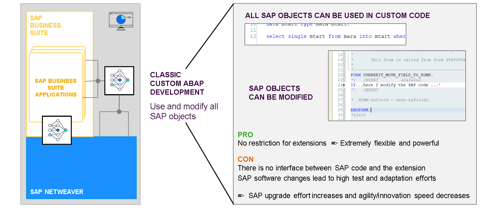

# 🌸 1 [EVALUATING THE NECESSITY FOR A NEW EXTENSIBILITY MODEL](https://learning.sap.com/learning-journeys/practicing-clean-core-extensibility-for-sap-s-4hana-cloud/evaluating-the-necessity-for-a-new-extensibility-model_d0073ae1-b57d-4c2e-9782-9f944369b933)

> 🌺 Objectifs
>
> - [ ] Vous serez capable d'évaluer l'extensibilité classique et ses défis

## 🌸 CLASSIC EXTENSIBILITY

### CLASSICAL EXTENSIBILITY AND THE ISSUE IT PRESENTS WITH CLOUD NATIVE

SAP S/4HANA Cloud étant conçu de A à Z, conformément aux principes du cloud natif, il n'existe aucun projet de mise à jour spécifique à chaque client. Les mises à jour logicielles sont déployées simultanément vers tous les clients. Cependant, comme mentionné précédemment dans l'Unité 1, Leçon 2, « Présentation de l'approche « Clean Core », l'extensibilité est une fonctionnalité importante et nécessaire des solutions SAP, et SAP S/4HANA Cloud ne fait pas exception. L'extensibilité permet aux clients de créer un avantage concurrentiel en personnalisant leurs processus métier et aux partenaires d'enrichir leur ERP avec des solutions sur mesure.

Les techniques d'extensibilité classiques, présentées dans l'Unité 1 et utilisées par les clients par le passé, ne sont pas compatibles avec le cloud natif. Un cadre évolué est nécessaire : un cadre qui permet aux clients de continuer à bénéficier d'un avantage concurrentiel grâce à la différenciation via les extensions, tout en bénéficiant des mises à jour logicielles de SAP S/4HANA Cloud de manière fluide et sans interruption. La solution est le modèle d'extensibilité de SAP S/4HANA Cloud, qui permet aux clients de conserver un noyau propre même lors du développement d'extensions.
