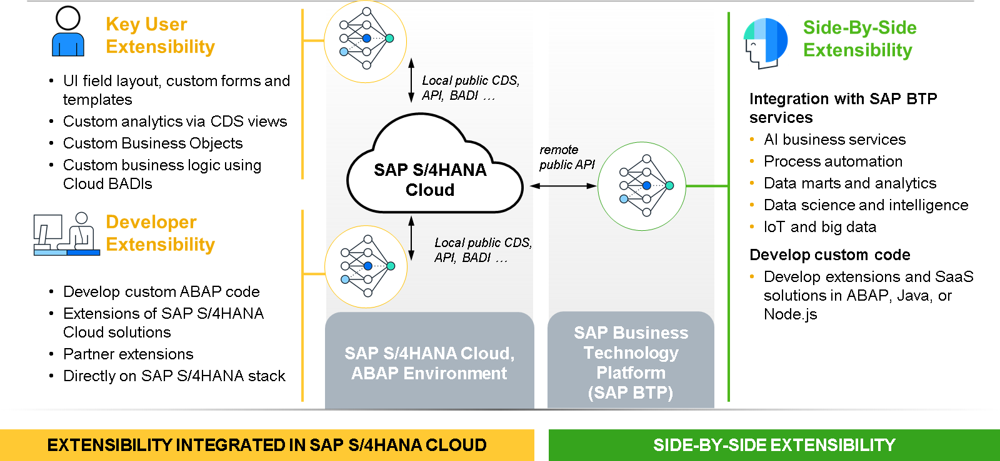

# 🌸 2 [INTRODUCING THE SAP S/4 HANA CLOUD EXTENSIBILITY MODEL](https://learning.sap.com/learning-journeys/practicing-clean-core-extensibility-for-sap-s-4hana-cloud/introducing-the-sap-s-4hana-cloud-extensibility-model_ccb4be88-d66d-47e1-96a0-3341dc007416)

> 🌺 Objectifs
>
> - [ ] Vous serez en mesure d'expliquer les fonctionnalités essentielles du modèle d'extensibilité SAP S/4HANA Cloud

## 🌸 SAP S/4 HANA CLOUD EXTENSIBILITY MODEL

### SAP S/4 HANA CLOUD EXTENSIBILITY MODEL

Le modèle d'extensibilité de SAP S/4HANA Cloud repose sur les trois principes suivants :

- Les extensions ne peuvent être implémentées qu'en interne dans SAP S/4HANA Cloud (extensions on-stack) ou en externe (extensions côte à côte exécutées sur SAP BTP).

- Les extensions ne peuvent utiliser que des interfaces de programmation d'applications (API) et des BAdI SAP publics, locaux ou distants, ainsi que des points d'extension d'objet métier (OBM) du modèle de programmation d'applications RESTful ABAP.

- Les extensions ne peuvent être implémentées qu'à l'aide de technologies cloud publiées.

### EXTENSION TYPES

Les principaux principes du modèle d'extensibilité SAP S/4HANA Cloud reposent sur les types d'extensions. Il existe trois patterns d'extensions répartis en deux catégories :

- On-stack extensions, qui se divisent en deux types distincts :

  - Key User Extensions (Type 1)

  - Developer Extensions (Type 2)

- Side-By-Side Extensions (Type 3)
