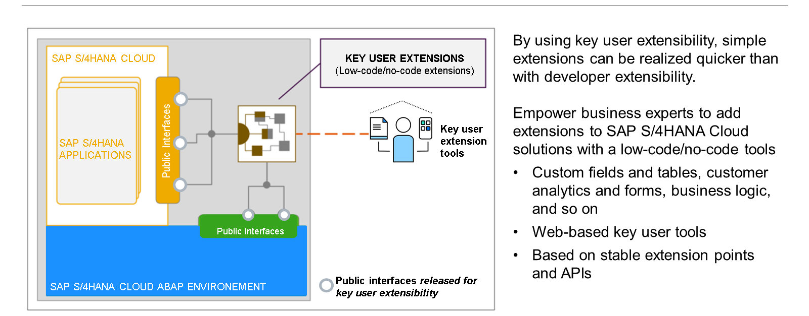

# 🌸 3 [EXPLAINING KEY USER EXTENSIBILITY](https://learning.sap.com/learning-journeys/practicing-clean-core-extensibility-for-sap-s-4hana-cloud/explaining-key-user-extensibility_c7f6cbcb-ed54-4f1d-8e76-4a6e311e3cfa)

> 🌺 Objectifs
>
> - [ ] Vous serez capable de décrire les différents outils utilisés dans l'extensibilité des utilisateurs clés

## 🌸 KEY USER EXTENSIBILITY

Précédemment, dans la leçon 2 de l'unité 2, « Évaluer SAP Build », nous avons expliqué que l'émergence du développeur citoyen a transformé le développement d'applications. L'extensibilité des utilisateurs clés s'adresse aux personnes dont les profils s'inscrivent dans le cadre du développement citoyen, c'est-à-dire l'utilisation d'outils low-code/no-code pour accomplir leurs tâches. Ces profils incluent donc également les experts métier, les utilisateurs clés et potentiellement d'autres types de rôles.

Les options d'extensibilité des utilisateurs clés (anciennement appelées « in-app ») couvrent un large éventail de cas d'utilisation. Les outils utilisés pour créer des extensions utilisateur clés ne dépendent pas de la compréhension par le développeur citoyen des détails techniques sous-jacents de l'application SAP étendue. L'accent est mis sur la mise en œuvre et le déploiement rapides d'extensions simples à l'aide d'outils low-code/no-code. Tous ces outils sont des applications web SAP Fiori, disponibles dans toutes les options de déploiement SAP S/4HANA et, lorsqu'ils sont utilisés, sont conformes à l'approche « clean core ».

En résumé, les outils et fonctionnalités sont les suivants :

- User Interface (UI) Adaption at Runtime : Un utilisateur clé peut adapter une interface utilisateur à l'exécution. Par exemple, un libellé de champ peut être modifié pour une valeur spécifique à un pays ou un nouveau champ peut être ajouté à l'affichage.

- Custom Fields : Grâce à cet outil, un utilisateur clé peut créer et modifier des champs personnalisés pour les tables SAP, les vues Core Data Service (CDS) ou les services OData.

- Custom Business Logic : Cet outil permet à un utilisateur clé d'améliorer les fonctionnalités de SAP S/4HANA Cloud en ajoutant une logique métier supplémentaire. Cette logique est intégrée à un point d'amélioration sous-jacent (dont les détails sont masqués pour l'utilisateur clé) et comprend un éditeur ABAP web avec saisie semi-automatique du code, vérification de la syntaxe et fonctionnalités de test.

- Custom Business Object (BO) : Grâce à cet outil, les utilisateurs clés peuvent aller plus loin que la logique métier personnalisée. De nouveaux BO peuvent être créés, ainsi que les tables de base de données associées. De plus, une API pour la création, la lecture, la mise à jour et la suppression de données peut être créée.

- Custom CDS View : Un utilisateur clé peut utiliser cet outil pour modéliser l'accès aux données d'une manière qui ne serait pas compatible avec les vues CDS existantes, afin de prendre en charge le reporting ou la logique métier personnalisée.

- Custom Analytical Queries : Les requêtes constituent l'un des fondements du reporting. L'outil de requêtes analytiques personnalisées permet aux utilisateurs clés de les créer facilement à partir de sources de données SAP ou créées par les clients.

- KPIs : Tout comme les requêtes, les KPI sont un élément important du reporting. Grâce à l'ensemble d'outils KPI, les utilisateurs clés peuvent concevoir de nouveaux KPI visualisés sous forme de mosaïques dans la plateforme SAP Fiori, avec des fonctionnalités d'exploration.

- Forms : Enfin, pour prendre en charge les implémentations de processus basés sur des formulaires et des e-mails, l'outil de formulaires personnalisés permet aux utilisateurs clés de créer des modèles de formulaires et d'e-mails à partir de sources de données SAP telles que les vues CDS et les services OData.
