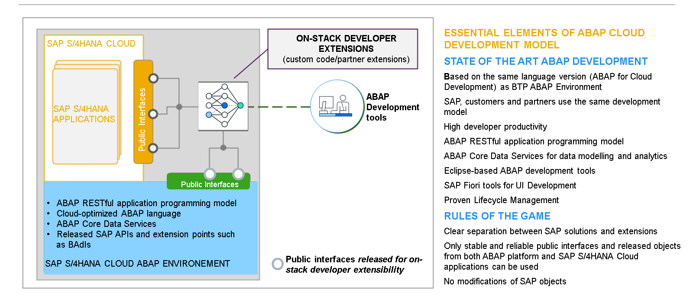
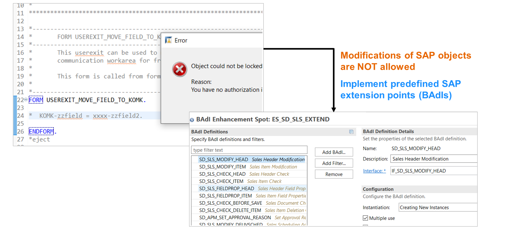
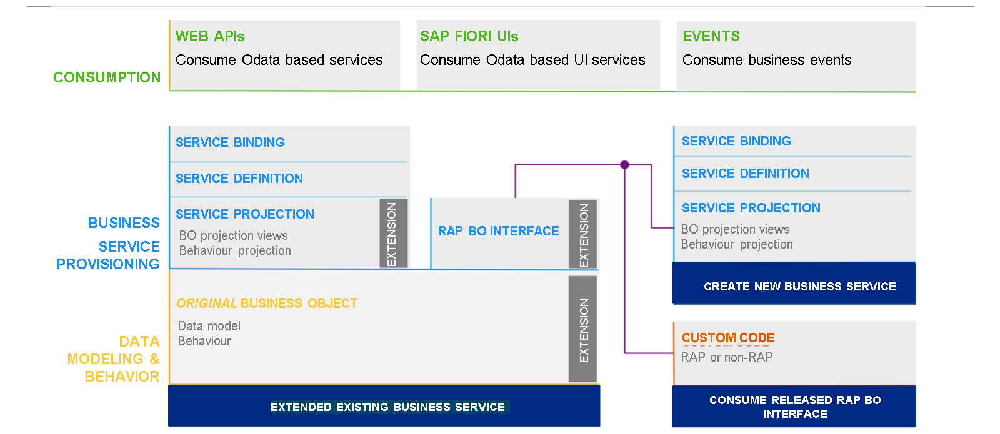

# 🌸 4 [EXPLAINING DEVELOPER EXTENSIBILITY](https://learning.sap.com/learning-journeys/practicing-clean-core-extensibility-for-sap-s-4hana-cloud/explaining-developer-extensibility_f2683861-d69e-4a59-9e3e-01e3cc20fb0f)

> 🌺 Objectifs
>
> - [ ] Explorer l'extensibilité du modèle de programmation d'applications ABAP RESTful
>
> - [ ] Explorer la conception des BAdI

## 🌸 DEVELOPER EXTENSIBILITY

Les extensions pour développeurs sont orientées vers le profil de développeur ABAP traditionnel. Grâce aux points d'extension publiés, les développeurs peuvent implémenter des cas d'utilisation plus complexes. Voici quelques possibilités :

- Extensions nécessitant un accès SQL fréquent et/ou complexe aux données

- Extensions exécutées dans la même logical unit of work (LUW) que les applications SAP

- Extensions servant d'interface de programmation d'applications (API) distante pour les applications côte à côte

Les extensions pour développeurs sont implémentées dans l'environnement ABAP SAP S/4HANA Cloud (intégré à la plateforme ABAP pour SAP S/4HANA) à l'aide du modèle de développement ABAP Cloud. Tous les éléments constitutifs du modèle sont utilisés, tels que les outils de développement ABAP pour Eclipse, l'utilisation d'interfaces publiques, etc.

L'extensibilité pour développeurs est proposée aux clients sous deux formes :

- ABAP RESTful application programming model extensibility options

- Business Add-Ins

Comme pour l'extensibilité classique, SAP décide si et dans quelle mesure les deux possibilités sont offertes. Actuellement, plus de 125 interfaces d'objets métier (qui répertorient les parties extensibles d'un modèle de programmation d'application ABAP RESTful BO) et plus de 800 modules complémentaires métier sont disponibles pour les clients.

## 🌸 SAP S/4 HANA CLOUD BUSINESS ADD-INS (BADIS)

### SAP S/4 HANA CLOUD BUSINESS ADD-INS (BADIS)

Les Business Add-Ins (BAdI) SAP S/4HANA Cloud constituent une option d'amélioration supplémentaire. Le concept de BAdI n'est pas nouveau : il est disponible depuis de nombreuses années comme extension de la plateforme ERP de SAP. Les BAdI sont orientés objet dans leur conception et leur implémentation et, conformément au concept de noyau propre, sont distincts de l'objet SAP sous-jacent qu'ils étendent. De plus, comme pour l'extensibilité du modèle de programmation d'applications ABAP RESTful, les mises à jour de SAP S/4HANA Cloud n'affectent pas les implémentations des extensions BAdI, et inversement. Pour plus d'informations, notamment un exemple de création d'une implémentation BAdI, consultez l'exercice « Implémentation d'une extension à l'aide de l'extensibilité utilisateur clé et développeur » du cours « Développer des extensions avec SAP S/4HANA Cloud, environnement ABAP » sur le site web de SAP Learning.

### SYSTEM LANDSCAPE FOR N-STACK DEVELOPER EXTENSIBILITY

À l'origine, SAP S/4HANA Cloud était proposé aux clients dans un environnement à deux locataires : un locataire de qualité utilisé pour les activités de développement, de configuration et de test, et un système de production, où les utilisateurs finaux travaillaient en production. Cette configuration était suffisante pour l'extensibilité des utilisateurs clés.

Cependant, comme les implémentations d'extensions de développement sur la pile nécessitent des outils ABAP et le code ABAP associé, une légère modification de la configuration du locataire est nécessaire. À l'instar de la conception sur site traditionnelle, des locataires distincts pour le développement, les tests et la production sont fournis aux clients pour SAP S/4HANA Cloud. Les extensions clés et les extensions de développement sont affectées aux transports à tester et à utiliser dans des environnements productifs.

### SAP S/4 HANA CLOUD ABAP RESTFUL APPLICATION PROGRAMMING MODEL EXTENSIBILITY

Dans l'unité 3, leçon 2, « Exploration du modèle de développement ABAP Cloud » (ABAP Cloud), nous avons examiné les différents artefacts du modèle de programmation d'applications ABAP RESTful, tels que les objets logiques (OB) et les définitions de services du modèle de programmation d'applications ABAP RESTful, et la manière dont le développement ABAP Cloud utilise ce modèle. L'extensibilité du modèle de programmation d'applications ABAP RESTful devient ainsi l'un des moyens d'assurer l'extensibilité des développeurs dans SAP S/4HANA Cloud. Elle permet aux clients de créer des extensions stables et évolutives pour les objets logiques (OB) du modèle de programmation d'applications ABAP RESTful, sur chaque couche de la pile de modèles de programmation d'applications ABAP RESTful. L'objet logique du modèle de programmation d'applications ABAP RESTful d'origine est développé par SAP, et à chaque couche, SAP peut activer l'extensibilité et spécifier les types d'extensions autorisés. De manière générale, les types d'extensions possibles dans la pile de modèles de programmation d'applications ABAP RESTful sont les suivants :

- Data Model Extensions

- Field Behavior and Behavior Extensions

- Node and Service Definition Extensions

- Data Model Extensions

  Ces extensions se présentent sous deux formes : extensions de table de base de données et extensions de vue CDS. L'ajout de nouveaux champs à une table de base de données est un concept familier aux développeurs ABAP. Grâce à l'extensibilité, les tables créées par SAP sont explicitement rendues extensibles via une annotation. SAP fournit également une structure d'extension (également explicitement rendue extensible) permettant au développeur ABAP d'y placer les nouveaux champs. Cette structure est explicitement référencée par la table. Pour les vues CDS, si un développeur ABAP étend une table de base de données avec de nouveaux champs, toutes les entités CDS dépendantes de cette table sont également étendues en conséquence. Comme au niveau de la base de données, une vue CDS créée par SAP et une vue d'inclusion d'extension liée (toutes deux explicitement rendues extensibles) sont utilisées. Cela garantit que la vue CDS est informée et peut sélectionner les nouveaux champs créés. Outre les nouveaux champs, la modélisation de nouvelles associations est également autorisée.

- Field Behavior and Behavior Extensions

  Ces types d'extensions permettent aux développeurs ABAP d'enrichir un modèle de programmation d'applications ABAP RESTful avec de nouveaux comportements. Voici quelques possibilités d'extension offertes aux clients :

  - De nouveaux champs peuvent être ajoutés au modèle de programmation d'applications ABAP RESTful d'origine et utilisés dans des mappages de champs supplémentaires.

  - De nouvelles actions, déterminations et validations sont possibles dans le modèle de programmation d'applications ABAP RESTful d'origine.

  - Une sauvegarde supplémentaire peut être définie et implémentée.

  - Pour les modèles de programmation d'applications ABAP RESTful en version préliminaire, de nouvelles actions de détermination peuvent être ajoutées et le framework de modèle de programmation d'applications ABAP RESTful fourni, « determine action Prepare », peut être étendu.

- Node and Service Definition Extensions

  Étroitement liée aux extensions de champ et de comportement de champ, l'extensibilité des nœuds permet d'ajouter des entités BO de modèle de programmation d'applications ABAP RESTful supplémentaires à un modèle BO de modèle de programmation d'applications ABAP RESTful existant. Par exemple, une table spécifique au client, non représentée dans le modèle BO de modèle de programmation d'applications ABAP RESTful SAP livré, peut néanmoins y être intégrée en tant que nouvelle entité d'extension BO de modèle de programmation d'applications ABAP RESTful, même si les extensions de champ et de comportement de champ décrites dans la section précédente sont disponibles pour garantir la mise en œuvre d'une logique métier appropriée. Enfin, pour garantir la disponibilité du nouveau nœud pour la consommation de services, une définition de service peut être étendue pour inclure la nouvelle entité BO de modèle de programmation d'applications ABAP RESTful.

### EXTENSIBILITY ENABLEMENT VERSUS EXTENSIBILITY PROVISIONING

Pour comprendre les extensions, la terminologie est importante afin de minimiser toute confusion. Comme pour l'extensibilité classique, la détermination de l'autorisation de l'extensibilité est effectuée par SAP ; c'est pourquoi le terme « activation de l'extensibilité » sera utilisé. L'utilisation effective de l'extension, autrement dit l'« extension », est effectuée par le client ; le terme « mise à disposition de l'extensibilité » sera utilisé comme terme de référence.
