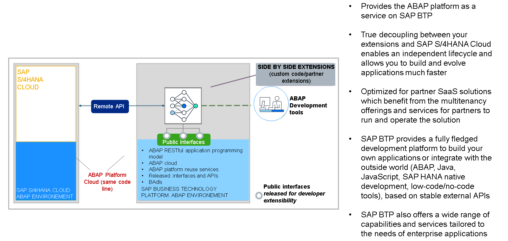

# 🌸 5 [EXPLAINING SIDE BY SIDE EXTENSIBILITY](https://learning.sap.com/learning-journeys/practicing-clean-core-extensibility-for-sap-s-4hana-cloud/explaining-side-by-side-extensibility_a01bb1ac-1acb-434d-8458-7a36cf2bcb3b)

> 🌺 Objectifs
>
> - [ ] Vous pourrez explorer l'extensibilité côte à côte

## 🌸 SIDE BY SIDE EXTENSIBILITY

Les extensions côte à côte s'adressent également aux développeurs traditionnels. Elles ne s'exécutent pas sur SAP S/4HANA Cloud, mais sur SAP BTP, en utilisant les services de développement et d'exécution qu'il propose. Il peut s'agir de Java, de Node.js, d'un environnement SAP BTP ou ABAP. Le principal facteur à prendre en compte lors du choix d'une approche côte à côte est que, même si l'application a besoin des données SAP S/4HANA Cloud, elle n'a pas besoin de l'environnement d'exécution. Dans l'unité 3, leçon 2, « Exploration du modèle de développement ABAP Cloud », nous avons expliqué comment SAP S/4HANA Cloud dispose d'interfaces publiques locales et distantes. Les extensions côte à côte utilisent des API distantes pour accéder aux données SAP S/4HANA Cloud et les manipuler. Ces données peuvent ensuite être utilisées localement par d'autres services SAP BTP, stockées localement si nécessaire, ou combinées à des données supplémentaires provenant d'autres sources pour le reporting et l'analyse.

Voici quelques exemples d'utilisation possibles des extensions côte à côte :

- Applications personnalisées nécessitant l'accès aux services SAP BTP, tels que le machine learning, l'IA, etc.

- Applications personnalisées s'intégrant à différents systèmes, sur site et dans le cloud

- Solutions SaaS développées par des partenaires

### SAP BTP, ABAP ENVIRONMENT

Comme mentionné précédemment, le modèle de développement ABAP Cloud est disponible pour tous les déploiements SAP S/4HANA, ainsi que dans l'environnement SAP BTP ABAP. L'environnement SAP BTP ABAP est l'offre PaaS (Platform as a Service) de SAP pour ABAP. Outre les applications côte à côte, les clients peuvent également développer leurs propres applications autonomes, qui bénéficient toutes deux des fonctionnalités multi-tenant de SAP BTP. Comme pour SAP S/4HANA, une base de données SAP HANA est incluse dans l'environnement SAP BTP ABAP. Les développeurs utilisent le modèle de programmation d'applications RESTful ABAP comme modèle de programmation, et les outils de développement ABAP pour Eclipse comme environnement de développement, avec l'option de langage ABAP Cloud. L'environnement SAP BTP ABAP est donc un choix naturel pour le développement d'extensions côte à côte.
