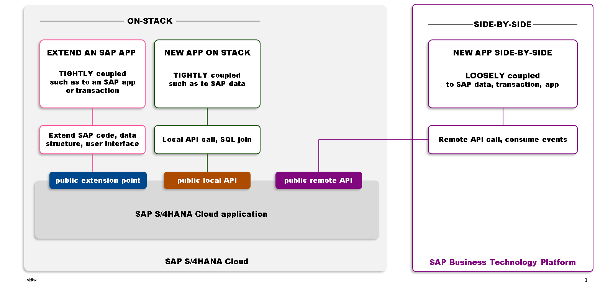

# 🌸 6 [EXPLORING RELEASED APIS IN SAP S/4 HANA CLOUD](https://learning.sap.com/learning-journeys/practicing-clean-core-extensibility-for-sap-s-4hana-cloud/exploring-released-apis-in-sap-s-4hana-cloud_e80220ec-00e5-490d-80ba-00edab846d29)

> 🌺 Objectifs
>
> - [ ] Vous pourrez explorer différents types d'API publiées dans SAP S/4HANA Cloud

## 🌸 ABAP PLATFORM APIS AND SAP S/4 HANA CLOUD APIS

Comme mentionné précédemment, l'un des objectifs principaux du modèle d'extensibilité de SAP S/4HANA Cloud est de garantir la pérennité des extensions. Pour ce faire, les extensions utilisent exclusivement une liste soigneusement sélectionnée d'artefacts et d'objets spécifiquement publiés pour le développement cloud. Il s'agit d'interfaces publiques, dont SAP garantit la stabilité, comme indiqué dans l'unité 3, leçon 2, « Exploration du modèle de développement cloud ABAP ». Ces interfaces se composent d'artefacts tels que des API locales et distantes, ainsi que de points d'extension, et sont disponibles à la fois sur la couche de plateforme ABAP Cloud locale et sur la couche SAP S/4HANA Cloud.

Les API locales issues de la couche SAP S/4HANA Cloud (indiquées par « point d'extension public » et « API locale publique » dans la figure) sont accessibles aux développeurs depuis l'environnement ABAP SAP S/4HANA Cloud pour implémenter des extensions pour les utilisateurs clés ou les développeurs. En revanche, l'environnement SAP BTP et ABAP n'a pas accès à ces API locales et doit utiliser des API distantes (appelées « API distantes publiques » dans la figure) pour concevoir et créer des extensions côte à côte. Cette distinction s'explique par la nécessité d'API basées sur la plateforme, par opposition à des API plus orientées produit.
