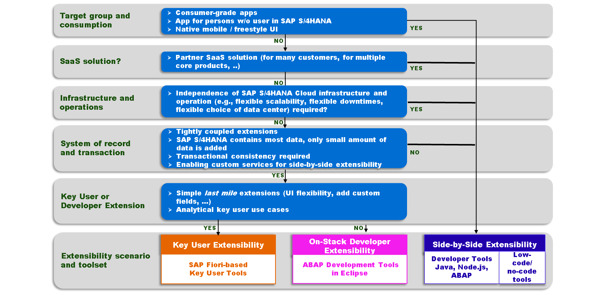

# 🌸 7 [EVALUATING EXTENSIBILITY OPTIONS](https://learning.sap.com/learning-journeys/practicing-clean-core-extensibility-for-sap-s-4hana-cloud/evaluating-extensibility-options_d4ed3486-230a-464d-9c0e-7b544ed30440)

> 🌺 Objectifs
>
> - [ ] Vous serez en mesure d'évaluer les facteurs à prendre en compte dans le choix de l'approche d'extensibilité appropriée

## 🌸 THE RIGHT EXTENSIBILITY OPTION

Pour choisir la bonne option d'extensibilité, tenez compte des points suivants :

- Extension use case : s'agit-il d'une nouvelle application ou d'une extension d'une application SAP ?

- Extension architecture : s'agit-il d'une extension plus ou moins couplée à SAP S/4HANA Cloud ? L'extension utilise-t-elle exclusivement les données SAP S/4HANA Cloud ou intègre-t-elle les données de plusieurs produits ?

- Extension scope and size : qui fournit l'extension et à quelle fin ? Par exemple, s'agit-il d'une petite extension fournie par des utilisateurs clés d'une organisation métier, d'un projet de développement personnalisé fourni par une organisation de développement, ou d'une application SaaS partenaire fournie à de nombreux clients (même indépendamment du produit principal) ?
