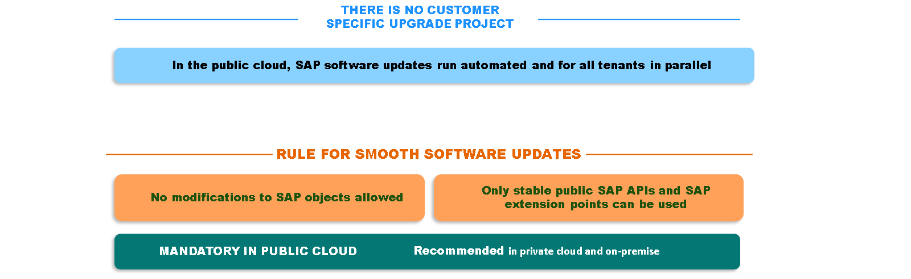
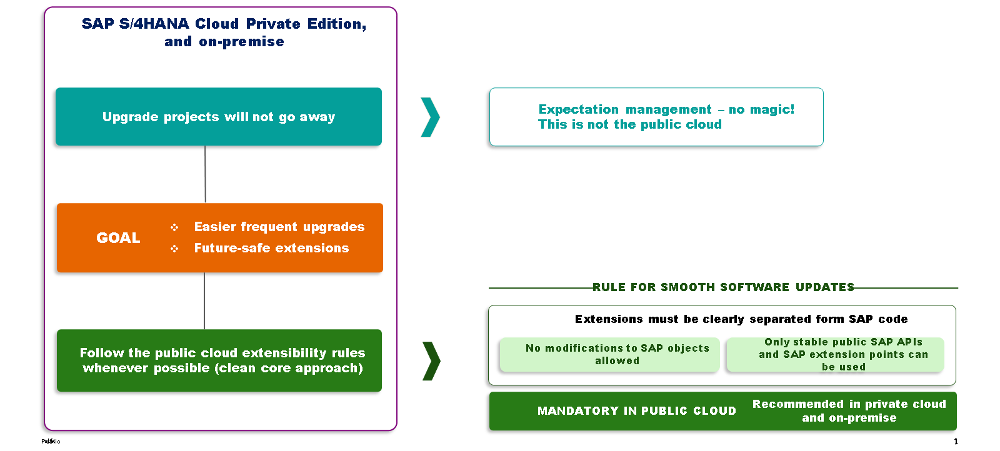

# 🌸 1 [EVALUATING USE CASES FOR SAP S/4 HANA CLOUD PRIVATE EDITION AND SAP S/4 HANA](https://learning.sap.com/learning-journeys/practicing-clean-core-extensibility-for-sap-s-4hana-cloud/evaluating-use-cases-for-sap-s-4hana-cloud-private-edition-and-sap-s-4hana_ef9d96d0-149d-447e-b7d6-11729ae19995)

> 🌺 Objectifs
>
> - [ ] Vous serez en mesure d'évaluer les besoins d'extensibilité uniques de SAP S/4HANA Cloud Private Edition et SAP S/4HANA

## 🌸 SPECIAL CONSIDERATIONS FOR S/4 HANA CLOUD PRIVATE EDITION AND SAP S/4 HANA

Jusqu'ici, notre discussion a principalement porté sur SAP S/4HANA Cloud Public Edition, ABAP Cloud et le modèle d'extensibilité de SAP S/4HANA Cloud. Ces règles peuvent être résumées comme suit :

- Les modifications des objets SAP ne sont pas autorisées.

- Les extensions doivent être clairement séparées du code SAP.

- Seuls les API publiées (locales ou distantes) et les points d'extension sont autorisés.

Avec SAP S/4HANA Cloud Public Edition, les mises à jour logicielles s'exécutent automatiquement et simultanément pour tous les clients. Pour les clients utilisant SAP S/4HANA Cloud Private Edition ou SAP S/4HANA, un projet de mise à niveau plus traditionnel (c'est-à-dire spécifique au client) est possible, car ni l'un ni l'autre n'est configuré pour recevoir les mises à jour logicielles automatiques comme SAP S/4HANA Cloud Public Edition. De plus, le périmètre fonctionnel de SAP S/4HANA Cloud Private Edition et de la version sur site est plus large que celui de SAP S/4HANA Cloud Public Edition. Ces facteurs contribuent à la nécessité d'autoriser certains cas d'utilisation supplémentaires pour SAP S/4HANA Cloud Private Edition et la version sur site, qui ne sont pas autorisés dans SAP S/4HANA Cloud Public Edition.

Malgré cela, SAP recommande aux clients utilisant SAP S/4HANA Cloud Private Edition ou une installation sur site de continuer à utiliser le modèle de développement ABAP Cloud autant que possible. Cela est particulièrement vrai pour les clients qui envisagent de migrer vers SAP S/4HANA Cloud Public Edition. Les migrations d'extensions créées à l'aide du modèle de développement ABAP Cloud se déroulent en douceur avec une perturbation minimale.

Dans les situations où le modèle de développement ABAP Cloud ne peut pas être utilisé, l'extensibilité classique reste disponible et prise en charge. Cependant, les clients doivent être conscients que l'utilisation de ces techniques d'extension classiques peut poser problème. L'évolution future vers SAP S/4HANA Cloud Public Edition pourrait s'avérer complexe et coûteuse pour ces clients. Les projets de mise à niveau pourraient également s'avérer plus perturbateurs que nécessaire.

Les sujets abordés s'appliquant aussi bien à SAP S/4HANA Cloud Private Edition qu'à des environnements sur site, seule SAP S/4HANA Cloud Private Edition sera désormais mentionnée. Si une distinction est nécessaire, elle sera explicitement indiquée.
