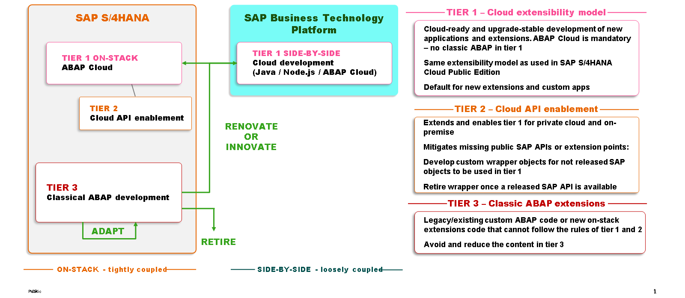

# 🌸 2 [EXPLAINING EXTENSIBILITY MODEL BEST PRACTICES](https://learning.sap.com/learning-journeys/practicing-clean-core-extensibility-for-sap-s-4hana-cloud/explaining-extensibility-model-best-practices_e290f382-800e-40ef-a203-85a13115f487)

> 🌺 Objectifs
>
> - [ ] Vous serez capable d'expliquer le modèle d'extensibilité à 3 niveaux

## 🌸 THREE TIER EXTENSIBILITY MODEL

Afin de fournir un cadre conceptuel permettant aux clients de comprendre les options d'extensibilité pour les scénarios SAP S/4HANA Cloud Private Edition, SAP a établi un concept d'extensibilité à trois niveaux, comme suit :

- Tier 1: Cloud Extensibility Model

- Tier 2: Cloud API Enablement

- Tier 3: Classic ABAP Extensions

#### 💮 **Tier 1: Cloud Extensibility Model** :

Le niveau 1 repose sur le modèle de développement ABAP Cloud. En résumé, les éléments essentiels sont les suivants :

- Seuls les types d'objets ABAP Cloud approuvés (artefacts du modèle de programmation d'applications ABAP RESTful, par exemple) peuvent être développés.

- Le langage ABAP Cloud est contrôlé par une vérification de syntaxe.

- L'utilisation des API publiées est contrôlée par une vérification de syntaxe.

- Les outils de développement ABAP pour Eclipse sont utilisés pour créer tous les objets de développement.

Pour les clients SAP S/4HANA Cloud Public Edition, le niveau 1 est la seule catégorie disponible. Comme mentionné précédemment, les clients SAP S/4HANA Cloud Private Edition peuvent également utiliser le niveau 1 et sont encouragés à le faire en priorité. Le développement utilisant une approche de niveau 1 permet d'exploiter pleinement les extensions utilisateur clés, les extensions de développement intégrées et les extensions côte à côte exécutées dans l'environnement SAP BTP et ABAP.

#### 💮 **Tier 2: Cloud API Enablement** :

Ce niveau est réservé aux clients SAP S/4HANA Cloud Private Edition. Il couvre les cas d'utilisation où une API non publiée (une BAPI ou des textes SAPscript, par exemple) est néanmoins nécessaire au développement. Pour permettre l'utilisation de l'API non publiée, le client crée et publie une API qui la référence. En résumé, l'API publiée par le client « encapsule » l'API SAP non publiée, permettant ainsi son utilisation. Cela satisfait l'utilisation des API publiées requise par le modèle de développement ABAP Cloud. En raison de l'encapsulation qui constitue la base du niveau 2, les artefacts utilisés dans le développement de ce niveau sont parfois appelés « encapsuleurs personnalisés ». De nombreuses possibilités d'encapsulation existent et peuvent être exploitées par les développeurs. Une classe d'objets ABAP, par exemple, peut encapsuler une BAPI non publiée. Une autre possibilité est une vue CDS qui encapsule une table SAP ou une vue CDS non publiée.

Afin de minimiser les perturbations potentielles liées aux mises à niveau logicielles, le développement de niveau 2 ne peut être réalisé qu'avec une approche de niveau 1. Par conséquent, toutes les règles de niveau 1 s'appliquent également au niveau 2 (à l'exception de l'utilisation du wrapper personnalisé). Alors qu'au niveau 1, l'utilisation du modèle de développement ABAP Cloud est contrôlée par des contrôles de syntaxe et d'exécution, au niveau 2, les contrôles du cockpit de test ABAP sont utilisés pour garantir la conformité ABAP Cloud, et l'utilisation d'une API SAP non publiée (dans le wrapper personnalisé) est gérée par une exemption du cockpit de test ABAP. Cette approche permet aux clients de surveiller et de gérer les écarts par rapport au modèle de développement ABAP Cloud.

Les clients sont encouragés à utiliser le canal d'influence client pour demander les API manquantes. SAP prévoit de transférer progressivement un nombre croissant d'API vers la catégorie des versions publiques ; les utilisations de niveau 2 doivent donc être analysées après les mises à niveau logicielles. Si une API non publiée auparavant a été publiée, le cas d'utilisation du niveau 2 n'est plus présent et le wrapper personnalisé doit être remplacé par l'utilisation directe de l'API désormais publiée.

#### 💮 **Tier 3: Classic ABAP Extensions** :

Le dernier niveau disponible pour les clients est réservé à l'extensibilité classique basée sur du code ABAP personnalisé, non implémentable avec les approches de niveau 1 ou 2. Ce niveau présente le plus grand risque d'interruption de mise à niveau logicielle et SAP recommande d'éviter le développement dans cette couche au profit des niveaux 1 ou 2 afin de minimiser ce risque.

Au niveau 3, il n'existe aucune restriction concernant le langage ABAP ou les types d'objets utilisables. Toutes les techniques d'extension classiques sont possibles. Cependant, pour minimiser le risque d'interruption, le client doit envisager les approches suivantes :

- Pour les extensions DDIC, utiliser des inclusions client ou des inclusions d'extension.

- Pour les extensions CDS, utiliser des extensions CDS et des extensions de métadonnées CDS.

- Redéfinir les services OData.

- L'utilisation d'un BAdI non publié est autorisée. Il est fort probable que le BAdI soit publié ou remplacé par un BAdI successeur.

- Les exits utilisateur et client peuvent être utilisés si nécessaire. Analysez toutes les utilisations après une mise à jour logicielle et, si un BAdI successeur est disponible, refactorisez-le pour l'utiliser à la place.

- Les améliorations explicites ne doivent être utilisées que lorsqu'aucune autre approche ne suffit.

- Les améliorations et modifications implicites doivent être totalement évitées. En cas d'absolue nécessité, veillez à utiliser l'Assistant de modification.

La liste suivante présente quelques exemples d'activités de développement possibles et leur niveau. Cette liste n'est pas exhaustive, mais elle permettra de conceptualiser concrètement le concept de niveau.

- Cas d'utilisation de niveau 1 :

  - L'ajout d'un champ personnalisé à une table de base de données ou à une vue CDS via une extension publiée comprend :

  - l'implémentation d'un BAdI SAP publié

  - la création d'une application SAP Fiori personnalisée basée sur un modèle de programmation d'applications RESTful ABAP

- Cas d'utilisation de niveau 2 :

  - la création d'une classe wrapper autour d'objets SAP non publiés (par exemple, BAPI)

  - la création d'une vue CDS wrapper pour une table SAP ou une vue CDS non publiée

  - la création d'une interface de modèle de programmation d'applications RESTful ABAP autour d'objets SAP non publiés

- Cas d'utilisation de niveau 3 (à éviter si possible) :

  - l'implémentation d'un BAdI non publié

  - l'extension d'une application SAP Fiori basée sur le modèle de programmation ABAP pour SAP Fiori (SEGW, BOPF, UI5)

  - l'extension d'une application SAP avec une technologie d'interface utilisateur héritée, par exemple, une transaction SAP GUI

  - la modification d'un objet SAP. Si nécessaire, utilisez l'assistant de modification.

Après les mises à niveau logicielles, tous les développements, quel que soit leur niveau, doivent être réévalués. Si un développement n'est plus nécessaire (par exemple, si une API précédemment non publiée a été publiée ou si une extension antérieure fait désormais partie des fonctionnalités standard), il doit être refactorisé ou supprimé.

### SETup REQUIRED FOR 3-TIER DEVELOPMENT

Pour utiliser efficacement le modèle à trois niveaux, plusieurs étapes préliminaires sont nécessaires :

- Les autorisations des développeurs doivent être attribuées.

- Les composants logiciels doivent être créés et les packages doivent leur être attribués.

- Les versions du langage ABAP doivent être attribuées aux objets de développement.

Ces étapes seront abordées dans les exercices suivants de cette leçon. Notez que ces exercices présentent deux approches alternatives pour créer des composants logiciels et attribuer des packages.
