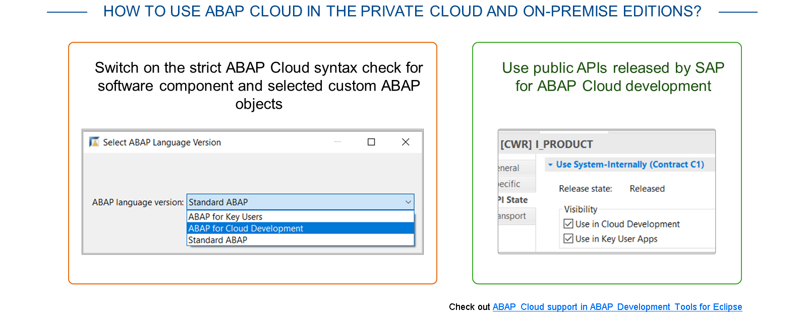
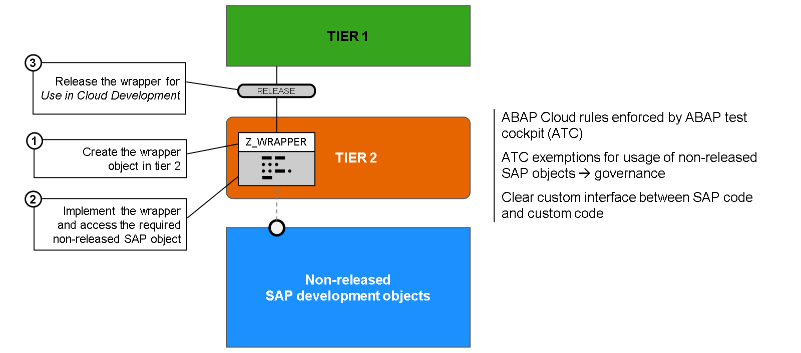
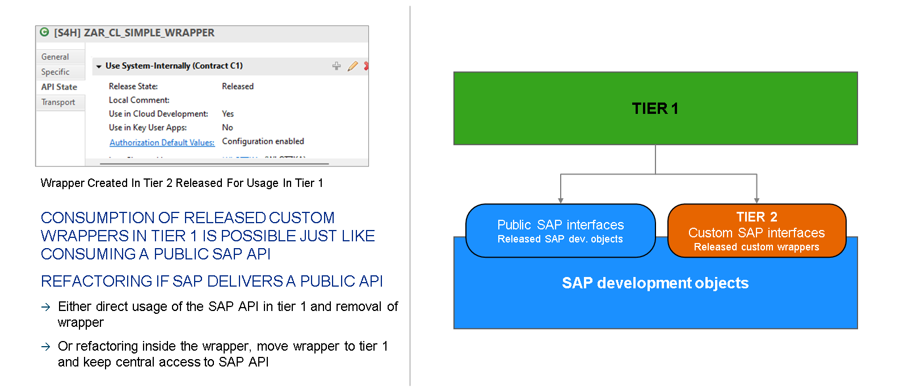

# 🌸 3 [CREATING TIER 2 CLOUD APIS](https://learning.sap.com/learning-journeys/practicing-clean-core-extensibility-for-sap-s-4hana-cloud/creating-tier-2-cloud-apis_a75bf2cd-815c-42bb-8d3b-2bba4931ecad)

> 🌺 Objectifs
>
> - [ ] Vous serez capable de développer une API Cloud Tier 2

## 🌸 TIER 2 GUIDELINES

### SETUP FOR TIER-BASED DEVELOPMENT

Pour configurer un développement hiérarchisé du système SAP S/4HANA Cloud Private Edition, les facteurs suivants sont pris en compte :

- Initial setup​

- Understanding release state, release contracts, and usage visibility​

- Understanding developer authorizations​

- Understanding ABAP test cockpit checks

### INITIAL SETUP

La configuration initiale comprend les éléments suivants :

#### 💮 **Software Component Setup​** :

Grâce au rapport RSMAINTAIN_SWCOMPONENTS, disponible à partir d'ABAP Platform 2022, les administrateurs peuvent créer et configurer des composants logiciels. Les composants créés seront classés comme « ABAP Cloud » ou « ABAP Classic », et leur transportabilité (transportable ou locale) sera garantie.

Tous les objets créés dans un composant logiciel de type ABAP Cloud doivent suivre le modèle de développement ABAP Cloud. En revanche, les objets des composants logiciels de type ABAP Classic peuvent être de n'importe quel type.

Les objets des composants logiciels ABAP Cloud ont un accès illimité à tous les objets du même composant. Cependant, pour accéder aux objets des composants logiciels ABAP Classic, ces objets doivent être spécifiquement publiés. Comme toujours, les API SAP locales publiées publiquement sont accessibles.

Les objets des composants logiciels ABAP Classic ont un accès illimité aux objets de développement ABAP Cloud. Comme pour ABAP Cloud, ils ont également accès à tous les objets du même composant. Cependant, ils sont autorisés à utiliser toutes les API SAP, publiées ou non.

#### 💮 **Structure Package​** :

Afin de faciliter la structuration des projets logiciels clients, un package de structure doit être créé pour chaque composant logiciel créé par le client. ​

##### Development Packages

Sous les packages de structure, un ou plusieurs packages de développement (en fonction des besoins individuels du projet) peuvent être créés pour contenir tous les artefacts de développement nécessaires.

##### Authorizations

Il existe quelques objets d'autorisation à prendre en compte. Premièrement, pour les administrateurs qui configurent des composants logiciels, l'objet d'autorisation S_CTS_ADMI est requis.

Deuxièmement, si les clients souhaitent limiter les développeurs au développement de niveau 1, ou si certains développeurs travailleront au niveau 1 tandis que d'autres travailleront aux niveaux 1, 2 et 3, l'objet d'autorisation S_ABPLNGVS peut être utilisé pour définir les autorisations appropriées pour les développeurs. La procédure est la suivante :

- À l'aide du code de transaction SACF, activez les contrôles d'autorité via l'objet d'autorisation S_ABPLNGVS.

- Créez deux rôles. L'un sera attribué aux développeurs limités au développement de niveau 1 uniquement. L'autre sera attribué aux développeurs autorisés à développer sur les trois niveaux, si applicable au client. Les deux rôles peuvent être créés à l'aide du code de transaction PFCG et du rôle SAP_BC_ABAP_DEVELOPER_5 comme modèle de copie. Ce rôle contient l'objet d'autorisation S_ABPLNGVS.

- Gérez le champ d'autorisation ABP_LNG_VS pour chaque développeur. Pour les développeurs qui développeront uniquement sur le niveau 1, la valeur à conserver est ABAP pour le développement cloud. Pour tous les autres développeurs, la valeur est Toutes les activités (c'est-à-dire les niveaux 1, 2 et 3).

### TIER 2 GUIDELINES - BASIC PRINCIPLES AND OVERALL IDEA

Une fois les composants et packages logiciels nécessaires configurés, le développement peut commencer. L'objet wrapper est créé au niveau 2. Il doit être créé dans un composant logiciel de type ABAP Standard (ABAP Classic). SAP recommande vivement de concevoir le wrapper le plus compatible ABAP Cloud possible. À cette fin, le cockpit de test ABAP vérifie la conformité des contrôles, dont les détails seront abordés prochainement. Cependant, comme l'accès à une API non publiée (la raison d'être d'un wrapper) entraînerait une erreur de vérification du cockpit de test ABAP, une exemption du cockpit de test ABAP est nécessaire pour autoriser cet accès. Une fois le wrapper finalisé, il est publié afin d'être utilisable par les objets du niveau 1.

Il est important de noter la différence entre « atténuation » et « encapsulation ». L'encapsulation implique qu'une API SAP non publiée sera mise à disposition pour une utilisation au niveau 1, tandis que l'atténuation fait référence à la création d'un nouvel objet (implémentant une fonctionnalité manquante) (bien que toujours disponible pour un accès au niveau 1).

Actuellement, les types d'objets recommandés par SAP pour l'encapsulation sont les suivants :

- ABAP RESTful application programming model BO

- Function Module

- Class / Interface

- CDS View

- Table

Les autres types ne sont actuellement pas recommandés. Il est recommandé d'utiliser une classe/interface comme objet wrapper pour les trois premiers objets de la liste précédente, et une vue CDS pour les deux derniers.

Pour les scénarios d'atténuation, SAP recommande les solutions suivantes :

- CDS Table Function

- AMDP Method

Pour la première option, une vue CDS (qui accède à la fonction de table) servirait d'objet publié pour l'utilisation de niveau 1 et pour la dernière option, une classe (accédant à la méthode) suffirait.

### ABAP TEST COCKPIT CHECK VARIANTS

Comme mentionné précédemment, SAP recommande fortement que les wrappers soient créés aussi conformes que possible à ABAP Cloud (à l'exception de l'utilisation de l'API non publiée). Pour faciliter cette approche, les contrôles du cockpit de test ABAP peuvent être utilisés pour garantir la conformité et garantir que les exceptions aux règles ABAP Cloud sont documentées et gérées correctement. Cette approche s'avère payante si, à l'avenir, SAP publie l'API. Si des API SAP publiques sont fournies et remplacent des objets non publiés utilisés dans les wrappers, le cockpit de test ABAP le détecte et suggère des options de refactorisation.

Les principales variantes de contrôle du cockpit de test ABAP à utiliser pour vérifier la conformité ABAP Cloud sont :

- ABAP_CLOUD_DEVELOPMENT_DEFAULT

Cette variante permet de confirmer que votre code ABAP est compatible avec le cloud. Elle permet d'appliquer les règles ABAP Cloud de base. De plus, grâce à la catégorie de vérification « API Release » incluse dans cette variante, la publication cohérente des wrappers pour ABAP Cloud et leur stabilité en cas de modification sont garanties par l'application des règles du contrat de publication.

- ABAP_CLOUD_READINESS

Les objets créés sous le niveau 2 (composant logiciel basé sur ABAP classique) peuvent, individuellement, avoir leur langage défini sur ABAP Cloud. Pour les clients souhaitant migrer ces objets vers des composants logiciels de niveau 1, cette variante permet de confirmer le respect des règles ABAP Cloud pour ces objets. Elle vérifie notamment que seuls les types d'objets disponibles dans ABAP Cloud sont développés, que seules les instructions de langage ABAP Cloud sont utilisées et que seules les API SAP publiées sont appelées.

### RELEASE STATE, RELEASE CONTRACTS AND USAGE VISIBILITY

Nous avons souvent évoqué l'importance des API publiées au cours de ce cours. Comme indiqué précédemment, les mises à jour logicielles des logiciels cloud sont régulières et des extensions mal conçues et implémentées peuvent engendrer des perturbations pour les clients.

Pour garantir la stabilité, les objets de développement destinés au développement d'extensions sont explicitement publiés et maintenus avec un contrat de publication et une visibilité d'utilisation. Ces trois options sont gérées simultanément sur le même écran. Les objets de développement SAP publiés ainsi que les wrappers personnalisés publiés suivent ce processus et, une fois les options de publication maintenues, ils sont utilisables dès le niveau 1.

Les options qui doivent être maintenues sont les suivantes :

- Release State

  Ce paramètre indique que l'objet de développement est « publié » (c'est-à-dire disponible pour utilisation)

- Release Contracts

- Extend (C0)

  Un objet de développement dont l'extensibilité est activée se voit attribuer le contrat de publication Extend (C0). Selon le type d'objet concerné, des prérequis supplémentaires peuvent être nécessaires avant la définition des points d'extension.

- Use System-Internally (C1)

  Cette désignation concerne les objets de développement utilisés pour la consommation. L'attribution de C1 est obligatoire pour tout objet de développement utilisé dans une implémentation d'extension. Comme un wrapper personnalisé est par définition destiné à la consommation au niveau 1, C1 est la valeur appropriée pour ce paramètre.

- Usage Visibility

Les deux options suivantes peuvent être définies pour la visibilité de l'utilisation :

- L'utilisation dans les applications utilisateur clés concerne les objets publiés destinés à être utilisés par les outils d'extensibilité utilisateur clés.

- L'utilisation dans le développement cloud concerne les objets publiés destinés à être utilisés par l'extensibilité des développeurs sur la pile.

Pour plus d'informations sur les différentes fonctionnalités offertes par les outils de développement ABAP pour Eclipse pour prendre en charge vos tâches de développement avec ABAP Cloud, consultez le blog : [Utiliser la prise en charge d'ABAP Cloud dans les outils de développement ABAP pour Eclipse (ADT)](https://community.sap.com/t5/technology-blogs-by-sap/make-use-of-abap-cloud-support-in-the-abap-development-tools-for-eclipse/ba-p/13558622).
